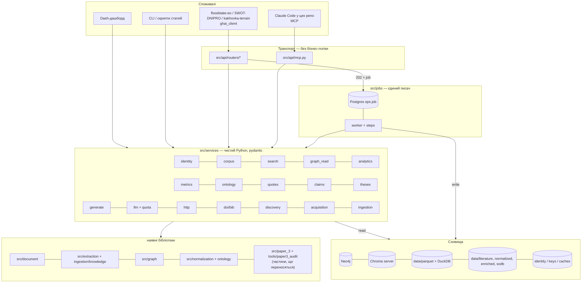

# 04 — Архітектура сервісу

**Дата**: 2026-10-02 · **Статус**: проєкт

Як влаштований сервіс: процеси, хто чим володіє, черга задач, ідентичність статей, LLM-шлюз, безпека, розгортання.
Контракт API описано в [03_API_DESIGN.md](03_API_DESIGN.md).

---

## 1. Топологія процесів (одна машина, WSL2-дистрибутив `Ubuntu`)

```text
 інші репозиторії (дистрибутив Ubuntu-24.04: floodstate-eo, SWOT-DNIPRO, icesat)
 Claude Code-сесії в них (MCP)          Dash-дашборд (:8050)
              │ HTTP 127.0.0.1:8090                │
              ▼                                    ▼
 ┌────────────────────────────── api (uvicorn, 1 процес, async) ───────────────────┐
 │ routers → src/services/* (read-only)    MCP adapter /mcp    jobs: INSERT only   │
 │ singletons: Neo4j driver (READ), Chroma HttpClient, SPECTER2 query-encoder (CPU),│
 │             LLM gateway + quota ledger, identity table (read)                    │
 └───────────────┬───────────────────────────────┬──────────────────────────────────┘
                 │ reads                          │ Postgres ops.job (SKIP LOCKED)
                 ▼                                ▼
   neo4j :7687  chroma server :8001      ┌──────────── worker (1 процес) ───────────────┐
   (docker)     (chroma run, .chromadb)  │ claim job → steps → write                     │
        ▲             ▲                  │ єдиний writer: Neo4j (MERGE), Chroma upsert,  │
        └─────────────┴──── writes ──────┤ data/literature/*, registry DuckDB, identity  │
                                         │ ресурси: gpu=1, grobid=1, llm=quota, net=4    │
                                         │ Ray local (workers ≤ 3) лише для батчів       │
                                         └───────┬───────────────┬───────────────────────┘
                                                 ▼               ▼
                                     grobid :8070 (on demand)   ollama :11434 (on demand)
```

| Процес | Як запускається | RAM (оцінка) | Примітка |
|---|---|---|---|
| `neo4j` | docker compose (`course-neo4j`) | 2–4 GB | зараз зупинений (Exited 2 дні тому) |
| `chroma` | `chroma run --path .chromadb --host 127.0.0.1 --port 8001` | ~4.5 GB (1.35 M векторів у пам'яті) | **нове**: сервер замість PersistentClient у кожному процесі |
| `api` | `uvicorn src.api.app:app --host 127.0.0.1 --port 8090` | ~1.5 GB (SPECTER2 на CPU) | 1 процес; важкі об'єкти — синглтони в `lifespan` |
| `worker` | `python -m src.jobs.worker` | 2–8 GB залежно від кроку | єдиний писач |
| `grobid` | docker, піднімається worker'ом під інжест | 5.3 GB | зупиняти між батчами: з ним Ray раніше падав з OOM |
| `ollama` | host, `ollama serve` | 8 GB VRAM/RAM | лише для LLM-judge legacy-пайплайну |

Машина зараз: 23 GB RAM, 32 ядра, RTX A4000 16 GB. Обмеження `--workers 3` у CLAUDE.md записане ще для ~3 GB RAM і застаріло. Його треба переміряти (див. 06, фаза 0).

---

## 2. Чому саме так (ключові рішення)

| # | Рішення | Альтернатива | Чому |
|---|---|---|---|
| A1 | **ChromaDB у режимі сервера** | PersistentClient у API і worker | PersistentClient не безпечний для двох процесів. Холодне завантаження HNSW займає ~4.5 GB і до 30 хв. Відомий збій 1.5.9 стався саме тоді, коли процес завершився з незалитим WAL (зараз у черзі **252 upsert-и** від 2026-09-19, які не потрапили в HNSW-сегмент). Сервер тримає індекс у пам'яті й контрольовано зупиняється |
| A2 | **Один writer (worker)** | Запис з API | DuckDB-реєстр підтримує лише одного писача. MERGE-інваріант простіше гарантувати в одному місці. Хто запустив задачу, видно в job log |
| A3 | **Черга задач і весь стан сервісу — у PostgreSQL** (`ops.job`, `SELECT … FOR UPDATE SKIP LOCKED`; див. [11](11_POSTGRES_TRUTH_LAYER.md)) | SQLite-файли (перший варіант плану); Redis + arq/RQ, Celery | Postgres уже є шаром правди: задачі, ідентичність, ключі й журнал LLM в одній транзакційній базі з даними, один бекап (`pg_dump`). Redis не потрібен для десятків задач на день. Ray лишається для GPU-батчів усередині кроків |
| A4 | **Сервісний шар `src/services/`** | Роутери кличуть CLI-скрипти | CLI-скрипти прив'язані до шляхів Kakhovka/Paper 3. Dash-логіку треба відв'язати від `dash`. Три реалізації Crossref/bib треба звести в одну |
| A5 | **API читає реєстр через Parquet-знімки** | Пряме читання `pipeline_registry.duckdb` | DuckDB не відкриває read-only з'єднання, поки інший процес тримає write lock. Реєстр уже має `data/registry/parquet/` |
| A6 | **SPECTER2-енкодер запитів на CPU в API** | Виклик Ray EmbeddingActor | Енкодинг одного запиту на CPU займає десятки мс, і Ray-кластер для читання не потрібен. Обов'язково та сама модель і адаптер, що при індексації, інакше простір векторів не збігається |
| A7 | **REST + MCP поверх тих самих сервісів** | Лише REST | Claude Code-сесії в інших репозиторіях отримують інструменти `search_literature`, `verify_quote`, `resolve_doi` напряму. Не доведеться копіювати файли між дистрибутивами вручну, як з `open_citations` 2026-10-01 |
| A8 | **Канонічний аналітичний шар — `data/parquet`** (інкрементальний), DuckDB in-memory з view над ним | `data/analytics` (повна перебудова) | `data/analytics` застарів: 3 680 статей, 9 з 21 колонки, `references` порожня (О-26). Два шари з різними числами дають різні відповіді на одне питання |
| A9 | **Дашборд і `VectorStoreActor` теж переходять на Chroma HttpClient** | Залишити PersistentClient у дашборді | Інакше `.chromadb` знову матиме двох власників. Ця ситуація вже коштувала +4,5 GB у кожному воркері (2026-09-18) і створює ризик зіпсованого WAL |
| A10 | **Пошук фільтрує метадані через ідентичність/DuckDB, а не через Chroma** | Записати DOI, рік і назву в метадані чанків | У чанках цих полів немає; перезапис 1,35 млн метаданих — це реіндекс. Префільтр `paper_id $in` батчами покриває всі фільтри й прибирає обрізання до 500 статей (О-27) |

---

## 3. Хто чим володіє

| Сховище | Читає | Пише | Режим |
|---|---|---|---|
| Neo4j | api (READ-сесії), worker | **лише worker**, лише `MERGE` через `src/graph` | драйвер-синглтон на процес |
| ChromaDB `flood_papers_768d` | api, worker (HttpClient) | **лише worker** (upsert, детерміновані `chunk_id`) | сервер :8001 |
| `data/literature/{pdf,grobid_xml,paper_json}`, `data/{normalized,enriched,sodb}` | api (файли), worker | **лише worker** | атомарний запис: tmp + rename |
| `data/registry/pipeline_registry.duckdb` | api — через Parquet-знімки | **лише worker** | single-writer + RLock |
| **PostgreSQL `ghai-postgres`** (`core`, `biblio`, `project`, `evidence`, `ops`) | api, worker | api: задачі (INSERT/cancel), мітки від користувачів; worker: усе інше | шар правди ([11](11_POSTGRES_TRUTH_LAYER.md)); `127.0.0.1:5433` |
| `core.paper` / `paper_alias` / `paper_file` | api, worker | worker (ETL `src/etl/identity.py`) | ідентичність §5 — **завантажено 2026-10-02**: 5 230 статей |
| `biblio.http_cache` (замінить `data/cache/*.db` і `_work/*_cache.json`) | api, worker | api і worker | ключ — нормалізований DOI/URL; TTL; таймаути не кешуються |
| `ops.llm_call` (журнал і квота LLM) | api, worker | api і worker | замість JSON-файлів `quota_ledger.*.json` |

---

## 4. Шари і пакети



Правила залежностей. Їх перевіряє тест-сторож, як `test_import_invariants.py`:
- `src/services` не імпортує `fastapi`, `dash`, `ray`.
- `src/api` імпортує лише `src/services` і `src/jobs.store`.
- Лише `src/jobs` (worker) викликає запис у Neo4j, Chroma і реєстр.
- Ізоляція `lxml` / `fitz` за `src/document` зберігається.

### Пакети, які треба створити

```text
src/services/            # чистий Python; без fastapi/dash/ray
    identity.py          # PaperIdentity, DOI-нормалізація, doi-slug, resolve()
    corpus.py            # метадані, TEI-розділи, текст, references (через src/document)
    search.py            # SPECTER2 query encoder + Chroma; агрегування по статтях
    graph_read.py        # іменовані Cypher-запити (каталог), READ-сесії
    metrics.py           # regex/table extract, NumericFact query, metric ontology
    ontology.py          # normalize terms → canonical_id
    doi.py               # Crossref + OpenAlex клієнт, кеш, порівняння полів, BibTeX
    quotes.py            # пошук цитат: exact → normalized → fuzzy; числа; attribution
    claims.py            # claim check (LLM поверх evidence)
    theses.py            # extract / evidence / novelty з воротами
    generate.py          # synthesis / related-work, grounding-перевірка
    analytics.py         # DuckDB in-memory view над data/parquet; лише параметризований SQL
    http.py              # спільний HTTP-шар: httpx, кеш у biblio.http_cache з TTL, 429/Retry-After, mailto
    discovery.py         # OpenAlex/Crossref/arXiv search, snowball, screening
    acquisition.py       # OA-PDF: OpenAlex best_oa_location, Unpaywall, arXiv, PMC
    ingestion.py         # покроковий per-paper ланцюг (05_PIPELINES.md)
    llm.py               # шлюз: Gemini-лейни, Ollama, (опційно Anthropic); quota; кеш
    models.py            # pydantic-схеми з 03 §4
src/api/
    app.py               # FastAPI(lifespan=...) ; routers ; problem+json handlers
    deps.py              # auth (X-API-Key → scopes), singletons
    routers/{system,papers,search,graph,metrics,ontology,doi,quotes,theses,generate,discovery,ingest,jobs,admin}.py
    mcp.py               # MCP-адаптер (streamable HTTP на /mcp)
src/jobs/
    store.py             # Postgres ops.job: enqueue / claim (SKIP LOCKED) / update / events
    worker.py            # цикл: claim → run steps → artifacts; семафори ресурсів
    steps/*.py           # тонкі обгортки над src/services/ingestion.py тощо
clients/python/ghai_client/   # типізований клієнт (httpx), генерується з OpenAPI
```

Залежності додати в `requirements.txt`: `fastapi`, `python-multipart`, `sse-starlette`, `mcp` (SDK); `uvicorn`, `starlette`, `pydantic-settings`, `httpx`, `rapidfuzz` уже встановлені.

---

## 5. Таблиця ідентичності статей (передумова всього API)

Проблема: файли корпусу названо трьома способами (`10.1029_2025gl120832.tei.xml`, `Water Resources Research - 2025 - Yi - ….tei.xml`, `giustarini2013.tei.xml`). Під час перевірки цитат DOI доводилось шукати grep'ом по 7 361 XML. У графі (знімок `data/graph/graph_summary.json`, 2026-09-23) назва, DOI і рік Paper-вузлів не збігаються. Наприклад, «MODELLING OF EXTREME FLOODS … UKRAINE», 1966, має DOI `10.1126/science.aan2506`.

```sql
CREATE TABLE paper_identity (
  paper_id      TEXT PRIMARY KEY,     -- doi-slug або 'sha256:<12hex>'
  doi           TEXT UNIQUE,          -- нормалізований: lower, без https://doi.org/
  sha256        TEXT,                 -- PDF (Stage0 content address)
  title         TEXT, year INTEGER, first_author TEXT,
  pdf_path TEXT, tei_path TEXT, paper_json_path TEXT,
  normalized_path TEXT, enriched_path TEXT, sodb_dir TEXT,
  chroma_paper_key TEXT, chroma_chunks INTEGER,
  neo4j_present INTEGER,
  cohorts TEXT,                       -- JSON: ["paper_3"] — виключати з recount
  identity_status TEXT,               -- OK | TITLE_DOI_MISMATCH | NO_DOI | DUPLICATE
  checked_at TEXT
);
```

Таблицю будує одноразова задача `integrity_check`, а далі підтримує кожен інжест. `identity_status != OK` блокує запис статті в граф, доки розбіжність не розв'язана.

---

## 6. LLM-шлюз і квоти

- **Провайдери.**
  - Gemini (`gemini-3.1-flash-lite` — основний лейн; `gemini-3.5-flash-lite` — другий).
  - Ollama `mistral-nemo:12b` — локально, judge і дешеві задачі.
  - Опційно Anthropic: SDK `anthropic` 0.104 уже встановлений.
  - Застарілий `google.generativeai` (бібліотека сама пише, що підтримку припинено) замінити на `google.genai` усюди.
- **Quota ledger** — таблиця `ops.llm_call` у Postgres; квота — агрегат за вікно `(model, window)`. Ліміти Gemini: 15 RPM / 500 RPD на модель, за `reference_gemini_quota`. Зараз кожен репозиторій і кожен інструмент витрачає квоту окремо. Через API квота стає спільною і видимою.
- **Кеш відповідей** за `prompt_hash` (модель + промпт + evidence ids). Повторний запит не витрачає квоту.
- **Структурований вивід.** Відповідь валідується pydantic-схемою. Невалідну відповідь не «лагодимо мовчки», як `judge_normalizer` (зауваження F-EXT-3), а рахуємо `repair_count` і повертаємо в `provenance.llm`.
- **Grounding-перевірка.** Кожне речення відповіді має `evidence_ids ⊆ наданий набір`. Інакше речення отримує позначку `unsupported` або відкидається, залежно від режиму.

---

## 7. Спостережуваність

- Структуровані логи (JSON) з `request_id` / `job_id`. `print` у сервісах заборонено (зауваження F-ANA-2).
- `/health` для кожної залежності: `neo4j` (`RETURN 1`), `chroma` (`heartbeat`), `grobid` (`/api/isalive`), `ollama` (`/api/tags`), `gemini` (залишок квоти).
- Метрики задач: тривалість кроків, падіння за типом, обсяг квоти. Таблиця `ops.job_event` у Postgres, перегляд у Dash.
- Кожен інжест пише в реєстр `run_id` і `git_commit`. Брудне робоче дерево позначається `dirty=true`, як WARN у воротах Paper 3.

---

## 8. Безпека

- Bind лише `127.0.0.1`. WSL2-дистрибутиви ділять мережевий простір віртуальної машини. Як саме доступ працює з `Ubuntu-24.04`, перевірено в [07_CONSUMERS.md](07_CONSUMERS.md).
- API-ключі: хеші в `ops.api_key` (Postgres); сирі ключі лише в `.env` споживачів. Ключ має скоупи й ім'я споживача.
- Секрети (`NEO4J_PASSWORD`, `GEMINI_API_KEY`, OpenAlex `mailto`) беруться з `.env` через `pydantic-settings`. Дефолти в коді заборонені. Пароль Neo4j `python2024` досі записаний у `docker-compose.yml` і в CLAUDE.md (пункт 0.5 ремедіації — ротація — відкритий).
- Сирий Cypher дозволений лише для `admin`, лише `READ_ACCESS` і з таймаутом. Більше ніде рядки від клієнта не потрапляють у Cypher, тільки параметри.
- Шляхи файлів у відповідях — відносні від кореня даних. Завантаження (`/ingest/upload`): лише `application/pdf`, ≤ 100 MB, перевірка сигнатури `%PDF`, SHA-256 до запису.
- Завантаження статей іде **лише з легальних OA-джерел** (OpenAlex/Unpaywall/arXiv/PMC/сторінки видавців з OA-ліцензією) або з PDF, які користувач завантажив сам. Ліцензія й URL джерела записуються для кожного файлу. Paywall означає статус `needs_manual`, а не обхід.

---

## 9. MCP-адаптер (для Claude Code в інших репозиторіях)

Набір інструментів — підмножина REST із тими самими сервісами:

| MCP tool | REST-відповідник |
|---|---|
| `search_literature(query, k, year_from?, year_to?)` | `POST /search/chunks` |
| `get_paper(doi_or_id)` / `get_paper_text(doi, section?)` | `/papers/resolve`, `/papers/{id}/text` |
| `verify_quotes(items)` | `POST /quotes/verify` |
| `check_claim(claim, source_doi)` | `POST /claims/check` |
| `resolve_doi(doi)` / `verify_bib(entries)` / `format_bib(dois)` | `/doi/{doi}`, `/doi/verify`, `/bib/format` |
| `graph_paper(doi)` / `graph_citations(doi, direction)` | `/graph/papers/...` |
| `metric_facts(metric, filters)` | `/metrics/facts` |
| `submit_ingest(dois)` / `job_status(job_id)` | `/ingest`, `/jobs/{id}` |

У споживача підключення виглядає як запис у `.mcp.json` з URL `http://127.0.0.1:8090/mcp` і ключем `claude-mcp` (скоупи `read`, `llm`). `write` додається лише за явним рішенням.

---

## 10. Розгортання

- Етап 1 — процеси на хості (venv), сховища в docker. GPU, Ray і локальні 75 GB даних простіше обслуговувати без контейнера для api/worker.
- `scripts/ghai_up.sh` / `ghai_down.sh`: `docker compose up -d neo4j` → `chroma run …` → `uvicorn …` → `python -m src.jobs.worker`. Зупинка йде у зворотному порядку, і Chroma зупиняється коректно (див. A1).
- Пізніше — `systemd --user` юніти (якщо в WSL увімкнено systemd) з `Restart=on-failure`.
- Бекап: `pg_dump -Fc ghai` (увесь шар правди: ідентичність, бібліографія, тези, докази, задачі, ключі) — щодня. Neo4j — `neo4j-admin database dump` перед кожним `rebuild_graph`. Chroma — копія `.chromadb` перед `rebuild_vectors`. Реіндекс іде в нову колекцію з атомарним перемиканням `COLLECTION_NAME`.
