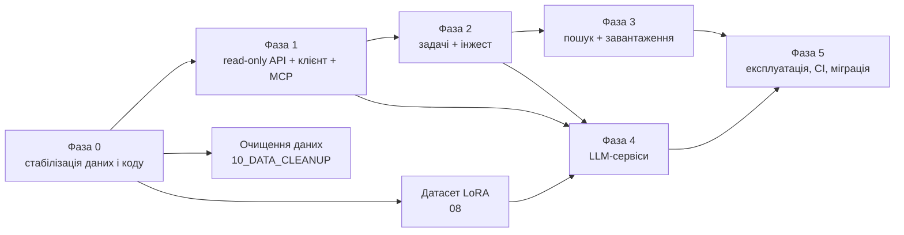

# 06 — План реалізації: фази, робочі пакети, кроки

**Дата**: 2026-10-02 · **Основа**:
- [01](01_PROJECT_INDEX.md) — відкриті проблеми О-*;
- [02](02_CAPABILITIES.md) — наявний код;
- [03](03_API_DESIGN.md) — контракт;
- [04](04_ARCHITECTURE.md) — архітектура;
- [05](05_PIPELINES.md) — пайплайни;
- [08](08_LORA_DATASET.md) — LoRA;
- [09](09_MIGRATION.md) — міграція;
- [10](10_DATA_CLEANUP.md) — очищення даних.

**Формат кроку**: `ID · що зробити · файли · готово, коли (перевірка) · залежить від · оцінка`.
Оцінки — дні одного розробника з Claude Code; для фаз дано діапазон.

---

## Прогрес (оновлено 2026-10-02, гілка `paper3-full-transformation-draft`, без push)

| Крок | Стан |
|---|---|
| 0.6.0 заморожування закріплених входів | ✅ `data/frozen/paper3_retrieval_20260916` (+ маніфест sha256 усіх 168 983 файлів даних) |
| 0.1.1 / 0.1.2 коміти, відв'язка від ігнорованого `src/paper_audit` | ✅ |
| 0.1.3 видалення коду Sci-Hub | ⏳ чекає вашого рішення |
| 0.1.4 повний lock-файл | ⏳ (лише доповнено `requirements.txt`: БД, FastAPI) |
| 0.2.1 єдиний `Settings` | ⏳ (додано лише `GHAI_PG_*`) · 0.2.3 ротація пароля Neo4j — ⏳ ваше рішення |
| 0.2.5 compose: зовнішній том Neo4j, digest, `127.0.0.1`, Postgres | ✅ |
| 0.3.1 / 0.3.2 ідентичність | ✅ **у Postgres** (`core.*`, міграція 0001): 5 230 статей; 3 обрізані DOI відновлено |
| 0.4.1 `graph_loader` · 0.4.3 `CITES` у лічильниках · 0.4.4 перебудова графа | ✅ ідентичність з Postgres (`--identity postgres`), індекс `Paper.title`, 25 049 NumericFact |
| 0.4.2 заглушки з назвами з GROBID | ⏳ 107 698 заглушок лише за назвою лишаються |
| 0.4.5 (нове) докази ребер сутностей | ✅ завантажувач брав `surface_form`/`evidence` з нормалізованих сутностей, де їх немає (у всіх 13 748 `USES_METHOD` було порожньо). Тепер вони беруться з сирих екстракцій разом з `role`, `page`, `section`. ✅ **Прив'язка до тексту TEI** (`src/graph/entity_grounding.py`, 31 с на корпус → `data/graph_inputs/entity_grounding.parquet`): термін має трапитися як слово. Прив'язано 75 % `USES_METHOD`, 96 % `USES_SENSOR`, 99 % `REPORTS_METRIC`; iRIC — 8 з 800 («empirical»), HAND — 73 з 640 («on the other hand»). API типово показує лише прив'язані ребра (`grounded=true`). ⏳ парафрази («2D hydraulic model») і неоднозначні абревіатури (ML) |
| 0.5.1 унікальні `chunk_id` | ✅ · 0.5.4 реіндекс у `.chromadb_v2` / `flood_papers_768d_v2` | ✅ 1 418 382 чанки з 5 028 статей; черга WAL без розриву, перезавантаження перевірено; v2 — типова колекція, v1 лишається для закріпленого аудиту U-Net |
| 0.5.6 (нове) склеєні речення TEI | ✅ `TEIParser._text` ставить пробіл на межах `<s>`/`
`/`<head>` (у ~92 % анотацій GROBID писав «planning.The»); чанки `abstract`/`figure`/`table` у v2 перезаписано (`--chunk-types`). Анотаційні чанки є у 4 814 статей — усіх, де TEI має справжню анотацію |
| 0.6.1 / 0.6.2 Parquet-шари | ✅ `references` 332 443 рядки; `data/analytics` за повною схемою · 0.6.3 вікно років — ⏳ |
| 0.7.1 / 0.7.2 NSE ÷100, юнікодний мінус | ✅ · 0.7.3 / 0.7.4 — ⏳ |
| 1.1 скелет API, 1.3 ключі, 1.4 контракти (частково), 1.5 `papers/resolve*` | ✅ `src/api` з документацією й правилами в OpenAPI, `GET /v1/agent-rules` |
| 1.6 `GET /papers/{id}/sections`, `/text` · 1.9 `POST /quotes/verify` · `POST /theses/validate` | ✅ без LLM. Ручна перевірка 01.10 відтворюється: Johnson/Olofsson/Bates/Zheng → `FOUND_EXACT`; Iqbal → вторинна цитата з DOI Hawker 2022; Lefebvre → `SOURCE_UNAVAILABLE` (немає в корпусі); `found_in` для цитат співцитованих праць. Бандл тез FS3 валідний (51/175/112), CSV-дамп KT2 відхиляється |
| 1.5 `GET /papers/{id}/references`, `/tables`, `/entities` | ✅ бібліографія GROBID зі зіставленням з корпусом (DOI-аліас або точна нормалізована назва, без нечіткого збігу) і лічильником внутрішньотекстових посилань; таблиці з клітинками; сутності з нормалізованого JSON тією ж логікою, що й ребра графа, з прив'язкою до TEI, задачею, типом дослідження й районом (сміття NER на кшталт «WGS84» відкидається з лічильником) |
| 1.7 `graph`: сусідство статті, цитування (курсори), сутність → статті, каталог 11 іменованих запитів, `graph/cypher` (admin) | ✅ лише статичний Cypher з параметрами; керована READ-транзакція з тайм-аутом 10 с; ad-hoc Cypher спершу `EXPLAIN` і допускається лише `query_type = r`. API додає до ребер `mention_in_evidence` |
| 1.8 `metrics/extract` (текст, TEI, стаття), `metrics/facts`, `metrics/ontology`, `ontology/normalize`, `ontology/entities` | ✅ детерміновано: значення береться лише тоді, коли назва метрики стоїть перед ним у тому ж реченні; нерівності позначаються `qualifier`; відсотки ділимо лише для обмежених відношень або за явного «%»; NSE 1.7 відхиляється. Факти з таблиць — DuckDB над `numeric_facts.parquet` (990 статей); фільтр за методом іде через прив'язані ребра. `TEIParser.parse_text` захищено від XXE, `tei_xml` з DTD відхиляється. ⏳ `mode=llm` (фаза 4), збереження текстових фактів |
| 1.6 `search/chunks`, `search/papers`, `search/similar` | ✅ живцем на v2: 0,04 с (теплий, типовий зріз), ~2 с для малих зрізів, 16 с перший запит. Великі зрізи — без фільтра Chroma з дофільтруванням (`$nin` коштував 4,5 с). ⚠ якість: 4/8 контрольних статей у топ-10; SPECTER2 base без адаптерів, подібності стиснуті (0,90–0,95). ⏳ адаптери `adhoc_query`/`proximity` (переіндексація) або гібридний лексичний канал; Chroma-сервер (1.2) |
| (нове) пошук PDF: `GET /v1/locate`, `scripts/pdf <doi|url> [--open]` | ✅ DOI, URL видавця з DOI, PII-посилання ScienceDirect (через Crossref), arXiv, `paper_id` → файли корпусу (з `\\wsl.localhost\…`-шляхом) + легальні OA-копії (OpenAlex, Unpaywall, arXiv; email Unpaywall у кеш не пишеться). API ніколи не завантажує довільні сторінки (SSRF); CLI читає `citation_doi`, але MDPI блокує роботів |
| 1.11 клієнт `clients/python/ghai_client` + `GET /v1/client.py` | ✅ один модуль на `httpx`; групи `papers`/`quotes`/`theses`/`doi`/`graph`/`metrics`/`ontology`; курсори як ітератори; розбиття пакетів понад ліміти API (`verify_open_citations` пакує цілі елементи ≤ 50 цитат); `GHAIError` з кодом problem+json; повтор 503/504 з `Retry-After` |
| 1.10 (продовження) `manuscripts/citations`, `bib/format`, `bib/render`, `bib/audit` | ✅ цитування рукопису → ключі bib (оповідні й дужкові форми, суфікси років, корпоративні автори через ключ); BibTeX у домашній конвенції (`Surname_YYYY`, транслітерація КМУ 2010 лише для ключів, суфікси при колізіях у проєкті); стилі apa/agu/copernicus/elsevier-harvard; аудит bib (85 записів floodstate-eo за 13 с: 52 ok, 31 fix, 2 unresolved; 13 пропущених DOI знайдено) |
| 1.10 `GET /doi/{doi}`, `POST /doi/verify` · міграція 0004 `biblio.http_cache` | ✅ Crossref → DataCite → OpenAlex з джерелом кожного поля; кешуються лише 200 і остаточні 404/410, збої — ні; ключ OpenAlex не потрапляє в кеш і відповіді. Бібліографія floodstate-eo (85 записів, 9 с): 30 `VERIFIED`, 33 `VERIFIED_WITH_NOTES`, 22 `UNRESOLVED` (без DOI), 0 `MISMATCH`. ⏳ `bib/format`, `bib/audit`, `bib/render`, `manuscripts/citations`. `openalex_extended` (61 580) не годиться як кеш: записи обрізані `select=` (без `biblio`, `type`, дат) |
| PostgreSQL-шар правди P0–P3 ([11](11_POSTGRES_TRUTH_LAYER.md)) | ✅ міграції 0001–0004; дані тек статей імпортовано (26 джерел) |

## 0. Порядок і залежності

| Фаза | Тривалість | Результат, який можна показати |
|---|---|---|
| 0 | 8–12 днів | граф із семантичними ребрами; Chroma з абстрактами всіх статей; таблиця ідентичності; чистий clone проходить тести |
| 1 | 10–14 днів | floodstate-eo перевіряє `open_citations` через API; Claude Code у floodstate-eo шукає літературу через MCP |
| 2 | 12–16 днів | одна нова стаття (PDF або DOI) за ≤ 5 хв стає вузлами Neo4j і векторами Chroma; повтор ідемпотентний |
| 3 | 8–10 днів | JobSpec → звіт: N нових статей знайдено, легально завантажено й проінжестовано |
| 4 | 10–14 днів | перевірка тверджень відтворює ручні знахідки 2026-10-01; генерація без жодного речення без доказу |
| 5 | 5–7 днів + постійно | CI, бекапи з перевіреним відновленням, дашборд на сервісах; за потреби — переїзд на сервер |
| D | 15–20 днів (паралельно з 1–3) | датасет ≥ 10 тис. прикладів (план — 60–80 тис.) + пілотний LoRA-адаптер з оцінкою |

---

## Фаза 0 — Стабілізація (передумова всього)

### WP0.1 Git і відтворюваність

| ID | Крок | Файли | Готово, коли | Залежить | Дні |
|---|---|---|---|---|---|
| 0.1.1 | Закомітити `tools/paper3_audit/`, `tools/paper3_literature_audit.py`, `tests/test_tools_paper3_audit.py`, `tests/test_paper1_vertical_closure.py`, `scripts/paper1_*` і незакомічені правки `nougat_parser.py`, `pdf_io.py`, `grobid_client.py` (окремими комітами) | — | `git status` чистий щодо коду | — | 0.5 |
| 0.1.2 | Розв'язати імпорт з ігнорованого `src/paper_audit`: перенести `build_docx.convert_markdown` у трекований модуль (`src/services/docx.py`) або зняти ignore з потрібних файлів | `src/paper_3/v2/assemble.py:476`, `.gitignore:67` | чистий clone: `pytest` зелений, включно з `test_paper_3_harvest.py:233` | 0.1.1 | 0.5 |
| 0.1.3 | Видалити код Sci-Hub (О-35) | `src/analytics/missing_reference_recovery.py:207`, `scripts/download_missing_papers.py` | `git grep -i scihub` порожній | — | 0.2 |
| 0.1.4 | Повний lock-файл (`uv pip compile` → `requirements.lock`); доповнити `requirements.txt` 23 пакетами | `requirements*.txt` | новий venv з lock проходить 1 413 тестів | 0.1.1 | 0.5 |
| 0.1.5 | Тег `pre-api-baseline` | — | тег на GitHub | 0.1.1–0.1.4 | — |

### WP0.2 Конфігурація і секрети

| ID | Крок | Файли | Готово, коли | Залежить | Дні |
|---|---|---|---|---|---|
| 0.2.1 | Один `Settings(BaseSettings)` (pydantic-settings) з **усіма** змінними: `GHAI_DATA_ROOT`, `CHROMA_URL` / `CHROMA_PATH`, `COLLECTION_NAME`, `EMBEDDING_MODEL` + `EMBEDDING_REVISION`, `NEO4J_*`, `GROBID_URL`, `OLLAMA_URL`, `GEMINI_API_KEY`, `GEMINI_LANES`, `OPENALEX_MAILTO`, `API_*`. `.env` читається до будь-чого (О-30). `src/config/__init__.py` лишається тонким шимом | `src/config/settings.py`, `src/config/__init__.py` | тест: значення з `.env` видно в `CHROMA_DIR`, `COLLECTION_NAME` | — | 1 |
| 0.2.2 | `OLLAMA_BASE_URL` → `OLLAMA_URL`; `GOOGLE_API_KEY` → `GEMINI_API_KEY`; прибрати email із ≥ 7 місць (О-15, О-18) | `judge_stage.py:273`, `paper_audit/_utils.py:59-99`, `references.py:27`, `p2_literature.py:57` … | grep-тест на email і `python2024` у трекованому коді | 0.2.1 | 0.5 |
| 0.2.3 | Ротація пароля Neo4j; прибрати літерал із `docker-compose.yml` (`${NEO4J_PASSWORD}`), CLAUDE.md, скриптів (О-10) | `docker-compose.yml:14`, `scripts/add_missing_papers_to_neo4j.py:44`, `scripts/revise_paper.py:447` | старий пароль не працює; grep порожній | 0.2.1 | 0.3 |
| 0.2.4 | Прибрати абсолютні шляхи й `wsl.exe` (О-14, P4 з 09) через `GHAI_DATA_ROOT` / `GHAI_BUNDLES_*` | `src/dashboard_dash/app.py`, `src/paper_3/snapshot.py`, `src/paper_3/v2/scientific_status.py`, `tools/paper3_audit/{config,bibtex,cli}.py`, 2 тести | тест-сторож: `git grep -E "/home/niko\|wsl\.exe"` у `src/ tools/` порожній | 0.2.1 | 1 |
| 0.2.5 | `docker-compose.yml`: том `neo4jdata` як `external: true` (О-43); закріплені образи `neo4j:5.26.19-community`, `grobid/grobid:0.9.0-full@sha256`; `HF_HOME=.hf_cache` явно в `.env` з ревізією SPECTER2 (О-45) | `docker-compose.yml`, `.env.example` | `docker compose up -d neo4j` відкриває **наявний** граф (лічильники як у `graph_summary.json`) | 0.2.3 | 0.3 |

### WP0.3 Ідентичність статей (О-3, О-37)

| ID | Крок | Файли | Готово, коли | Залежить | Дні |
|---|---|---|---|---|---|
| 0.3.1 | `src/services/identity.py`: `normalize_doi`, `doi_slug` (обробляє `:`; таблиця псевдонімів для старих slug), `title_fingerprint`, `resolve(doi\|title\|file\|chroma_id)` (логіка `PaperResolver`) | новий | ≥ 40 тестів: регістр, `https://doi.org/`, `:`, `@`, «2024a», кирилиця, `…09.069reference:hydrol20760` | 0.2.1 | 1.5 |
| 0.3.2 | ✅ 2026-10-02: `python -m src.etl.identity` завантажує `core.paper` / `paper_alias` / `paper_file` / `cohort_member` у Postgres (міграція `0001`; 5 230 статей). Джерела: pdf, tei, paper_json, normalized, enriched, sodb, Chroma `paper_id` (SQLite read-only). Статуси `TITLE_DOI_MISMATCH` (GROBID-назва проти OpenAlex-назви), `DUPLICATE` (144 групи), `NO_DOI` | `src/services/identity.py`, `python -m src.services.identity build` | таблиця на всі 5 038 статей; звіт розбіжностей; 0 «невідомих» | 0.3.1 | 1.5 |
| 0.3.3 | Перевести на `identity.resolve` 4 найважливіші місця: `tools/paper3_audit/corpus.py`, `paper_3/_utils.py:55,71`, `harvest_openalex.py:219`, `missing_reference_recovery.py:288` | ці файли | наявні тести зелені; один поріг збігу назв у конфігу | 0.3.2 | 1 |

### WP0.4 Граф (О-1, О-2)

| ID | Крок | Файли | Готово, коли | Залежить | Дні |
|---|---|---|---|---|---|
| 0.4.1 | `graph_loader`: читати `doc["paper"]["normalized_entities"]` і `doc["paper"]["references"]` (з фолбеком на верхній рівень) | `src/graph/graph_loader.py:448,607` | **новий тест** на реальній enriched-фікстурі: на ребра > 0 | — | 0.5 |
| 0.4.2 | Один ключ `:Paper` = `paper_id` з ідентичності. Вузли-заглушки: `MERGE` за `doi` з `ON CREATE SET` назви/року **з кешу OpenAlex/Crossref**, а не з GROBID-розбору посилань. «Підвищення» заглушки до повної статті. `Paper.doi` — унікальний констрейнт. `fact_writer` перевести з `source_file`/`id` на `paper_id` | `neo4j_writer.py:83,311`, `fact_writer.py:166,393`, `graph_constraints.py` | тест: стаття, що спершу з'явилась як заглушка, після інжесту — **один** вузол | 0.3.2 | 2 |
| 0.4.3 | `rel_counts()` рахує `CITES`; `graph_queries` — без `%d` у Cypher (параметр або whitelist 1–3) | `neo4j_writer.py:689-698`, `graph_queries.py:149` | тест | — | 0.3 |
| 0.4.4 | Дамп старої БД (архів) → повна перебудова (`build_graph` + `table_kg_loader`) → звірка | — | `USES_METHOD`, `USES_SENSOR`, `REPORTS_METRIC` близькі до 15 322 / 4 944 / 1 196 зв'язків; `CITES` з ~4 905 статей; 0 Paper з невідповідністю назва/DOI | 0.4.1–0.4.3 | 1 |

### WP0.5 ChromaDB (О-4, О-24, О-39)

| ID | Крок | Файли | Готово, коли | Залежить | Дні |
|---|---|---|---|---|---|
| 0.5.1 | Детерміновані унікальні `chunk_id`: `sha1(paper_id_full + chunk_type + section_n + ordinal)`; абстракт, рисунки, таблиці й формули з `paper_id` у ключі | `src/document/chunker.py:156,311,336,360,420-422` | тест: 6 статей J. Hydrology → 0 спільних ID (зараз 7–23 на пару) | — | 0.5 |
| 0.5.2 | `VectorStore.delete(paper_id)`; `count()` не на кожен запит; заборона `get_or_create` для імені, якого немає в конфігу (тиха порожня колекція) | `src/vectorstore/chroma_store.py:107-188` | тести зі стабом | — | 0.5 |
| 0.5.3 | Злити WAL поточної колекції (252 upsert-и) і перевірити `count()` у вікні обслуговування | — | `embeddings_queue` порожня, `max_seq_id` однаковий | — | 0.3 |
| 0.5.4 | Реіндекс у **нову** колекцію `flood_papers_768d_v2` з виправленими ID → звірка → перемикання `COLLECTION_NAME`; стару лишити як відкат на 2 тижні | `reindex_chromadb` | абстракт є в кожної статті, де TEI має `<abstract>`; ≈ 5 038 статей; 20 контрольних запитів не гірші | 0.5.1–0.5.3 | 1 + години GPU |
| 0.5.5 | `RAGPipeline.ingest(force=True)` більше не очищає колекцію; видалити мертвий `VectorSynchronizer` (`data/chroma`) і мертвий буст цитувань у `Retriever` | `rag_pipeline.py:69-89`, `vector_synchronizer.py`, `retriever.py:33-62` | grep-тест: `.clear(` лише в admin-коді | — | 0.5 |

### WP0.6 Аналітичний шар (О-25, О-26, О-34)

| ID | Крок | Файли | Готово, коли | Залежить | Дні |
|---|---|---|---|---|---|
| 0.6.0 | **Заморозити закріплені входи досліджень** до будь-якої перебудови: `data/analytics` (`papers.parquet` `0f7a45a2…`) → `data/frozen/paper3_retrieval_20260916/` (read-only); записати в `RUN_MANIFEST`, що закріплений `references.parquet` (`d6124d0b…`) втрачено (О-44). Додати сторож: задача, що перезаписує файл з хешем у маніфесті, спершу копіює його в `data/frozen/` | `data/frozen/`, `src/jobs/` (пізніше) | хеш у `data/frozen` збігається з маніфестом | — | 0.3 |
| 0.6.1 | Виправити ключ дедуплікації посилань (`source_paper_id`) і перебудувати `data/parquet/references.parquet` | `src/enrichment/build_parquet_layer.py:145-229,283` | ≈ 320 тис. рядків; тест інкрементального запуску не зменшує таблицю | 0.6.0 | 0.5 |
| 0.6.2 | **Один** канонічний шар: `data/parquet`. Дашборд, RQS, `paper_audit/export_reading_lists`, `build_graph` перевести з `data/analytics` (стара схема) або перебудувати `data/analytics` за схемою з 21 колонкою | `data_loader.py`, RQS, `paper_audit/export_reading_lists.py:59`, `parquet_builder.py` | KPI-запити за `has_doi`/`abstract_length` працюють; 5 0xx статей | 0.6.1 | 1.5 |
| 0.6.3 | Прибрати жорстке вікно 1990–2025 | `data_loader.py:33-34`, RQS `:263-264,575` | статті 2026 видно | — | 0.2 |

### WP0.7 Коректність екстракції (О-7, О-8, О-28, О-29)

| ID | Крок | Файли | Готово, коли | Залежить | Дні |
|---|---|---|---|---|---|
| 0.7.1 | Прибрати «порятунок» `>1 → /100` для NSE/KGE/R²; дозволяти це лише для явних відсотків OA/F1 | `scientific_extractor.py:133-136` | тест: NSE 1.7 → `suspect`, а не 0.017 | — | 0.3 |
| 0.7.2 | Юнікодний мінус і тонкі пробіли в `_NUM` і `float()` | `regex_extractor.py:34`, `table_extractor.py:254-261` | тест «NSE = −0.27» на обох шляхах | — | 0.3 |
| 0.7.3 | Значення поза діапазоном отримують `suspect`, а не відкидаються; підключити `validate_metric_value`/`units_comparable` | `metric_ontology.py:220,338-377`, `table_extractor.py:277-278` | тести; поле `range_verdict` у NumericFact | — | 1 |
| 0.7.4 | Одна схема ID метрик (`metric_ontology` канонічна) + таблиця відповідності | registry, `metric_ontology.py:234`, KB | тест: OA 97.2 → 0.972 з одиницею `%` | 0.7.3 | 1 |

### WP0.8 Документація

| ID | Крок | Готово, коли | Дні |
|---|---|---|---|
| 0.8.1 | Виправити CLAUDE.md і docs_v2 за [01 §8](01_PROJECT_INDEX.md): лічильники, шляхи, типи чанків, RAM, 36 тез; додати посилання на `API_PLAN_v1/` | grep старих чисел порожній | 0.5 |

**Вихід з фази 0**:
- тести зелені з чистого clone;
- граф має семантичні ребра;
- Chroma v2 перевірено;
- ідентичність у Postgres (`core.paper`) без невідомих розбіжностей;
- `references.parquet` повний;
- екстракція не втрачає від'ємні або «великі» значення.

---

## Фаза 1 — Read-only API, клієнт, MCP

| ID | Крок | Файли | Готово, коли | Залежить | Дні |
|---|---|---|---|---|---|
| 1.1 | Залежності: `fastapi`, `python-multipart`, `sse-starlette`, `mcp`; скелет `src/api/app.py` з `lifespan`: Settings; Neo4j driver (READ); Chroma HttpClient; SPECTER2-енкодер (CPU, закріплена ревізія); DuckDB in-memory з view над `data/parquet`; пул з'єднань Postgres (шар правди) | `src/api/{app,deps}.py` | `uvicorn` стартує; `/health` показує стан 5 залежностей | Ф0 | 1 |
| 1.2 | Chroma-сервер: `scripts/ghai_up.sh` / `ghai_down.sh`; `VectorStore(mode="http")`; дашборд і `VectorStoreActor` також на HttpClient (один власник `.chromadb`) | `chroma_store.py`, `actors/vectorstore_actor.py`, `scripts/` | два процеси одночасно читають; коректна зупинка без хвоста WAL | 1.1 | 1.5 |
| 1.3 | Автентифікація: `ops.api_key` у Postgres (хеш, споживач, скоупи), CLI `python -m src.api.keys create --consumer floodstate-eo --scopes read,llm`; problem+json; `request_id`; JSON-логи | `src/api/deps.py`, `src/api/errors.py` | тести 401/403/429 | 1.1 | 1 |
| 1.4 | `src/services/models.py` — контракти з 03 §4; `GET /schemas/{name}` | новий | JSON Schema для `Thesis`, `AtomicClaim`, `BibEntry`, `GraphBundle`, `CitationOccurrence` | 1.1 | 1 |
| 1.5 | `papers`: `resolve`, `resolve-batch`, деталі, `sections`/`text` (TEI через `src/document`), `references`, `entities`, `tables` | `src/services/corpus.py`, `routers/papers.py` | контрактні тести на фікстурах TEI | 1.4, 0.3 | 2 |
| 1.6 | `search`: префільтр (ідентичність/DuckDB → `$in` батчами) → ембединг запиту → Chroma → join метаданих → агрегування по статтях; `coverage`; `retrieval_validity=NOT_MEASURED`, поки для `(collection, manifest)` немає виміряного recall | `src/services/search.py`, `routers/search.py` | тест: фільтр за роком не обрізає до 500 статей (О-27); p95 < 1,5 с на теплому сервері | 1.2, 1.5 | 2 |
| 1.7 | `graph`: сусідство статті, цитування in/out, сутність → статті, whitelist іменованих запитів (параметри, ліміт хопів 1–3), `admin/cypher` у READ-режимі з таймаутом | `src/services/graph_read.py`, `routers/graph.py` | тести з mock-драйвером; немає f-рядків у Cypher (О-33) | 1.1, 0.4 | 1.5 |
| 1.8 | `metrics` і `ontology`: `extract` (regex + таблиці, синхронно), `facts` (DuckDB, параметризований SQL), `ontology/normalize` (`allow_semantic=false`), `metrics/ontology` | `src/services/{metrics,ontology}.py` | тести; немає f-рядків у SQL | 1.4, 0.7 | 1.5 |
| 1.9 | `quotes/verify`: повний текст з TEI (abstract/body/back, підписи, таблиці) → `verify_quote` (перенести в `src/services/quotes.py`); `…`-фрагменти; `expected_numbers`; атрибуція через `<ref type="bibr">` у знайденому реченні; `SOURCE_UNAVAILABLE` з підказкою на `/acquire` | `src/services/quotes.py`, `routers/quotes.py` | **регресійні фікстури 2026-10-01**: Johnson, Olofsson, Zheng, Bates → `FOUND_EXACT`; Iqbal 1.12–1.61 → `attribution.cites_other_sources=true`; Lefebvre «71 %» → `SOURCE_UNAVAILABLE` (статті немає в корпусі; 01.10 перевірено за анотацією OpenAlex) | 1.5 | 2 |
| 1.10 | `doi`/`bib`: спільний HTTP-шар (httpx, кеш `biblio.http_cache` з TTL, 429/`Retry-After`, `mailto`); Crossref + OpenAlex з порівнянням полів (назва, рік online/print, том, сторінки, автори); `bib/format` (ключі `Surname_Year` + псевдоніми); `bib/audit` (задача, якщо > 50); `bib/render`; `manuscripts/citations` (автор-рік з комою й без, et al., кілька посилань в одних дужках) | `src/services/{http,doi}.py`, `routers/{doi,bib,manuscripts}.py` | фікстури: Biancamaria (online 2015 / print 2016 → `VERIFIED_WITH_NOTES`), Monti (сторінки «50-50»), Pedregosa (`UNRESOLVED`, JMLR) | 1.4, 0.3 | 3 |
| 1.11 | Клієнт `clients/python/ghai_client` (httpx, TypedDict, опційно pydantic) + `GET /client.py` | `clients/python/` | установка в floodstate-eo `.venv`; e2e-тест проти TestClient | 1.5–1.10 | 1 |
| 1.12 | MCP-адаптер (читальні інструменти з 04 §9) на `/mcp` | `src/api/mcp.py` | Claude Code у floodstate-eo бачить інструменти `ghai` | 1.11 | 1 |
| 1.13 | **Перша інтеграція**: у floodstate-eo `p100b_open_citations.py` викликає `/quotes/verify` і записує статуси в `open_citations.json` | (репозиторій floodstate-eo) | 22 посилання отримують статуси автоматично | 1.11 | 0.5 |

**Вихід з фази 1**: пункти 1.13 і 1.12 працюють; усі ендпоінти з контрактними тестами; живі сховища в unit-тестах **застаблено** (правило пам'яті «no live stores in unit tests»); інтеграційні тести — під маркером `@pytest.mark.live`.

---

## Фаза 2 — Задачі та інжест

| ID | Крок | Файли | Готово, коли | Залежить | Дні |
|---|---|---|---|---|---|
| 2.1 | `src/jobs/store.py`: таблиці `jobs`, `job_steps`, `job_events`, `candidates`, `acquisitions` (WAL); `enqueue` / `claim` (`UPDATE … RETURNING`) / `heartbeat` / `cancel` / `retry` | новий | тести конкурентного `claim` | Ф1 | 1.5 |
| 2.2 | `src/jobs/worker.py`: цикл, семафори `gpu=1`, `grobid=1`, `network=4`, `llm` (через ledger); змінні середовища до імпорту torch; graceful shutdown; маркер `.index_verified` | новий | `kill -TERM` не лишає хвоста WAL; повторний запуск продовжує крок | 2.1 | 1.5 |
| 2.3 | `/jobs/*` + SSE `/jobs/{id}/events` | `routers/jobs.py` | e2e: фіктивна задача з 3 кроками | 2.1 | 1 |
| 2.4 | `process_paper_local(xml, ner_fn, encode_fn, judge_fn, vector_sink)`; Ray-задача — адаптер. Нормалізація **після** judge. Атомарні записи. Жодного фолбеку на MiniLM (О-12, О-31) | `orchestration/process_paper.py`, `ingestion/pipeline.py`, `actors/embedding_actor.py` | тести наявні + нові (judge змінює сутність → normalized відображає зміну) | Ф0 | 2 |
| 2.5 | `write_paper_subgraph(paper_id)` + підвищення заглушки + `ingest_run_id` на ребрах + admin-задача `compact_paper` (05 §6) | `src/graph/` | тест: повторний інжест не дублює вузли; старі ребра відфільтровуються | 0.4 | 2 |
| 2.6 | Інжест у Chroma для однієї статті: `delete` + `upsert`; інвалідація кешів (`_pack_cache`, `data_neo4j` lru, PaperStore, DuckDB-view) | `chroma_store.py`, `services/search.py` | тест: повторний інжест → та сама кількість чанків | 0.5 | 1 |
| 2.7 | Клієнт збагачення без акторів (кеш у Postgres, 429, політика оновлення) | `src/enrichment/`, `services/http.py` | тест з mock HTTP | 1.10 | 1 |
| 2.8 | Кроки задачі `ingest` (05 §5, 1–13); керування GROBID-контейнером (старт/зупинка, `is_alive`); `GROBID_URL` з конфігу; Nougat опційно (локальний парсер); `/ingest`, `/ingest/upload` | `src/jobs/steps/*.py`, `routers/ingest.py` | **e2e**: PDF → вузли + вектори ≤ 5 хв; падіння на кроці 9 → `retry` продовжує з 9 | 2.2–2.7 | 3 |
| 2.9 | Реєстр за стадіями (рядок на кожен крок; `paper_id` + `sha256`) | `registry_db.py` | `registry.cli stats` показує всі стадії | 2.8 | 1 |
| 2.10 | Батч-задачі: `rebuild_analytics` (щоночі), повторна екстракція метрик по корпусу після WP0.7 → оновлення NumericFact | `jobs/steps/batch.py` | NumericFact з `range_verdict`; звіт: скільки значень повернуто з «відкинутих» | 2.8 | 1.5 |

---

## Фаза 3 — Пошук нових статей і завантаження

| ID | Крок | Файли | Готово, коли | Залежить | Дні |
|---|---|---|---|---|---|
| 3.1 | Звести клієнти OpenAlex / Crossref / Unpaywall / Europe PMC / arXiv на `services/http.py`; cursor-пагінація; TTL-кеш; не кешувати таймаути як «не знайдено» | `services/http.py`, `services/discovery.py` | старі 5 + 8 клієнтів позначені deprecated; тести | 1.10 | 2 |
| 3.2 | `discovery.search` / `snowball` / `missing_references` (після 0.6.1), JobSpec (05 §2) з хешем запитів; дедуп через `identity.resolve` | `services/discovery.py` | тест: seed `10.1029/2025gl120832` → кандидати з `in_corpus` | 3.1, 0.3 | 2 |
| 3.3 | Скринінг: SPECTER2-скор + LLM-смуга через `llm.py` (з фази 4, або простий шлюз тут); черга кандидатів + `PATCH` | `services/discovery.py`, `routers/discovery.py` | LLM-викликів ≤ `max_llm_calls` | 3.2 | 1.5 |
| 3.4 | Завантаження: OA-каскад з `oa_resolver`, перевірка PDF, ліцензія і версія в `acquisitions`, `needs_manual`, Wayback лише для OA | `services/acquisition.py`, `routers/acquire.py` | 100 % завантажених мають маршрут і ліцензію; 0 не-OA маршрутів | 3.1 | 2 |
| 3.5 | Складена задача `discover-and-ingest` з бюджетами і звітом | `jobs/steps/composite.py` | звіт на 20 статей; бюджет зупиняє задачу коректно (`partial`) | 3.2–3.4, 2.8 | 1.5 |
| 3.6 | Інтеграція з воротами прийняття (контролі, заморожений набір) для пошуку як доказу прогалини | `services/theses.py` (з фази 4) | без пройдених воріт статус ≤ `RETRIEVAL_UNVALIDATED` | 3.5 | 1 |

---

## Фаза 4 — LLM-сервіси

| ID | Крок | Файли | Готово, коли | Залежить | Дні |
|---|---|---|---|---|---|
| 4.1 | `services/llm.py`: • провайдери Gemini-лейни, Ollama, опційно Anthropic і локальний LoRA (08); • quota ledger у Postgres `ops.llm_call` (міграція `quota_ledger.*.json`); • кеш за `prompt_hash`; • pydantic-вивід з `repair_count`; • модель — аргумент; • перевірка «вже зроблено» **до** виклику (О-36); • `google.generativeai` → `google.genai` (О-19) | новий; `ai_gateway.py` стає адаптером | тест: квота не перевищується за паралельних задач | Ф1 | 2 |
| 4.2 | `claims/check` (синхронно — одне твердження; пакет — задача): докази через `search` + `quotes`; вердикти з 03 §4; `suggested_rewrite` | `services/claims.py` | **фікстури 2026-10-01**: Lehnigk (Discussion) → `CONTRADICTED`; Zheng «by design» → `OVERSTATED`; Hawker/Iqbal → вторинне цитування; Johnson → `SUPPORTED` | 4.1, 1.9 | 2.5 |
| 4.3 | `theses`: • `validate` (JSON Schema; закриває О-13); • `evidence-run` — перенести пайплайн `tools/paper3_audit` (claims → retrieve → select → screen → export) у задачу з конфігом бандла замість `config.py`; • `novelty` з воротами; • **новий** LLM-витяг атомарних тверджень за схемою `atomic_claims.yaml` | `services/theses.py`; адаптація `tools/paper3_audit/*` | прогін бандла floodstate-eo через API дає ті самі 02/03/05, що й CLI (порівняння на копії) | 4.1, 3.6 | 4 |
| 4.4 | `generate`: • `synthesis` — винести з `callbacks.py:1741-1761`; evidence pack серіалізується в JSON; перевірка, що кожен DOI у тексті є в pack; • `related-work` (задача); • `rewrite-check`; • блокування чисел і DOI токенами, як у `translate` | `services/generate.py` | тест: відповідь з DOI поза pack → речення позначено `unsupported` | 4.1 | 2 |
| 4.5 | `bundles/import`: `graph.json` / `open_citations.json` / `paper2_graph.json` → Neo4j під `ns`, лише MERGE, мітки `:Bundle*` | `services/bundles.py` | імпорт трьох бандлів; повтор не дублює | 2.5 | 1.5 |

---

## Фаза 5 — Експлуатація

| ID | Крок | Готово, коли | Дні |
|---|---|---|---|
| 5.1 | CI (GitHub Actions): `pytest` (без живих сховищ), тести інваріантів, grep-сторожі (секрети, абсолютні шляхи, `scihub`, f-рядки в Cypher/SQL), `mypy` для `src/services` + `src/document` + `src/schemas`, гейт покриття 35 % з ratchet | PR без зелених перевірок не мерджиться | 1.5 |
| 5.2 | Дашборд на сервісах: прибрати власний драйвер (`data_neo4j.py:23`), RQS → `services/*`; розбити `callbacks.py`, `@safe_callback` (О-17) | Dash не імпортує `neo4j`/`chromadb` напряму | 3 |
| 5.3 | Спостережуваність: метрики задач, сторінка «Ops» у Dash, алерт на вичерпання квоти | видно чергу, падіння, квоту | 1 |
| 5.4 | Бекапи й щомісячна перевірка відновлення (09 §7) | перший успішний restore drill | 1 |
| 5.5 | Безпека: ротація ключів, тести ін'єкцій SQL/Cypher, ліміти | звіт | 1 |
| 5.6 | Переїзд на сервер за [09_MIGRATION.md](09_MIGRATION.md) (коли буде потрібно) | §5 «cutover» виконано | 3–5 |

---

## Паралельні треки

- **Датасет і LoRA** — кроки й оцінки в [08_LORA_DATASET.md §10](08_LORA_DATASET.md). Стартує після WP0.3, WP0.4, WP0.5 і WP0.7: датасет не можна будувати на графі без ребер і на чанках без абстрактів.
- **Очищення даних** — у [10_DATA_CLEANUP.md](10_DATA_CLEANUP.md). Стартує після тегу `pre-api-baseline`, маніфесту sha256 і кроку 0.6.0 (заморожування). Звільняє ≈ 46 GiB у репозиторії (PNG-кропи Nougat 43 GiB, дублікати PDF 2,9 GiB) без впливу на результати. Порядок — у 10 §3; кожне видалення лише за вашою командою. Моделі HF (55,5 GiB) — після підтвердження власника.

---

## Перші 10 кроків (з чого почати завтра)

0. 0.6.0 і маніфест sha256 даних — заморозити закріплені входи Paper 3; пів дня, зате нічого вже не буде втрачено.
1. 0.1.1 — закомітити незакомічений код (окремі коміти: tools, scripts, правки парсерів).
2. 0.1.2 — відв'язати трекований код від ігнорованого `src/paper_audit`.
3. 0.4.1 — виправити `graph_loader` + тест (найбільший ефект за найменших зусиль).
4. 0.5.1 — унікальні `chunk_id` + тест.
5. 0.6.1 — ключ дедуплікації посилань + тест.
6. 0.7.1 і 0.7.2 — NSE ÷100 і юнікодний мінус + тести.
7. 0.2.1 — єдиний `Settings`, `.env` до всього.
8. ✅ 0.3.1 і 0.3.2 — ідентичність у Postgres (`core.*`).
9. 0.2.5, потім 0.4.2–0.4.4 — спершу compose на правильний том Neo4j, далі граф з одним ключем і перебудова.
10. 0.5.3–0.5.4 — Chroma: злиття WAL і реіндекс у `flood_papers_768d_v2`.

Після кроку 10 корпус чесний: граф із зв'язками, пошук з абстрактами, правильні числа. Лише тоді має сенс відкривати його іншим репозиторіям через API.
