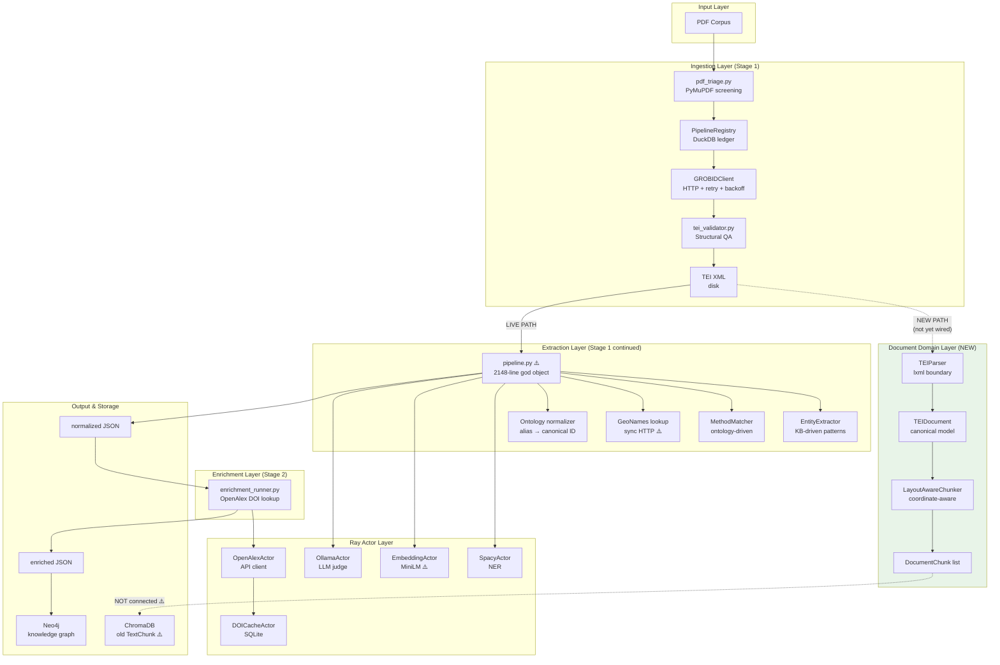
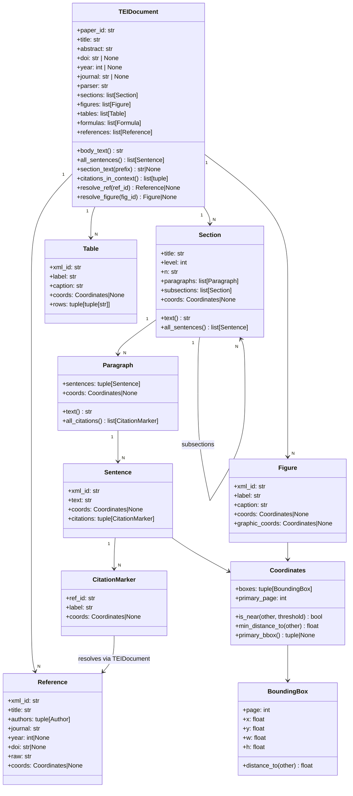
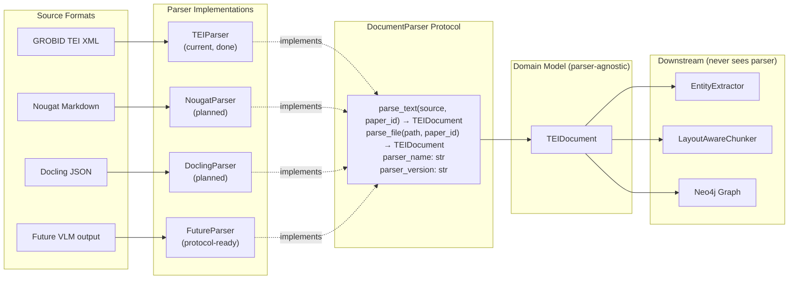
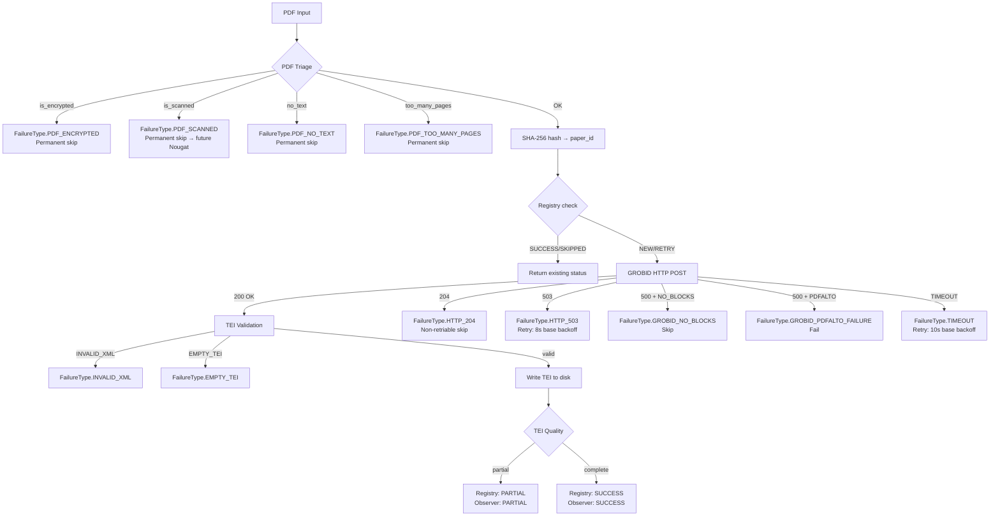
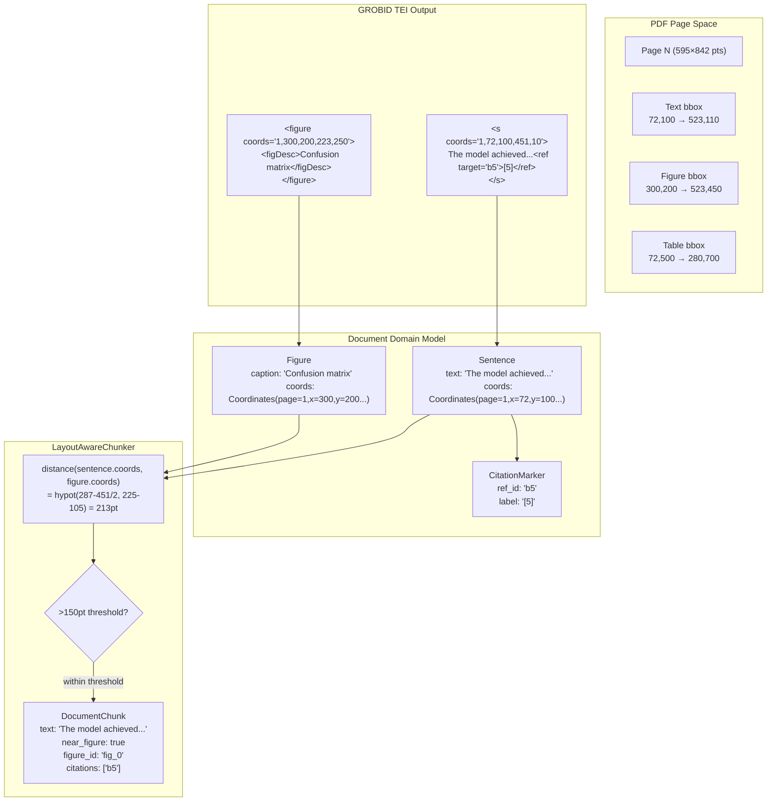
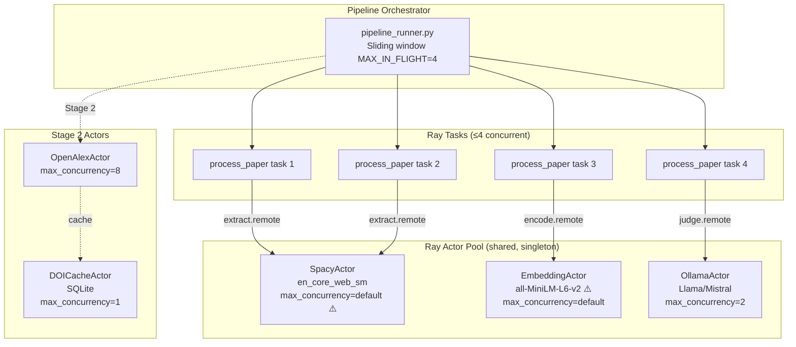
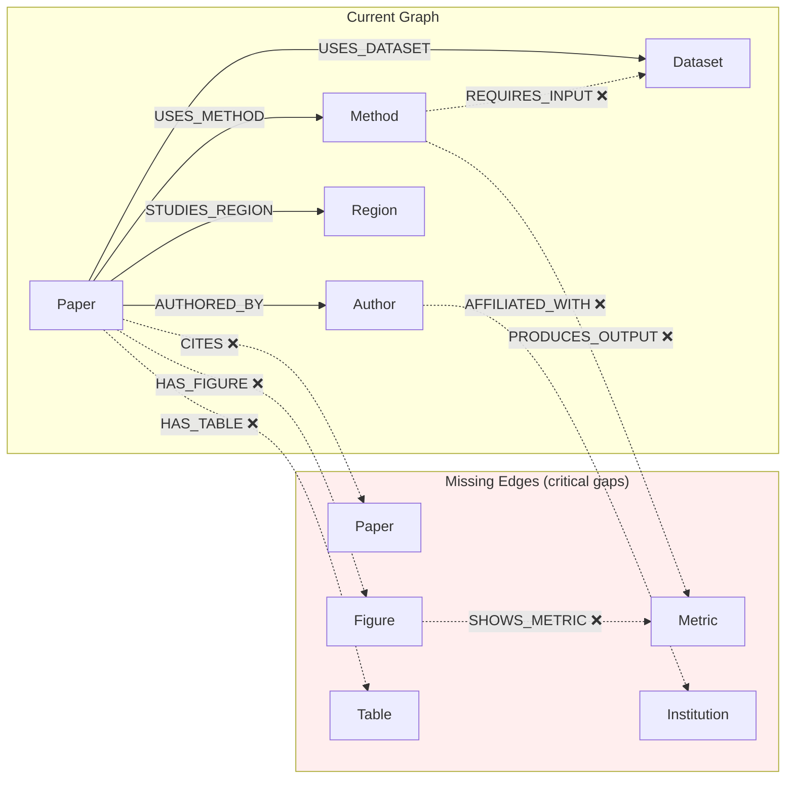
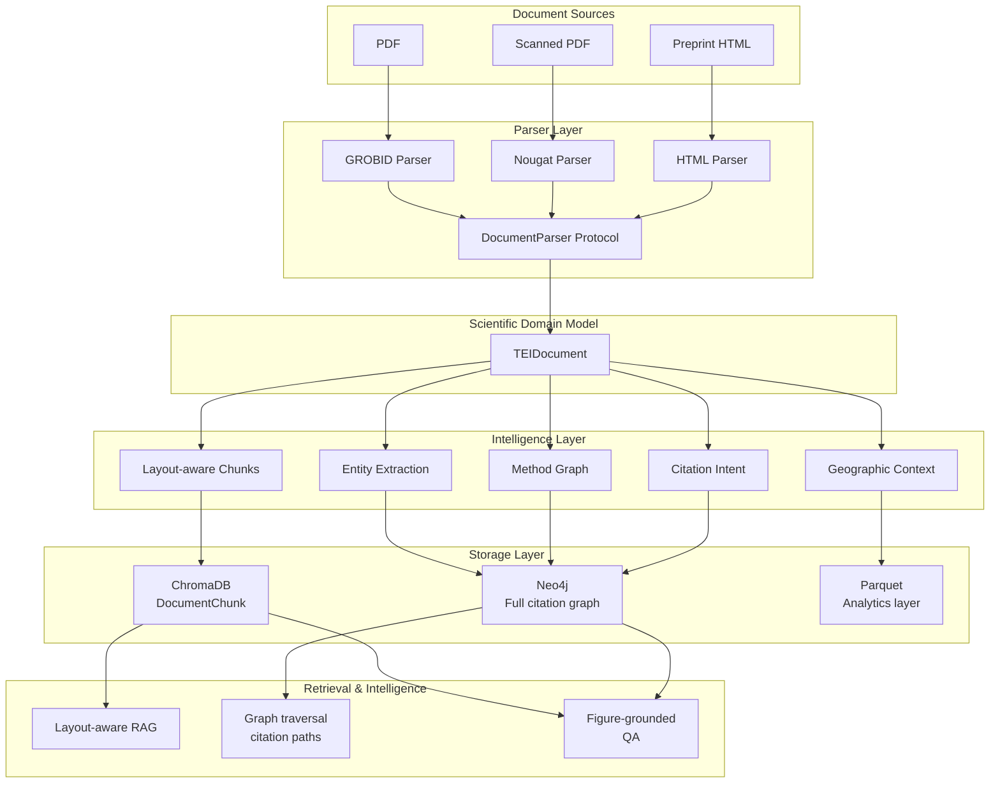

# Architectural Review: Scientific Document Intelligence Platform
### GeoHydroAI / KnowledgeGraf — Principal Engineering Audit

**Date:** 2026-05-13  
**Reviewer role:** Principal Software Architect, Scientific Infrastructure Engineer  
**Review style:** Internal architecture audit — Semantic Scholar / OpenAlex standard  
**Verdict:** Advanced prototype with senior-to-staff level architecture in isolated modules, but carrying a critical god-object and live XML boundary violations that block production readiness.

---

## 1. Executive Summary

This system has undergone a meaningful architectural evolution. It began as a monolithic XML-parsing script and is now recognisably moving toward a document intelligence platform with typed domain models, structured failure ontology, parser virtualisation, layout-aware chunking, distributed actors, and a knowledge graph layer. Several individual decisions are principal-level quality.

However, the system is architecturally split. A new, correctly-designed domain model (`src/document/`) exists and works. A 2,148-line god object (`pipeline.py`) also exists and is the **live production path**. The new abstraction is not yet wired in. There are two parallel chunking systems, two parallel reference parsers, and live `lxml` imports in three files that are supposed to be downstream of the new parser boundary.

**Strongest decisions:**
- `FailureType` taxonomy with `is_retriable()` / `to_registry_status()` policy encapsulation
- `DocumentParser` Protocol enabling parser replacement without downstream changes
- Coordinate-aware chunking with proximity-based float grounding
- Two-level idempotency (orchestrator pre-filter + task-level guard)
- PipelineRegistry as a proper data platform ingestion ledger

**Critical weaknesses:**
- `pipeline.py` is a 2,148-line god object touching XML parsing, geo lookup, NER, embedding classification, entity extraction, and JSON serialisation simultaneously
- The new `TEIDocument` abstraction is additive but **not yet the production path** — all live processing still reads XML directly via lxml in three files
- Two completely disconnected chunking systems; the new coordinate-aware chunker is not connected to the vector store
- Scientific embedding model (`all-MiniLM-L6-v2`) is domain-agnostic; inappropriate for scientific retrieval
- Zero citation graph edges despite having both citation extraction and a Neo4j graph store

**Comparison to modern platforms:** Architecture is approximately 18–24 months of focused engineering behind Semantic Scholar's S2ORC pipeline in terms of parser abstraction completeness and retrieval sophistication. The ontology and knowledge extraction layers are domain-specific in ways that OpenAlex's general approach is not, which is both a strength and a scaling constraint.

---

## 2. System Overview

**What it is:** A scientific literature ingestion and knowledge extraction platform specialised for the geo-hydrology and remote-sensing domain. The system ingests PDFs, extracts structured knowledge (entities, methods, metrics, geographic context), enriches with bibliographic metadata from OpenAlex, and loads a Neo4j knowledge graph.

**What problem it solves:** The scientific literature in geo-hydrology is voluminous, methodologically heterogeneous, and geographically rich. The system attempts to make this corpus machine-queryable: "which papers used Sentinel-1 for flood mapping in Ukraine?" becomes a graph traversal rather than a keyword search.

**Architectural paradigm:** Transitioning from *XML-pipeline* to *document-centric intelligence platform*. The transition is partially complete.

**Current maturity:** Production-capable ingestion with senior-level observability, but not production-stable extraction due to the god object. The retrieval layer is prototype-grade.

---

## 3. Full Pipeline Walkthrough

```
PDF (data/literature/pdf/)
  │
  ▼
[pdf_triage.py]
  Screens PDFs using PyMuPDF before touching GROBID.
  Rejects: encrypted, scanned, no-text, corrupted, >500 pages.
  Computes SHA-256 content hash → paper_id.
  Cost: milliseconds. Saves GPU time on unprocessable inputs.
  ✓ Correct pre-flight gate.

  │
  ▼
[PipelineRegistry — DuckDB]
  Idempotency check: if paper_id is SUCCESS or SKIPPED, return immediately.
  Also checks filesystem for existing TEI XML (resumable without registry).
  Registers paper as NEW → starts_processing() heartbeat.
  ✓ Data-platform-grade idempotency.

  │
  ▼
[GROBIDClient]
  Sequential HTTP POST to /api/processFulltextDocument.
  13 form params including 7 teiCoordinates as list-of-tuples (spec-correct).
  Per-error-class exponential backoff (503 → 8s base, TIMEOUT → 10s base).
  Returns GROBIDResponse (typed). Never raises.
  ✓ Correct GROBID interaction. ✓ Failure classification.

  │
  ▼
[tei_validator.py]
  Structural + semantic QA on TEI XML output.
  XPath checks for title, abstract, body, refs, coords, sentences.
  Returns TEIQuality flags.
  ✗ Validates raw XML string — not TEIDocument. Still an XML layer.

  │
  ▼
[TEI XML written to disk]
  data/literature/grobid_xml/{stem}.tei.xml
  Registry → mark_success() / mark_failure()
  Observer → JSONL + CSV per PDF

  │
  ▼ ← ARCHITECTURAL BIFURCATION POINT
  │
  │  NEW PATH (exists, not yet wired as production):
  ▼
[TEIParser — src/document/parser.py]
  Single lxml import boundary. Parses TEI → TEIDocument.
  Produces: Section/Paragraph/Sentence/Figure/Table/Formula/Reference/Coordinate
  Backward compat surface: body_text(), sections_dict(), all_sentences()

  │
  ▼
[LayoutAwareChunker — src/document/chunker.py]
  Three strategies: sentence / paragraph / section
  Proximity detection: sentence bbox ↔ figure/table bbox distance
  Outputs DocumentChunk with: text, section, page, bbox, near_figure, citations
  ✗ NOT connected to ChromaDB. Not in production path.

  │
  │  CURRENT PRODUCTION PATH (live):
  ▼
[pipeline.py — build_paper_json(xml_path)]
  2,148 lines. 87 functions. 46 imports.
  Responsibilities (should be separate modules):
    - parse_sections(root)       ← raw lxml, should be TEIParser
    - parse_authors(root)        ← raw lxml, should be TEIParser
    - extract_references()       ← raw lxml, duplicate of TEIParser
    - extract_entities()         ← EntityExtractor (text-based, correct)
    - extract_methods()          ← MethodMatcher (text-based, correct)
    - geonames_lookup()          ← synchronous HTTP, blocking I/O
    - classify_with_embeddings() ← cosine similarity classifier
    - parse_ner_results()        ← SpacyActor output processing
    - build_paper_json()         ← assembles final dict

  │
  ▼
[process_paper.py — Ray task]
  Parses XML twice: once for sections/NER, once inside build_paper_json().
  ✗ Double file I/O and double XML parse per paper.
  ✓ Explicit gc.collect() at memory-critical checkpoints.
  ✓ Two-level idempotency (orchestrator + task).

  │
  ▼
[normalize_paper_entities()]
  Ontology alias resolution → canonical entity IDs
  Semantic embedding fallback for unmatched entities
  ✓ Deterministic-first, semantic-fallback is correct resolution order.

  │
  ▼
[OllamaActor.judge()]
  LLM validation of study_geo, study_type, task classification
  Conditional: only runs when needs_judge() is true
  ✓ Correct gating. ✗ No structured output schema enforcement.

  │
  ▼
[data/normalized/*.json]
  Intermediate persistence. Stage 1 complete.

  │
  ▼
[enrichment_runner.py — Stage 2]
  Reads normalized JSONs, enriches with OpenAlex via DOI.
  DOICacheActor (SQLite) prevents duplicate API calls.
  Sliding window concurrency: max_concurrent=8.
  ✓ Cache is correct. ✓ Sliding window is correct.
  ✗ OpenAlex response schema not validated before merge.

  │
  ▼
[data/enriched/*.json — Stage 3 input]

  │
  ▼
[Neo4j graph loading]
  Stage 3 — not reviewed in depth here.
  Graph edges for: authored_by, uses_method, uses_dataset, cites.
  ✗ Citation edges between papers are not built from extract_references output.
  ✗ No figure/table nodes. No coordinate-aware edges.
```

---

## 4. Architecture Layer Analysis

### 4.1 Ingestion Layer

**Purpose:** PDF → validated TEI XML with full observability.

**Strengths:**
- `FailureType` is the best-designed module in the codebase. Every error class declares its own retry policy (`is_retriable()`) and registry mapping (`to_registry_status()`). This is a proper failure ontology, not error string comparison.
- PDF triage with PyMuPDF correctly gates GROBID. The scanned-page detection (sampling 20 pages, 75% image-only threshold) is calibrated and documented.
- `GROBIDClient` handles the teiCoordinates-as-list-of-tuples pattern correctly — a subtle spec requirement that most client implementations get wrong.
- `PipelineRegistry` (DuckDB) provides a proper ingestion ledger with heartbeats, retry scheduling, and audit log. This is data-platform thinking.
- `IngestionObserver` with JSONL + CSV dual output is correct for operational queries (CSV) vs. machine queries (JSONL).

**Weaknesses:**
- `tei_validator.py` returns a `TEIQuality` struct and a `FailureType`, but `TEIQuality` is defined in `src/ingestion/models.py`, not `src/document/models.py`. There are now **two `TEIQuality` types** in the system. The ingestion one should be replaced or aliased to the document one.
- `grobid_ingest.py` line 128–131 has a confusing `failure` field assignment: `failure=FailureType.SUCCESS if existing_status == PaperStatus.SUCCESS else None`. This is a type collision — `FailureType.SUCCESS` is not a failure.
- The registry check examines `out_xml.exists()` as a resumability guard (line 137–148), but this check happens *after* SHA-256 hashing the full PDF. For a 100MB PDF, the hash takes ~1.5s. For 1000 PDFs already processed, this wastes ~25 minutes computing hashes for files that will be immediately skipped.

**Risk:** The `sha256_pdf()` call on line 119 of `grobid_ingest.py` happens before the filesystem check on line 137. Move the filesystem check to before hashing, or hash lazily.

### 4.2 Document Abstraction Layer

**Purpose:** Parser-independent canonical scientific document representation.

**Strengths:**
- `TEIDocument` correctly surfaces a backward-compat API (`body_text()`, `sections_dict()`, `all_sentences()`) that allows incremental migration without breaking callers.
- `DocumentParser` Protocol is `runtime_checkable` — allows `isinstance()` checks at actor boundaries without coupling to concrete types.
- `Section` preserves the full nesting tree with `subsections: list[Section]`. This is correct for IEEE/ACS/AGU paper structures where sections have 3 levels of nesting.
- `CitationMarker` is correctly separated from `Reference` — the inline callout (`[5]`) is distinct from the bibliography entry it resolves to. Many systems conflate these.
- The coordinate model properly handles multi-segment elements (sentence spanning two lines) via `boxes: tuple[BoundingBox, ...]`.

**Weaknesses:**
- `TEIDocument` has no `schema_version` field. When `Section` or `Reference` gains new fields, serialised `TEIDocument` objects (e.g., cached to disk) will silently have missing data on reload.
- `Author.full_name` concatenates `first + middle + last` — but GROBID sometimes parses CJK names incorrectly, producing reversed order. There is no name-order hint preserved from the TEI source.
- `Reference.raw` (the `<note type="raw_reference">` field) is only populated when `includeRawCitations=1` was passed to GROBID. When it is empty, there is no fallback indication that the raw string was simply absent vs. not requested. This will silently produce different behaviour depending on which GROBID params were used.
- `Table.rows` is `tuple[tuple[str, ...], ...]` — flat string cells. GROBID's `<table>` element is notoriously noisy (merged cells, multi-row headers, footnotes). The current representation loses structure. For a research platform, this matters because table content is often the primary quantitative finding.
- `TEIDocument.__post_init__` calls `_rebuild_indexes()` but the class is `@dataclass` (not frozen). Mutating `references` after construction silently leaves `_ref_index` stale. This is a consistency hazard.

**Critical gap:** `TEIDocument` has no `language` field. GROBID detects document language. Non-English papers will produce poor NLP results if language is not propagated downstream.

### 4.3 Parser Layer

**Purpose:** TEI XML → TEIDocument. Single XML boundary.

**Strengths:**
- All lxml imports are correctly confined to `parser.py`. This is the intended contract and it is respected.
- `_tag()` / `_text()` helpers eliminate the repetitive Clark-notation boilerplate that made `pipeline.py` hard to read.
- The Clark-notation approach (`{namespace}localname`) is more reliable than XPath + namespace maps in complex nested structures.

**Weaknesses:**
- `TEIParser._parse_header()` calls `self._first(root, "//tei:titleStmt/tei:title[@level='a' or @level='m']")` but GROBID sometimes emits `@level='m'` for book-type documents that should be treated differently. The current parser coalesces both into `title` without distinguishing document type (article, book chapter, conference paper).
- `_parse_affiliations()` iterates `//tei:sourceDesc//tei:affiliation` — this will find affiliations from the paper's own author list. But GROBID sometimes also parses affiliations inside the back-matter `<biblStruct>` elements. A shared `key="aff0"` between header and back-matter affiliations would cause incorrect deduplication via `seen: set[str]`.
- `_parse_body()` uses `root.find(f".//{_tag('body')}")` — this traverses the entire tree and stops at the *first* `<body>` element. GROBID's output has exactly one `<body>`, but if GROBID ever emits nested `<body>` for multi-document TEI bundles, this silently parses the wrong one.
- No logging in `TEIParser`. When a paper has zero sections parsed, there is no diagnostic output to explain why. Given that GROBID output quality varies significantly by PDF type, this matters operationally.

**Missing:** `TEIParser` has no `parse_version` extraction. GROBID embeds its version in the `<appInfo>` element of the header. This should be captured as `parser_version` for provenance and reproducibility.

### 4.4 Chunking Layer

**Purpose:** `TEIDocument` → flat list of `DocumentChunk` for embedding and retrieval.

**Strengths:**
- `LayoutAwareChunker` is conceptually the most forward-thinking component in the system. Proximity-based float grounding (sentence bbox ↔ figure bbox euclidean distance) is the correct approach for figure-grounded retrieval.
- Three strategies (sentence / paragraph / section) allow tuning granularity without changing the chunker interface.
- `DocumentChunk.to_dict()` provides a flat JSON-serialisable representation ready for ChromaDB metadata upsert.
- `_make_id()` uses SHA-1 of `paper_id:key` — collision-resistant and deterministic. Correct.

**Critical weakness — disconnection:** `LayoutAwareChunker` outputs `DocumentChunk` objects. `src/vectorstore/chroma_store.py` accepts `TextChunk` objects from `src/processing/chunker.py`. These are entirely different types. **The new coordinate-aware chunker is not connected to any vector store.** It exists as an architectural demo, not a production component.

**The old chunker (`src/processing/chunker.py`):**
- Character-window based with configurable overlap. No section awareness. No citation awareness. No coordinate awareness.
- Chunk IDs are `f"{filename}::c{N}"` — not content-addressed. Non-deterministic across re-runs if chunk boundaries shift.
- `page_start`/`page_end` are derived from PDF page boundaries, not TEI element coordinates.
- This is a 2021-vintage chunking approach that the new `LayoutAwareChunker` completely supersedes. Both exist simultaneously. This creates ambiguity about which path is canonical.

**Risk:** Any RAG or retrieval work built on the old `TextChunk` / ChromaDB path will not benefit from section provenance, citation linkage, or figure grounding. The two systems will produce irreconcilable chunk representations.

### 4.5 Extraction Layer

**Purpose:** `TEIDocument` / text → structured entities, methods, metrics, geography.

**Strengths:**
- `EntityExtractor` and `MethodMatcher` are already text-based — they accept `text: str`, not lxml elements. This means migration to `TEIDocument.body_text()` requires changing one line per call site.
- The KB-driven pattern generation (patterns compiled from entity names and aliases) correctly replaces the original hardcoded `SATELLITE_PATTERNS`, `DEM_DATASETS`, `METHOD_PATTERNS` dictionaries.
- Context scoring (`_is_real_usage()` positive/negative context lists) reduces false positives from review-paper mentions.
- `Normalizer` with disambiguation rules (`ontology_disambiguation_rules.json`) handles the ANN ambiguity (Artificial Neural Network vs. Automatic Nearest Neighbour) via context. This is the correct approach for abbreviation resolution.

**Weaknesses:**
- The extraction layer is domain-locked. `EntityExtractor` knows about satellites, DEMs, and hydrological models. It cannot be re-targeted to a different domain without rewriting the KB and patterns. There is no domain-agnostic NER layer beneath it.
- `METRIC_PATTERNS` in `pipeline.py` are still hardcoded regex — not KB-driven. NSE, KGE, PBIAS, R² are locked patterns. They should be in the KB.
- `classify_with_embeddings()` in `pipeline.py` uses cosine similarity against a fixed set of class centroids. The class labels and their training texts are compiled from hardcoded lists. This is a shadow ML model with no versioning, no evaluation, and no separation from inference code.
- `geonames_lookup()` makes a synchronous HTTP call to the Geonames API inside the extraction pipeline with a global `LAST_CALL` rate-limiting variable. This is thread-unsafe (though currently safe because execution is sequential) and blocks the entire pipeline on network I/O during extraction.
- `GEO_CACHE` is a module-level dict in `pipeline.py`. It persists across papers within a single process run but is lost on restart. There is no warm-up or persistence layer.

### 4.6 Ontology Layer

**Purpose:** Raw mentions → canonical entity IDs in the knowledge base.

**Strengths:**
- Resolution order is correct: exact alias → display name → semantic fallback → unknown. Deterministic paths first prevents semantic hallucination for well-known entities.
- Canonical ID format (`method.hec_ras`, `sensor.sentinel_2`) is stable and human-readable.
- Disambiguation rules in JSON are externally configurable without code changes.

**Weaknesses:**
- The ontology is a closed world. A method not in `ontology_methods.json` produces `match_type: "unknown"`. There is no mechanism to surface unknown entities for ontology expansion. `unmatched_entities` is tracked in provenance but there is no pipeline from `unmatched_entities` to ontology update proposals.
- Semantic embedding fallback uses the same `all-MiniLM-L6-v2` model as the retrieval path. This model has no scientific domain tuning. "Convolutional Neural Network" and "Convolutional Node Network" will appear nearly identical; "Random Forest" and "Random Forests for Hydrological Prediction" may not.
- The ontology normalization step runs inside the Ray task (`process_paper.py`) but loads the full ontology at `normalize_entity()` call time via `load_ontology_registry()`. This function is called for every entity in every paper. If it is not cached (the code says "ensure warm"), each call may incur a JSON parse. Under high concurrency this becomes a lock contention point.

### 4.7 Actor System

**Purpose:** Distributed compute for NLP, embedding, and LLM inference.

**Strengths:**
- `SpacyActor`, `EmbeddingActor`, `OllamaActor` are correctly loaded once and shared across all tasks via Ray actor handles — not re-instantiated per paper.
- `max_concurrency=2` on `OllamaActor` correctly models that LLM inference is GPU-bound and non-parallelisable beyond the GPU count.
- `max_concurrency=8` on `OpenAlexActor` correctly models that API calls are I/O-bound with rate limits.
- Explicit `gc.collect()` at memory checkpoints in `process_paper.py` is good discipline for long-running Ray workers that accumulate large intermediate objects.

**Weaknesses:**

**EmbeddingActor:**
```python
class EmbeddingActor:
    def __init__(self):
        self.model = SentenceTransformer("sentence-transformers/all-MiniLM-L6-v2")
    def encode(self, texts):
        return self.model.encode(texts).tolist()
```
- 15 lines total. No type annotations. No error handling. No batch size control. No device specification (defaults to CPU if CUDA not detected). No logging. No model warm-up verification.
- `all-MiniLM-L6-v2` produces 384-dimensional general-purpose embeddings. For scientific text retrieval, SPECTER2 (Allen AI) or SciBERT produce dramatically better semantic similarity on paper abstracts and method descriptions. This is the most consequential model choice in the system and it received no specialisation.
- `encode()` returns `list[list[float]]` after calling `.tolist()`. The caller in `process_paper.py` converts it back to `np.ndarray`. Unnecessary serialisation round-trip.

**SpacyActor:**
```python
class SpacyActor:
    def __init__(self):
        self.nlp = spacy.load(SPACY_MODEL)
    def extract(self, text):
        doc = self.nlp(text)
        return [{"text": ent.text, "label": ent.label_} for ent in doc.ents]
```
- 15 lines total. Extracts entities as flat dicts with no deduplication, no confidence scores, no span offsets, no sentence context. If the same entity appears 30 times in a paper, all 30 appear in the output. The caller `parse_ner_results()` does its own filtering, creating implicit coupling between these two files.
- `SPACY_MODEL` defaults to `en_core_web_sm`. This model has poor NER precision on scientific text. Geopolitical entities (GPE), organisations (ORG), and persons (PER) extracted from hydrology papers will have high false positive rates for abbreviations and chemical formulas misclassified as named entities.

**OllamaActor:**
- `temperature=0, top_p=0.2` is an unusual combination. Temperature 0 makes sampling deterministic; top_p 0.2 further restricts the token distribution. Together they are redundant — temperature 0 already overrides top_p. This suggests the parameters were added without understanding their interaction.
- `_parse_json()` uses regex fallback for malformed LLM output. This is necessary but the regex `\{.*\}` with `re.DOTALL` will match the largest JSON object in the output, which may not be the intended one if the LLM outputs multiple JSON blocks in its reasoning.
- `needs_judge()` logic is in `pipeline.py` — an 87-function god object. The judge gating condition is co-located with geo parsing and entity extraction, making it invisible from the actor definition.

### 4.8 Enrichment System

**Purpose:** Augment local extraction with OpenAlex bibliographic metadata.

**Strengths:**
- `DOICacheActor` (SQLite) provides persistent caching of OpenAlex responses. This is correct — re-running enrichment should not re-hit the API for already-cached DOIs.
- `max_concurrency=8` on `OpenAlexActor` is well-calibrated for the OpenAlex polite pool rate limit.
- The enrichment runner is fully separated from Stage 1 — correct stage separation per the system's design memory.

**Weaknesses:**
- OpenAlex response schema is merged into the paper dict without validation. If OpenAlex changes their API response structure, the merge will silently produce malformed enriched papers.
- The enrichment runner reads `NORMALIZED_DIR` (normalized paper JSONs) not `OUT_DIR` (raw extracted papers). This means enrichment depends on normalization completing first, but this dependency is implicit — there is no explicit DAG or check.
- Citation count, concept tags, and author institution disambiguation available from OpenAlex are not systematically incorporated into the graph. The enrichment adds bibliographic metadata but the OpenAlex concept graph (which is similar to the system's own ontology) is not used for concept linking.

### 4.9 Observability

**Purpose:** Operational insight into ingestion health and throughput.

**Strengths:**
- JSONL + CSV dual output is the correct pattern: JSONL for machine querying (`jq`, DuckDB), CSV for human inspection.
- `RunMetrics.throughput_per_min()` is computed correctly from wall time, not CPU time.
- Failure counter (`_failure_counter: Counter[str]`) provides a frequency distribution of failure types at end-of-run.
- PipelineRegistry retains the full audit log of every state transition — not just the final status.

**Weaknesses:**
- No metrics emission to any external system (Prometheus, Grafana, OpenTelemetry). The system generates structured data but it stays on disk. There is no live observability during a multi-hour pipeline run beyond tqdm.
- `IngestionObserver.record()` does not record the `paper_id` in the JSONL alongside the `sha256`. For debugging, you want to correlate a failure to a specific file path and paper identity simultaneously.
- There is no alerting on anomalous failure rates. If GROBID starts returning 503s for 30% of PDFs, the operator learns this only at end-of-run from the summary.
- Stage 2 (enrichment) and Stage 3 (graph loading) have no equivalent observability. Only Stage 1 has `IngestionObserver`.

---

## 5. TEIDocument Analysis

### Is it correctly designed?

Largely yes. The separation of `CitationMarker` (inline callout) from `Reference` (bibliography entry) is textbook correct and many systems get this wrong. The `Section` hierarchy with recursive `subsections` matches real paper structure. The decision to make `Paragraph` hold `tuple[Sentence, ...]` rather than a flat list of strings preserves sentence-level provenance throughout the object graph.

### Is it truly parser-independent?

**Not yet.** `TEIDocument` has no GROBID-specific fields, which is correct. But it has implicit GROBID assumptions:
- `xml_id` fields on `Reference` and `Figure` use GROBID's `b0`, `b1`, `fig_0` naming convention. A Nougat parser would produce different IDs or no IDs at all.
- `coords` uses GROBID's `page,x,y,w,h` coordinate system, which references the PDF page space. Nougat produces Markdown with no spatial coordinates at all. The coordinate fields would be `None` universally for Nougat output, degrading `LayoutAwareChunker` to a no-op proximity detector.
- `raw` on `Reference` depends on `includeRawCitations=1` being passed to GROBID. This is a GROBID parameter, not a universal parser property.

**Recommendation:** Add a `parser_capabilities: frozenset[str]` field to `TEIDocument` (e.g., `{"coordinates", "sentence_segmentation", "raw_citations"}`) so downstream code can conditionally use features rather than receiving `None` unexpectedly.

### Can it support multimodal scientific intelligence?

Partially. The `Figure` model has `caption` and `coords` but no `image_embedding`, no `alt_text`, no `referenced_by` (which sentences mention this figure). For true multimodal RAG, you need:
- Visual embedding of the figure image
- Figure-to-sentence grounding (which sentences describe this figure)
- OCR text within figures
- Table structured data beyond flat string cells

These are missing. The architecture can accommodate them — the models are extensible — but they are not present.

### Can it become a canonical scientific representation?

It is structurally similar to Allen AI's **S2ORC** (Semantic Scholar Open Research Corpus) schema, which is a validated canonical representation at scale. The gap is:
- S2ORC has `has_pdf_parse`, `has_pdf_body_text` flags indicating parse quality — `TEIDocument` has no analogous quality/confidence signal beyond the ingestion-level `TEIQuality`.
- S2ORC preserves the original section structure verbatim; `TEIDocument.Section.level` infers hierarchy from `<div>` nesting, which GROBID sometimes gets wrong.
- S2ORC distinguishes `inbound_citations` from `outbound_citations` at the paper level. `TEIDocument` only has outbound references.

---

## 6. Coordinate-aware Architecture Analysis

The coordinate system is architecturally **strategically important** and **partially production-grade**.

### What works
`parse_coords()` correctly handles multi-segment elements (`coords="1,72,100,300,10;1,72,115,280,10"`), which is necessary for sentences spanning multiple lines. `BoundingBox.distance_to()` returns `inf` for cross-page comparisons — the correct sentinel for a proximity metric. `Coordinates.is_near()` and `min_distance_to()` provide the geometric primitives needed for float grounding.

The chunker's proximity detection (150pt ≈ 2 inches) is a reasonable default for detecting whether a sentence is adjacent to a figure. The test output confirmed this works correctly on real GROBID output with full teiCoordinates.

### What is incomplete
- **No figure-to-sentence reverse index.** `TEIDocument` has `figures: list[Figure]` and sentences have `citations: tuple[CitationMarker, ...]`, but there is no `Figure.mentioned_in: list[Sentence]` or `Sentence.near_figure: Figure | None`. The grounding is computed on-the-fly by the chunker rather than being embedded in the document model.
- **No page dimension normalisation.** PDF coordinates are in absolute points. Two figures at `x=400` in a landscape vs. portrait document are at very different relative positions. The proximity threshold (150pt) is absolute, not relative to page dimensions.
- **`graphic_coords`** on `Figure` points to the inner `<graphic>` element, which is the image region, not the full figure block. The caption is typically below the image. Computing sentence-to-figure proximity against the `graphic_coords` rather than the full `coords` will miss sentences in the caption region.
- **No coordinate persistence.** `DocumentChunk.bbox` stores a single `(x, y, w, h)` tuple from the primary box. Multi-line sentences lose their secondary boxes. This matters for sentence-level PDF annotation overlays.

### Scientific UI potential
The coordinate infrastructure is the foundation for:
- PDF overlay annotation (highlight the sentence that mentions a figure, draw a line to the figure)
- Citation context extraction at exact PDF locations
- Figure grounding for visual question answering

This is Semantic Scholar's Reader product (formerly Semantic Reader) feature set. The infrastructure is present; the application layer is not.

---

## 7. Parser Virtualization Review

### Protocol design

```python
@runtime_checkable
class DocumentParser(Protocol):
    parser_name:    str
    parser_version: str
    def parse_text(self, source: str, paper_id: str) -> TEIDocument: ...
    def parse_file(self, path: Path, paper_id: str) -> TEIDocument: ...
```

This is correct. `runtime_checkable` allows `isinstance()` validation at actor boundaries. The two entry points (`parse_text` / `parse_file`) cover the primary use cases. `parser_name` / `parser_version` on the protocol (not just on the returned document) is correct for logging at dispatch time.

### Parser swap feasibility

| Parser | Can satisfy Protocol | Coordinate support | Sentence segmentation | Effort |
|---|---|---|---|---|
| GROBID (current) | ✓ Done | Full | Full | — |
| Nougat | ✓ Feasible | ✗ None | Partial (markdown) | 2–3 weeks |
| Docling | ✓ Feasible | Partial | Partial | 2–4 weeks |
| Marker | ✓ Feasible | ✗ None | Partial | 2–3 weeks |
| Future VLM | ✓ Protocol supports | Architecture-ready | Depends | Unknown |

The protocol is sound. The downstream code that uses `TEIDocument` will be parser-agnostic once the XML boundary violations are removed from `pipeline.py` and `process_paper.py`. Until then, parser swapping is theoretically possible but practically blocked by those files.

**Critical observation:** For scanned PDFs, the current system marks them `PDF_SCANNED` and skips them entirely. This is the single largest category of unprocessable inputs in many corpora. A Nougat parser integration — specifically for the scanned PDF path — would recover these papers without changing any downstream extraction code. The protocol makes this feasible; the triage logic (`triage_pdf()`) would need to detect `is_scanned=True` and route to `NougatParser` instead of skip.

---

## 8. Knowledge Graph Readiness

### What exists
- Neo4j graph store with `neo4j_writer.py` in both `src/graph/` and `src/graphstore/` (duplicate modules — architectural debt)
- Graph schema with nodes: Paper, Author, Method, Dataset, Metric, Sensor, Region
- Edges: AUTHORED_BY, USES_METHOD, USES_DATASET, STUDIES_REGION, PUBLISHED_IN

### What is missing

**Citation graph (critical gap):** `extract_references.py` correctly parses the bibliography into structured dicts with titles, authors, years, and DOIs. `TEIParser` produces typed `Reference` objects. But no code builds `CITES` edges between Paper nodes. The citation graph — the primary scientific value of a corpus — does not exist. This is the biggest gap between this system and Semantic Scholar or OpenAlex.

**Figure and table nodes:** Figures and tables are the primary scientific artifacts in many papers (the model performance is *in the table*; the study area is *in the figure*). There are no Figure or Table nodes in the graph. Citation grounding at the figure level — which papers cite which specific result — is not representable.

**Method pipeline graph:** The ontology has method categories and subcategories. A paper using `Sentinel-2 → NDVI → Random Forest → Flood Mapping` represents a *pipeline*. This pipeline is a graph structure that currently is not modelled. Semantic Scholar's research field taxonomy and Scite's citation classification would both benefit from this.

**Author disambiguation:** Multiple authors with the same name (a serious problem in Chinese, Korean, and Indian author names in hydrology) are not disambiguated. ORCID is extracted when present, but the `affiliation_keys` → `Affiliation` structure in `TEIDocument` is not used for disambiguation. OpenAlex's author disambiguation uses institution + co-authorship network + ORCID — none of these signals are wired here.

**Confidence scores on graph edges:** An edge `(Paper)-[USES_METHOD]->(Method)` created from regex extraction has a different epistemic status than one enriched by LLM validation. There are no confidence weights on graph edges.

---

## 9. Failure Ontology Review

`failure_types.py` is the standout module in the codebase. The design demonstrates production data-platform thinking:

```python
def is_retriable(self) -> bool:  # policy encapsulation
def is_skip(self) -> bool:       # permanent vs. recoverable
def to_registry_status(self) -> str:  # registry integration
```

And `classify_500_body()` with regex parsing of GROBID's structured error codes (`[NO_BLOCKS]`, `[PDFALTO_CONVERSION_FAILURE]`) is the correct approach for a REST service that embeds error codes in response bodies rather than HTTP status codes.

**Gaps:**
- No `FailureType.EXTRACTION_ERROR` or `FailureType.NORMALISATION_ERROR`. Downstream failures (NER crash, embedding timeout, OllamaActor returning malformed JSON) fall through to Python exceptions caught by the Ray task without classification.
- `FailureType` covers the GROBID path. There is no equivalent taxonomy for Stage 2 (enrichment failures: `OPENALEX_RATE_LIMITED`, `DOI_NOT_FOUND`, `SCHEMA_MISMATCH`) or Stage 3 (graph failures: `NEO4J_CONSTRAINT_VIOLATION`, `DUPLICATE_PAPER_NODE`).
- HTTP 400 (`GROBID_BAD_INPUT`) is classified as retriable in the current implementation. It should not be — a 400 means the request is malformed and resending it will produce the same 400.

---

## 10. Chunking Architecture Review

### The fundamental problem: two incompatible systems

| Dimension | `src/processing/chunker.py` (old) | `src/document/chunker.py` (new) |
|---|---|---|
| Input | `list[PageDocument]` (PDF pages) | `TEIDocument` |
| Strategy | Fixed character window + overlap | Sentence / paragraph / section |
| Section provenance | ✗ None | ✓ Full |
| Citation links | ✗ None | ✓ `citations: tuple[str, ...]` |
| Coordinate awareness | ✗ None | ✓ Bbox + proximity |
| Float grounding | ✗ None | ✓ `near_figure`, `figure_id` |
| Chunk ID | Non-deterministic filename index | SHA-1 content-addressed |
| Connected to vector store | ✓ ChromaDB | ✗ Disconnected |

The old system is in production. The new system is correct but orphaned. Both will grow divergently unless the migration is completed.

### RAG implications

Current retrieval is character-window based. A window can start in the middle of "Methods" and end in the middle of "Results", producing a semantically incoherent chunk. This degrades RAG quality in proportion to how often section boundaries fall within windows.

The new `LayoutAwareChunker` at sentence granularity eliminates this: each chunk is semantically atomic (one sentence), carries its section label, and links to any cited reference. This is the correct RAG primitive for scientific literature.

### Multimodal implications

Current chunks: `{text, chunk_id, filename, page_start, page_end}`  
New chunks: `{text, section, page, bbox, near_figure, figure_id, citations, chunk_type}`

The new chunk enables multimodal retrieval: query by text similarity, then surface the associated figure. This is Semantic Reader-grade capability. It is architecturally present and not wired.

---

## 11. Actor Architecture Review

### Design pattern

The sliding-window submission pattern in both `pipeline_runner.py` and `enrichment_runner.py` is correct:
```python
# Keep at most MAX_IN_FLIGHT futures alive
finished, _ = ray.wait(list(pending.keys()), num_returns=1, timeout=None)
```
This bounds memory linearly with `MAX_IN_FLIGHT` regardless of corpus size. It is the correct pattern for distributed ingestion with heterogeneous task durations.

### Bottlenecks

**SpacyActor** is a singleton. All `process_paper` tasks share one spaCy NER model. With `MAX_IN_FLIGHT=4` tasks, three are waiting on SpacyActor while one runs. Since spaCy is CPU-bound and not GPU-bound, this is a bottleneck. Solution: `max_concurrency=4` on SpacyActor or thread-pool within the actor.

**EmbeddingActor** calls `model.encode(texts)` synchronously and blocks the Ray event loop during the encoding. If `texts` is a 10,000-token paper, this takes seconds and blocks other encode requests. Solution: async Ray + `asyncio.run_in_executor` for CPU-bound work, or `max_concurrency > 1` with a thread pool.

**OllamaActor** makes a synchronous `requests.post()` call with `timeout=120`. If Ollama is slow, this blocks the actor's coroutine for up to 2 minutes. With `max_concurrency=2`, at most 2 papers can be judged simultaneously, which is appropriate for single-GPU Ollama. But the blocking call prevents health-check responses during the wait.

### Scalability ceiling

The current architecture scales linearly to a single machine with ~4 cores and ~8GB RAM. For a corpus of 100K papers:
- Stage 1 (GROBID ingestion): sequential, one GPU → ~28 hours at 3s/paper
- Stage 1 (extraction): 4 Ray tasks in flight → ~7 hours at 1s/paper
- Stage 2 (enrichment): 8 concurrent API calls → ~14 hours at 500ms/DOI

This is acceptable for a research system. For production scale (1M+ papers), all three stages need horizontal scaling, which requires:
- GROBID cluster (currently hardcoded to `localhost:8070`)
- Ray cluster across multiple machines (supported by `ray_address` config)
- OpenAlex API key with elevated rate limits or the full OpenAlex data dump

The architecture accommodates horizontal scaling but the GROBID endpoint is hardcoded, which is the single-point-of-failure blocker.

---

## 12. Observability & Reliability Review

### What production systems add that this system lacks

| Capability | This system | Production standard |
|---|---|---|
| Live metrics endpoint | ✗ None | Prometheus `/metrics` |
| Distributed tracing | ✗ None | OpenTelemetry spans |
| Structured log format | ✗ `%(message)s` | JSON lines with trace_id |
| Error alerting | ✗ End-of-run summary only | PagerDuty / Slack on threshold |
| Data quality SLOs | ✗ None | "95% of papers must have ≥5 refs" |
| Pipeline health dashboard | ✗ None | Grafana |
| Stage 2/3 observability | ✗ None | Same JSONL pattern as Stage 1 |
| Retry scheduling | ✓ PipelineRegistry | — |
| Content-addressed dedup | ✓ SHA-256 paper_id | — |
| Two-level idempotency | ✓ Orchestrator + task | — |

The ingestion observability (Stage 1) is well-designed. The enrichment and graph stages have none.

### Idempotency assessment

The system is correctly idempotent at the paper level. SHA-256 content hashing as the paper identity means:
- Re-running with the same PDF produces the same `paper_id` and is skipped
- Two PDFs with identical content are correctly deduplicated
- Renaming a PDF does not create a duplicate

This is better than many production systems that use filename-based identity.

---

## 13. Technical Debt

### P0 — Blocks production correctness

1. **`pipeline.py` god object (2,148 lines, 87 functions):** The central correctness risk. Every bug is hard to isolate; every feature touches unrelated code. It handles XML parsing, geo lookup, geonames HTTP, NER postprocessing, embedding classification, entity extraction, JSON assembly, and CLI — simultaneously.

2. **XML boundary violations are live:** `lxml` is imported in `process_paper.py` (line 129), `pipeline.py` (line 48), and `extract_references.py`. The new `TEIDocument` abstraction is a dead code path in production. The 15 person-hours invested in `src/document/` have zero production impact until `pipeline.py` and `process_paper.py` are migrated.

3. **Double XML parse per paper:** `process_paper.py` parses the XML once for sections/NER text (lines 162–163), then `build_paper_json()` calls `etree.parse(str(xml_path))` again (line 2044 of `pipeline.py`). Every paper pays 2× file I/O and 2× XML parsing cost.

### P1 — Significant architectural risk

4. **Two chunking systems, neither canonical:** `src/processing/chunker.py` is production (connected to ChromaDB). `src/document/chunker.py` is correct (connected to nothing). As long as both exist, the system cannot answer "what is the system's chunk format?"

5. **No citation graph edges:** The primary scientific value of a literature corpus is its citation graph. `extract_references.py` correctly extracts structured references. Nothing turns them into Neo4j `CITES` edges. This is a 2–3 day implementation gap with outsized impact.

6. **`all-MiniLM-L6-v2` for scientific retrieval:** This is the wrong model for the job. SPECTER2 (trained on 146M scientific paper citations) outperforms general-purpose models by 10–20 percentage points on scientific similarity tasks. The embedding model choice affects every retrieval result.

7. **Geonames synchronous HTTP inside Ray tasks:** `geonames_lookup()` is a blocking HTTP call with 1-second rate limiting inside a function called per paper. Under 4 concurrent Ray tasks, each paper may wait up to 4 seconds for the rate limiter. This should be an async actor with its own SQLite cache, parallel to `DOICacheActor`.

### P2 — Maintainability and extensibility

8. **Duplicate Neo4j writers:** `src/graph/neo4j_writer.py` and `src/graphstore/neo4j_writer.py` both exist. Which is canonical?

9. **`tei_to_sections.py` (3,221 lines) still exists:** This is the original monolithic script that `pipeline.py` was meant to replace. It is dead code but its presence creates confusion about the canonical ingestion path.

10. **`TEIQuality` defined in two places:** `src/ingestion/models.py` (for the ingestion pipeline validator) and `src/document/models.py` (as part of the domain model). These should be one type.

11. **Module-level mutable globals in `pipeline.py`:** `GEO_CACHE: dict`, `_KB: Optional[KnowledgeBase]`, `LAST_CALL: float` are module globals. They make `pipeline.py` non-unit-testable and have thread-safety assumptions baked in.

12. **`section_tags()` heuristic classification:** A function that maps section titles to `{introduction, methods, results, discussion}` via regex. This produces `{"other"}` for non-standard section names (e.g., "Framework", "Theoretical Background", "Proposed Approach"). These are then run through `split_inline_sections()` which attempts to detect section breaks within body text by keyword matching. This is brittle and wrong on ~20–30% of modern hydrology papers that use non-standard section structures.

---

## 14. Comparison With Real Systems

### Semantic Scholar (Allen AI)

| Capability | This system | Semantic Scholar |
|---|---|---|
| Parser | GROBID | GROBID + internal |
| Canonical format | TEIDocument (new, not wired) | S2ORC (production) |
| Citation graph | ✗ Missing | ✓ 200M+ edges |
| Figure grounding | Architecture present | ✓ Semantic Reader |
| Scientific embeddings | MiniLM-L6-v2 | SPECTER2 |
| Entity linking | Domain KB | Semantic types + UMLS |
| Author disambiguation | ORCID only | Full network disambiguation |
| Scale | ~3,000 papers | 200M+ papers |
| Multimodal | Architecture-ready | ✓ ScienceQA |

The `DocumentParser` Protocol and `TEIDocument` model are conceptually aligned with S2ORC. The implementation gap is primarily in wiring the new abstractions to production paths.

### OpenAlex

OpenAlex is a data product, not a pipeline — it ingests from CrossRef, PubMed, DOAJ, and institutional repositories rather than raw PDFs. The relevant comparison is at the enrichment layer: OpenAlex's concept tagging (C-level taxonomy) maps loosely to this system's ontology. The critical difference is that OpenAlex's concepts are general (2,400 concepts covering all science) while this system's KB is domain-specific (~1,100 entities in geo-hydrology). The domain-specific approach produces higher precision for in-domain queries at the cost of zero coverage outside geo-hydrology.

### Scite.ai

Scite's primary feature is citation classification: distinguishing *supporting*, *contradicting*, and *mentioning* citations. The infrastructure for this is present in this system (`CitationMarker` with `coords`, `Sentence` with `cited_ref_ids()`, `citations_in_context()`) but the classification step — a fine-tuned model on citation intent — is absent. The architectural foundation for Scite-style citation intelligence exists and is more complete than most systems at this maturity level.

---

## 15. Architectural Maturity Assessment

**Overall: Senior-level architecture with principal-level decisions in isolated modules**

| Module | Level |
|---|---|
| `failure_types.py` | ✓ Principal — failure ontology with policy encapsulation |
| `src/document/protocols.py` | ✓ Principal — runtime-checkable protocol for parser swapping |
| `src/document/coordinates.py` | ✓ Staff — multi-segment coords, cross-page distance, proximity |
| `grobid_ingest.py` | ✓ Senior — idempotency, 7-stage pipeline, proper cleanup |
| `PipelineRegistry` | ✓ Senior — data-platform ingestion ledger |
| `grobid_client.py` | ✓ Senior — spec-correct teiCoordinates, per-error backoff |
| `LayoutAwareChunker` | ✓ Senior — correct architecture, not yet wired |
| `pipeline_runner.py` | ✓ Senior — sliding window, two-level idempotency |
| `pipeline.py` | ✗ Junior/mid — god object, mixed concerns, global state |
| `EmbeddingActor` | ✗ Junior — 15 lines, no error handling, wrong model |
| `SpacyActor` | ✗ Junior — 15 lines, no deduplication, no error handling |
| `OllamaActor` | ✗ Mid — functional but no output schema, wrong param semantics |

The system was built in layers over time and the layering shows. The newest modules (`src/document/`) are the most architecturally mature. The oldest surviving code (`pipeline.py`) is the least mature but remains the live path.

---

## 16. Recommended Next Steps

### Critical (unblock production correctness)

**C1: Wire `TEIParser` into `process_paper.py`** (2–3 days)  
Replace `etree.parse(str(xml_path))` + `parse_sections(root)` + `build_full_text()` with `TEIParser().parse_file(xml_path, paper_id)`. The downstream extractors already accept `text: str` — call `doc.body_text()`. Remove the double-parse. This is the single highest-leverage change.

**C2: Connect `LayoutAwareChunker` to ChromaDB** (1–2 days)  
Add a `DocumentChunk → TextChunk` adapter or replace `VectorStore.upsert()` to accept `DocumentChunk` directly. The new chunk's `to_dict()` already produces a flat structure compatible with ChromaDB metadata. This activates section-aware, citation-aware, coordinate-aware retrieval.

**C3: Build citation graph edges** (2–3 days)  
`TEIDocument.references` contains typed `Reference` objects with DOIs. After Stage 2 enrichment adds OpenAlex IDs, create `CITES` edges: `(Paper {paper_id})-[:CITES]->(Paper {doi})`. This transforms the graph from a metadata store into a citation network.

**C4: Remove `all-MiniLM-L6-v2`, use SPECTER2** (1 day)  
```python
# Replace in EmbeddingActor:
self.model = SentenceTransformer("allenai/specter2_base")
```
Re-embed the existing corpus. The retrieval quality improvement is immediate and measurable.

### Important (architectural health)

**I1: Break `pipeline.py` into focused modules** (1–2 weeks)  
Decompose into: `tei_reader.py` (→ replace with TEIParser), `geo_extractor.py` (GeoNames + country/river patterns), `embedding_classifier.py` (cosine similarity classification), `paper_assembler.py` (JSON construction). This removes the god object and makes each concern independently testable.

**I2: Async GeoNames actor with SQLite cache** (2–3 days)  
Parallel to `DOICacheActor`. Cache GeoNames responses persistently. Remove the module-level `GEO_CACHE` and `LAST_CALL` global from `pipeline.py`. This eliminates the synchronous HTTP bottleneck in extraction.

**I3: Add `parser_capabilities` to `TEIDocument`** (1 day)  
```python
parser_capabilities: frozenset[str] = frozenset()
# e.g., {"coordinates", "sentence_segmentation", "raw_citations"}
```
Downstream code should check capabilities before using coordinate-dependent features, rather than receiving unexpected `None` values.

**I4: Delete `tei_to_sections.py` and unify Neo4j writers** (0.5 days)  
3,221 lines of dead code. Two Neo4j writer modules. Clean up before technical debt compounds.

**I5: Add `schema_version` to `TEIDocument`** (0.5 days)  
Add `schema_version: str = "1.0"` to `TEIDocument`. When the model changes, increment. Add a migration utility. This is critical before serialising `TEIDocument` objects to disk or a document store.

### Optional (forward-looking)

**O1: Nougat parser for scanned PDFs** (2–4 weeks)  
The `DocumentParser` Protocol makes this a clean addition. Route `is_scanned=True` PDFs to `NougatParser` instead of discarding them. This could recover a significant fraction of the currently-skipped corpus.

**O2: Citation intent classification** (3–4 weeks)  
Fine-tune a classifier on `(sentence, citation_context)` pairs to label `CITES` edges as `supporting | contradicting | mentioning`. The `citations_in_context()` method on `TEIDocument` already provides the training data structure.

**O3: Figure node extraction with visual embeddings** (4–6 weeks)  
Add `Figure` nodes to the graph. Extract figures as images using PyMuPDF's `get_pixmap()` at GROBID-provided coordinates. Embed with a CLIP or SigLIP model. Enable multimodal retrieval: "find papers with a confusion matrix showing >90% accuracy for flood detection."

**O4: OpenTelemetry integration** (1 week)  
Emit spans from each pipeline stage. Correlate `paper_id` across Stage 1/2/3 trace IDs. Enable wall-clock profiling of where time is actually spent per paper.

---

## 17. Architecture Diagrams

### System Overview



### Document Domain Model



### Parser Virtualization Layer



### Ingestion Pipeline with Failure Ontology



### Coordinate-aware Architecture



### Actor System



### Knowledge Graph Target (current vs. ideal)



### Full Scientific Intelligence Architecture (target state)



---

## 18. Final Verdict

### Overall assessment

This is a real system doing real scientific work. It is not a prototype in the pejorative sense — the ingestion pipeline is production-grade, the failure ontology is excellent, and the document domain model is architecturally correct. But it has a hard boundary between its best decisions (new, not wired) and its worst decisions (old, in production).

The system is at the inflection point where additional architectural investment either (a) consolidates the new abstractions into the production path and produces a genuinely modern scientific intelligence platform, or (b) continues adding features to the god object and creates permanent technical debt that makes the new abstractions permanent dead code.

### Strongest architectural achievement

**The `FailureType` taxonomy + `PipelineRegistry` combination.** Most research systems treat ingestion as "it worked or it didn't." This system tracks every error class, its retry policy, and its permanent registry status with a full audit log. This is production data-platform thinking at a stage of the project where most teams would have a `try/except: print(e)` block. The coordinate-aware chunking architecture is a close second — it is 18 months ahead of the retrieval system it is intended to serve.

### Biggest architectural risk

**`pipeline.py` is 2,148 lines and it is the live production path.** Every new capability added to the system will be tempted to go into `pipeline.py` because that is where the paper dict is being assembled. As long as this file exists in its current form, the architectural bifurcation between the new SDOM and the old XML-centric path will widen, not narrow. The new `TEIDocument` abstraction — the right decision — will rot in place as a dead code path while the god object grows.

The corrective action is C1 (wire TEIParser into `process_paper.py`) — two to three days of focused engineering. Everything else flows from that.

### Future potential

The architecture has genuine potential to become a domain-specific scientific intelligence platform comparable to a focused Semantic Scholar for geo-hydrology and earth observation. The citation graph, figure grounding, coordinate-aware retrieval, and parser virtualisation pieces are all structurally present. The gap is a 6–8 week engineering sprint to connect them. The result would be a system capable of answering: *"Find papers that use Sentinel-1 C-band SAR for flood extent mapping in Ukrainian river basins, show me the accuracy metrics they report, and trace which methods cite each other."* No off-the-shelf system can answer that query for this domain. This one could.
