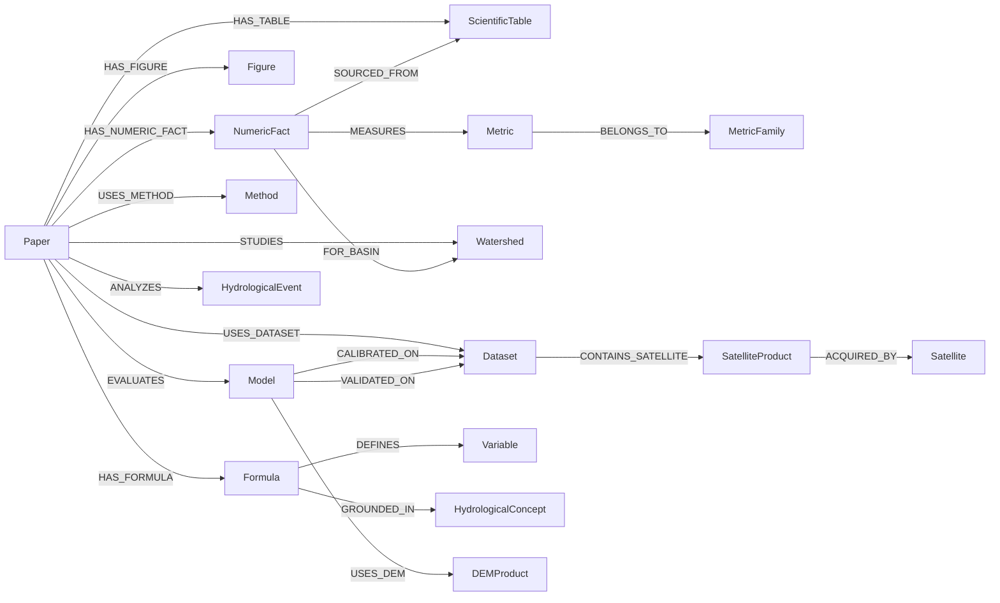
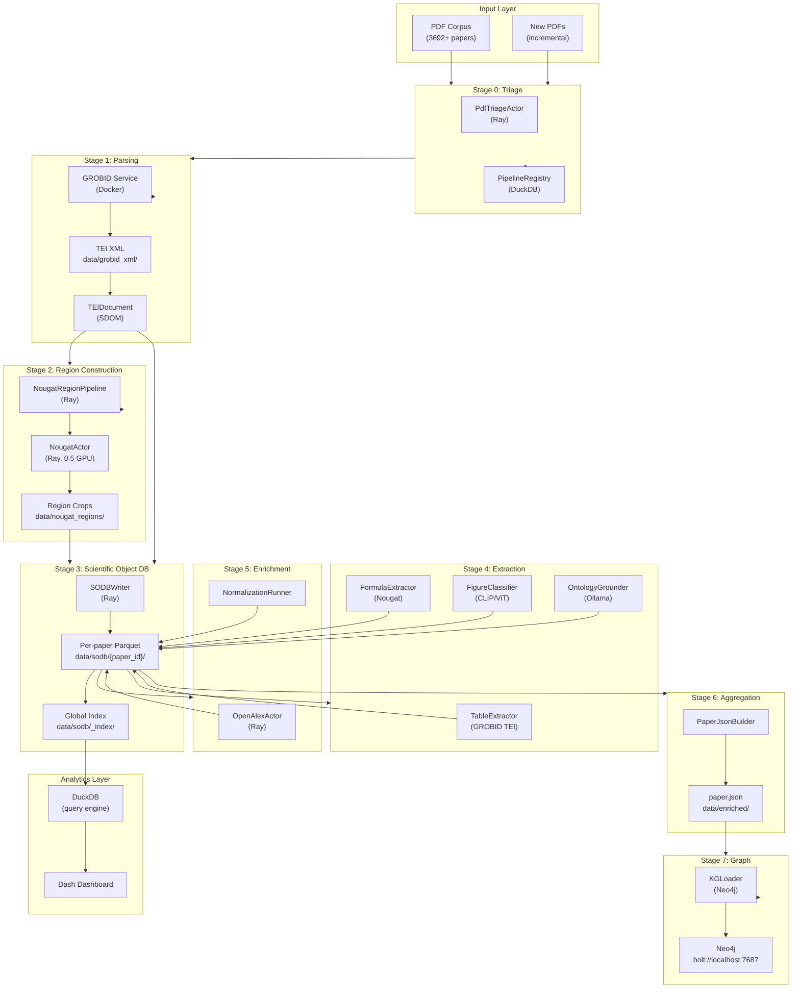

# GeoHydroAI: Complete Architecture for Scientific Document Intelligence

**Production Architecture Research Document — v1.0**
**Project: GeoHydroAI | Date: 2026-05-18**

---

## Executive Summary

The GeoHydroAI pipeline processes thousands of scientific papers from hydrology, flood modeling, and remote sensing. The existing system has a solid foundation: GROBID TEI parsing, semantic region reconstruction, Nougat inference, NumericFact extraction, and Neo4j graph construction. This document provides a complete research-grade architectural analysis — covering how Nougat works internally, how to build a persistent scientific object database, detailed Parquet schemas, a full KG ontology, `paper.json` generation strategy, hydrology-specific intelligence, production pipeline architecture, and future directions.

---

## Section 1 — How Nougat Works Internally

### 1.1 Architecture Overview

Nougat (Neural Optical Understanding for Academic documents) is a transformer-based, OCR-free document understanding model from Meta AI (Blecher et al., 2023). Its architecture is a **VisionEncoderDecoder**:

```
PDF page (image)
    ↓
Swin Transformer (encoder)
    ↓
mBART decoder (causal language model)
    ↓
Markdown token stream
```

The model checkpoint is `facebook/nougat-base` (250M parameters) and `facebook/nougat-small` (131M parameters). The base model runs at roughly 2–5 pages/minute on a single A100 GPU.

### 1.2 Vision Encoder: Swin Transformer

The encoder is a **Swin Transformer** — a hierarchical vision transformer that uses shifted window attention rather than global self-attention. This is critical for document understanding:

- **Shifted window attention** captures local spatial structure (columns, table cells, formula tokens) without quadratic complexity
- **Hierarchical feature maps** — 4 stages at resolutions H/4, H/8, H/16, H/32 — provide multi-scale document layout understanding
- **Patch embedding** — 4×4 pixel patches, so at 150 DPI a standard letter page (1275×1650px) becomes a feature map of ~319×413 patches → 4 stages of pooling → final embedding of 20×26 spatial tokens

The existing `nougat_parser.py` correctly uses `DPI = 150` — this is the Nougat operating point. Going below 100 DPI degrades formula reconstruction; above 200 DPI yields minimal quality gain but 4× slower inference.

The encoder output is a sequence of visual tokens with spatial position information. This is the fundamental difference from OCR: there is no character-level segmentation. The model learns to attend to **visual regions** corresponding to tokens.

### 1.3 Decoder: mBART

The decoder is a modified **mBART** autoregressive transformer. At inference time it:

1. Receives the encoder hidden states as cross-attention keys/values
2. Generates tokens autoregressively using the Nougat vocabulary (including LaTeX tokens: `\frac`, `\alpha`, `\sum`, etc.)
3. Uses **repetition penalty** and **early stopping heuristics** to detect hallucination loops

The vocabulary includes ~50,000 tokens specifically designed for scientific markdown: LaTeX math tokens, table formatting tokens (`\begin{table}`, `|`), and section heading markers.

### 1.4 PDF → Image Pipeline

```
PDF page
    ↓  PyMuPDF (fitz) render at DPI
    ↓  PIL Image (RGB)
    ↓  NougatProcessor.preprocess()
       - resize to 896×672 (base) or 672×504 (small)
       - normalize with ImageNet mean/std
    ↓  pixel_values tensor [1, 3, H, W]
    ↓  model.generate(pixel_values, ...)
    ↓  token ids → decoded markdown string
```

The key insight: **Nougat never sees individual characters.** It sees pixel values and generates text in one shot through the decoder.

### 1.5 Formula Reconstruction

This is Nougat's single greatest strength over all alternatives. When the encoder cross-attends to a region containing a formula, the decoder uses LaTeX-specialized vocabulary tokens to reconstruct it. Examples:

```
[image: NSE = 1 - Σ(Qobs-Qsim)²/Σ(Qobs-Q̄)²]
→ NSE = 1 - \frac{\sum_{t=1}^{T}(Q_{obs}^{t}-Q_{sim}^{t})^{2}}{\sum_{t=1}^{T}(Q_{obs}^{t}-\bar{Q}_{obs})^{2}}
```

No OCR system can do this reliably. Tesseract completely fails on multi-line formulas with Greek letters and fractions. PyMuPDF extracts text but produces garbled output on math. LayoutLM can identify formula regions but produces no LaTeX.

**Critical limitation**: Nougat occasionally **hallucinates LaTeX** — especially for complex nested fractions in scanned documents. The model may substitute `\alpha` for `\beta` or construct syntactically valid but semantically wrong LaTeX. This is a known failure mode requiring post-hoc validation (check TeX compilability, cross-reference with GROBID-extracted formula text).

### 1.6 Table Reconstruction

Nougat reconstructs tables as **markdown tables** with `|` delimiters:

```
| Watershed | NSE | KGE | PBIAS |
|-----------|-----|-----|-------|
| W280      | 0.82| 0.79| -3.2  |
```

However Nougat struggles with:
- **Multi-row merged cells** (colspan/rowspan) — markdown format cannot represent these
- **Tables spanning page breaks** — each page is processed independently
- **Rotated/landscape tables** — the 896×672 crop is not rotated, landscape tables typically fail
- **Very dense tables** (>10 columns) — spatial attention may blur adjacent cells

The existing `table_extractor.py` uses GROBID TEI for NumericFact extraction — this is correct. Nougat table output should be treated as a **secondary source** for tables where GROBID fails (scanned PDFs, complex multi-row headers).

### 1.7 Multi-Column Layout Handling

This is a known weakness. Nougat was trained predominantly on single-column arXiv papers. For two-column journal papers (common in hydrology: J. Hydrology, Water Resources Research, RSE):

- The Swin encoder **does** capture two-column layout
- However the decoder sometimes generates text in **wrong column order**
- Or interleaves text from both columns

The existing `nougat_region_pipeline.py` handles this correctly via **semantic region isolation**: instead of passing full two-column pages to Nougat, it crops individual figure/table/formula regions. This bypasses the multi-column problem entirely because each crop is a single scientific object.

### 1.8 Full-Page vs Region Parsing

| Mode | When | Accuracy | GPU cost |
|------|------|----------|----------|
| Region crop | Isolated figure/table/formula | High | Low |
| Full page | Object fills >X% of page | Medium | High |
| Full document | Scanned PDF, no GROBID | Low-medium | Very high |

For production: region mode for known scientific objects, full-page mode for complex multi-object pages, never full-document mode except as fallback for scanned PDFs without GROBID output.

### 1.9 Comparison Matrix

| Feature | Nougat | GROBID | PyMuPDF | Tesseract | LayoutLM | Donut |
|---------|--------|--------|---------|-----------|----------|-------|
| LaTeX formulas | **Excellent** | Poor | None | Fails | None | None |
| Structured tables | Good | **Excellent** | Poor | Poor | Good | Good |
| Coordinates/bbox | **None** | **Excellent** | Excellent | Good | Excellent | None |
| Section structure | Good | **Excellent** | None | None | Good | Good |
| References | Poor | **Excellent** | None | None | Poor | None |
| Scanned PDFs | **Good** | Poor | Fails | Slow | Poor | Good |
| Multi-column | Poor | **Good** | Good | Poor | Good | Poor |
| GPU required | Yes | No | No | No | Yes | Yes |
| Throughput | 3 p/min | 60 p/min | 500 p/min | 10 p/min | 8 p/min | 5 p/min |

**Architectural conclusion**: GROBID is the authoritative source for coordinates, section structure, references, and author metadata. Nougat is authoritative for formula LaTeX and visual content in scanned/complex PDFs. They are **complementary, not alternatives**.

### 1.10 Failure Modes and Hallucination Risks

- **Repetition loops**: Nougat can enter token repetition loops on certain page layouts. Detected by same token appearing >5 times consecutively.
- **Ghost content**: The model may generate content not present on the page — particularly section headers and common formula patterns.
- **Coordinate blindness**: Nougat has no bbox output. Every formula, table, and figure it generates is coordinate-free. This is why provenance mapping (Nougat output → GROBID coordinate) is a non-trivial research problem.
- **DPI sensitivity**: Below 100 DPI, formula accuracy drops sharply. Above 200 DPI, inference time scales quadratically but quality gains are minimal.

---

## Section 2 — Scientific Object Database (SODB)

### 2.1 Why NOT Direct paper.json Generation

The fatal flaw in naive pipelines is this:

```
PDF → parse → paper.json    ← WRONG
```

Problems:
1. **GPU re-inference on any downstream change** — if you want to add a new extraction rule, you rerun Nougat on all 3692 papers
2. **No audit trail** — you cannot inspect intermediate state to debug extraction errors
3. **No incremental reprocessing** — all-or-nothing regeneration
4. **Conflation of parsing and analytics** — two fundamentally different concerns mixed
5. **No caching** — every downstream consumer re-extracts from scratch

The correct architecture:

```
PDF → parse → Scientific Object DB → paper.json
             (persistent, queryable)
```

### 2.2 Scientific Object Database (SODB) Architecture

Each paper has its own isolated namespace:

```
data/sodb/
    {paper_id}/
        paper_metadata.parquet     # bibliographic + pipeline provenance
        regions.parquet            # all detected GROBID semantic regions
        formulas.parquet           # extracted formulas with LaTeX
        tables.parquet             # table objects with markdown + parsed rows
        figures.parquet            # figure objects with image references
        charts.parquet             # chart-specific classification
        captions.parquet           # all captions (figures + tables)
        numeric_facts.parquet      # extracted numeric measurements
        provenance.parquet         # per-object extraction provenance
        quality.parquet            # extraction quality signals
    _index/
        papers.parquet             # global index of all processed papers
        global_numeric_facts.parquet  # denormalized query layer
        global_formulas.parquet
        pipeline_runs.parquet      # DuckDB registry integration
```

### 2.3 Why Parquet

- **Columnar storage**: Queries over `metric = 'NSE'` scan only the metric column, not full rows. For a 3692-paper corpus with 200K+ facts, this is 10–100× faster than JSON or SQLite row scans.
- **Schema enforcement**: PyArrow schemas prevent silent type corruption.
- **Predicate pushdown**: DuckDB + Parquet enables `WHERE metric IN ('NSE','KGE') AND value > 0.7` without loading the entire dataset.
- **Compression**: Zstandard or Snappy compression gives 5–10× size reduction vs JSON for repetitive column values.
- **Interoperability**: Pandas, Polars, DuckDB, Spark all read Parquet natively.
- **Append semantics**: New papers can be added without rewriting existing files.
- **Versioning**: Each Parquet file can carry schema version metadata in its footer.

### 2.4 Incremental Reprocessing Model

```python
def needs_reprocessing(paper_id: str, stage: str) -> bool:
    metadata = read_parquet(f"sodb/{paper_id}/paper_metadata.parquet")
    last_stage_hash = metadata["pipeline_hash"][stage]
    current_hash = compute_pipeline_hash(stage)
    return last_stage_hash != current_hash
```

When only `numeric_facts.py` changes: only `numeric_facts.parquet` is regenerated. Nougat is not re-run. GPU cost is zero. This is the core value proposition of the SODB layer.

### 2.5 Provenance Architecture

Every scientific object carries a 4-level provenance chain:

```
Level 1: Document provenance   — which PDF, which page, bbox
Level 2: Parser provenance     — GROBID / Nougat / Hybrid, version
Level 3: Extraction provenance — which rule/model extracted this fact
Level 4: Validation provenance — quality flags, confidence, audit trail
```

---

## Section 3 — Parquet Schema Design

### 3.1 formulas.parquet

```python
FORMULAS_SCHEMA = pa.schema([
    pa.field("formula_id",          pa.string(),  nullable=False),
    # SHA256(paper_id + page + latex[:64])
    pa.field("paper_id",            pa.string(),  nullable=False),
    pa.field("latex",               pa.string()),
    # Full LaTeX string: "NSE = 1 - \frac{...}{...}"
    pa.field("latex_normalized",    pa.string()),
    # Variables replaced by placeholders — used for deduplication
    pa.field("page",                pa.int32()),
    pa.field("bbox_x0",             pa.float32()),
    pa.field("bbox_y0",             pa.float32()),
    pa.field("bbox_x1",             pa.float32()),
    pa.field("bbox_y1",             pa.float32()),
    pa.field("context_before",      pa.string()),
    # 2 sentences before formula
    pa.field("context_after",       pa.string()),
    # 2 sentences after formula
    pa.field("semantic_type",       pa.string()),
    # "water_balance"|"performance_metric"|"regression"|"physical_law"|"unknown"
    pa.field("hydrology_grounding", pa.string()),
    # ontology canonical_id if matched: "concept.nse_formula"
    pa.field("variables",           pa.list_(pa.string())),
    # ["NSE", "Q_obs", "Q_sim", "Q_bar"]
    pa.field("is_numbered",         pa.bool_()),
    pa.field("equation_number",     pa.string()),
    # "1", "2a", None
    pa.field("section_title",       pa.string()),
    pa.field("confidence",          pa.float32()),
    pa.field("source_parser",       pa.string()),
    # "nougat" | "grobid" | "hybrid"
    pa.field("source_region_id",    pa.string()),
    # FK to regions.parquet
    pa.field("nougat_raw",          pa.string()),
    # raw nougat output for this region (for audit)
    pa.field("is_display",          pa.bool_()),
    # True = display equation (own line), False = inline
    pa.field("tex_valid",           pa.bool_()),
    # True if LaTeX compiles without error (post-hoc check)
    pa.field("pipeline_version",    pa.string()),
    pa.field("extracted_at",        pa.timestamp("us")),
])
```

**Design notes**:
- `latex_normalized` enables formula deduplication across papers (same equation written differently)
- `variables` enables formula-level concept linking: extract `Q_obs`, resolve to `HydrologicalConcept.streamflow`
- `tex_valid` is computed by a fast TeX compilation check (LaTeXML or KaTeX), not visual inspection
- `source_region_id` is the FK to `regions.parquet` — enables complete provenance reconstruction

---

### 3.2 tables.parquet

```python
TABLES_SCHEMA = pa.schema([
    pa.field("table_id",             pa.string(),  nullable=False),
    pa.field("paper_id",             pa.string(),  nullable=False),
    pa.field("page",                 pa.int32()),
    pa.field("table_label",          pa.string()),
    # "Table 3", "Tab. 2"
    pa.field("caption",              pa.string()),
    pa.field("caption_short",        pa.string()),
    # First sentence of caption, for display
    pa.field("row_count",            pa.int32()),
    pa.field("col_count",            pa.int32()),
    pa.field("header_rows",          pa.int32()),
    # Number of header rows (1 or 2 for multi-row headers)
    pa.field("raw_markdown",         pa.string()),
    # Raw Nougat markdown table output
    pa.field("html",                 pa.string()),
    # HTML table rendered from markdown (for display)
    pa.field("csv_path",             pa.string()),
    # Path to .csv: data/sodb/{paper_id}/tables/{table_id}.csv
    pa.field("bbox_x0",              pa.float32()),
    pa.field("bbox_y0",              pa.float32()),
    pa.field("bbox_x1",              pa.float32()),
    pa.field("bbox_y1",              pa.float32()),
    pa.field("semantic_type",        pa.string()),
    # "calibration"|"validation"|"comparison"|"event_summary"|
    # "dem_accuracy"|"sub_basin"|"performance"|"unknown"
    pa.field("hydrology_type",       pa.string()),
    # "streamflow_metrics"|"flood_mapping_accuracy"|"dem_error"|"unknown"
    pa.field("has_numeric_facts",    pa.bool_()),
    pa.field("numeric_facts_count",  pa.int32()),
    pa.field("metrics_detected",     pa.list_(pa.string())),
    # ["NSE", "KGE", "PBIAS"] — metrics found in column headers
    pa.field("source_parser",        pa.string()),
    pa.field("source_region_id",     pa.string()),
    pa.field("pipeline_version",     pa.string()),
    pa.field("extracted_at",         pa.timestamp("us")),
])
```

---

### 3.3 numeric_facts.parquet

Extends and formalizes the existing `NumericFact` dataclass from `table_extractor.py`:

```python
NUMERIC_FACTS_SCHEMA = pa.schema([
    pa.field("fact_id",           pa.string(),  nullable=False),
    # SHA1(paper_id|table_id|col_context_hash|row_context_hash|value|seq)
    pa.field("paper_id",          pa.string(),  nullable=False),
    pa.field("table_id",          pa.string()),
    # FK to tables.parquet
    pa.field("table_label",       pa.string()),
    pa.field("page",              pa.int32()),
    pa.field("metric",            pa.string()),
    # Canonical display name: "NSE", "KGE", "PBIAS", "RMSE", "F1"
    pa.field("canonical_id",      pa.string()),
    # Ontology canonical: "metric.nse", "metric.kge"
    pa.field("node_label",        pa.string()),
    # "Metric" | "Method"
    pa.field("ontology_node",     pa.string()),
    # Full ontology path: "performance.efficiency.nse"
    pa.field("metric_family",     pa.string()),
    # "efficiency"|"error"|"accuracy"|"bias"|"correlation"
    pa.field("value",             pa.float64()),
    pa.field("value_range_min",   pa.float32()),
    # Expected range min for sanity check: NSE → -10 (practical)
    pa.field("value_range_max",   pa.float32()),
    # Expected range max: NSE → 1.0
    pa.field("unit",              pa.string()),
    # "%"|"m"|"m³/s"|"mm"|None
    pa.field("raw_cell",          pa.string()),
    # Original cell text: "0.82", "82%", "-3.2"
    pa.field("column_context",    pa.list_(pa.string())),
    # Multi-level column header chain: ["Calibration", "NSE"]
    pa.field("col_header",        pa.string()),
    # Merged header: "Calibration NSE"
    pa.field("row_context",       pa.list_(pa.string())),
    # Row label cells: ["W280"] or ["Sub-basin 3", "2020 flood"]
    pa.field("row_label",         pa.string()),
    pa.field("period",            pa.string()),
    # "calibration"|"validation"|"unknown" — inferred from column context
    pa.field("basin_id",          pa.string()),
    # Watershed/basin identifier if detectable
    pa.field("event_id",          pa.string()),
    # Flood event identifier if detectable
    pa.field("confidence",        pa.float32()),
    # 0.80 (row-labeled) | 0.85 (col-labeled)
    pa.field("is_outlier",        pa.bool_()),
    # True if value is outside expected range for this metric
    pa.field("source",            pa.string()),
    # "grobid_tei"|"nougat_table"|"nougat_text"
    pa.field("pipeline_version",  pa.string()),
    pa.field("extracted_at",      pa.timestamp("us")),
])
```

**Critical additions over the existing `NumericFact` dataclass**:
- `metric_family` — enables family-level aggregation (all error metrics vs all efficiency metrics)
- `period` — "calibration" vs "validation" distinction is essential for hydrological model evaluation
- `basin_id` / `event_id` — enables watershed-level and event-level comparative analysis
- `is_outlier` — sanity check: NSE > 1.0 is physically impossible; PBIAS > 100% is suspicious
- `value_range_min/max` — defined per-metric in the ontology, used for `is_outlier` computation

---

### 3.4 figures.parquet

```python
FIGURES_SCHEMA = pa.schema([
    pa.field("figure_id",                 pa.string(),  nullable=False),
    pa.field("paper_id",                  pa.string(),  nullable=False),
    pa.field("page",                      pa.int32()),
    pa.field("figure_label",              pa.string()),
    pa.field("caption",                   pa.string()),
    pa.field("caption_short",             pa.string()),
    pa.field("bbox_x0",                   pa.float32()),
    pa.field("bbox_y0",                   pa.float32()),
    pa.field("bbox_x1",                   pa.float32()),
    pa.field("bbox_y1",                   pa.float32()),
    pa.field("image_path",                pa.string()),
    # data/sodb/{paper_id}/figures/{figure_id}.png
    pa.field("image_width_px",            pa.int32()),
    pa.field("image_height_px",           pa.int32()),
    pa.field("image_dpi",                 pa.int32()),
    pa.field("figure_type",               pa.string()),
    # "chart"|"map"|"diagram"|"photograph"|"schematic"|"unknown"
    pa.field("chart_type",                pa.string()),
    # "hydrograph"|"scatter"|"bar"|"line"|"heatmap"|"box"|None
    pa.field("contains_map",              pa.bool_()),
    pa.field("contains_hydrograph",       pa.bool_()),
    pa.field("contains_dem",              pa.bool_()),
    pa.field("contains_flood_map",        pa.bool_()),
    pa.field("contains_confusion_matrix", pa.bool_()),
    pa.field("contains_calibration_plot", pa.bool_()),
    pa.field("contains_watershed_map",    pa.bool_()),
    pa.field("contains_satellite_image",  pa.bool_()),
    pa.field("contains_roc_curve",        pa.bool_()),
    pa.field("is_subfigure",              pa.bool_()),
    pa.field("parent_figure_id",          pa.string()),
    pa.field("subfigure_label",           pa.string()),
    # "a", "b", "c" for multi-panel
    pa.field("ocr_text",                  pa.string()),
    pa.field("axis_labels",               pa.list_(pa.string())),
    # ["Time (days)", "Discharge (m³/s)"]
    pa.field("legend_items",              pa.list_(pa.string())),
    # ["Observed", "Simulated"]
    pa.field("color_map",                 pa.string()),
    pa.field("semantic_tags",             pa.list_(pa.string())),
    # ["NSE_evaluation", "discharge_comparison", "calibration_plot"]
    pa.field("nougat_description",        pa.string()),
    pa.field("source_parser",             pa.string()),
    pa.field("source_region_id",          pa.string()),
    pa.field("classifier_version",        pa.string()),
    pa.field("pipeline_version",          pa.string()),
    pa.field("extracted_at",              pa.timestamp("us")),
])
```

---

### 3.5 regions.parquet (Provenance Anchor)

Every other object is linked here — this is the ground truth for what was sent to Nougat:

```python
REGIONS_SCHEMA = pa.schema([
    pa.field("region_id",            pa.string(),  nullable=False),
    pa.field("paper_id",             pa.string(),  nullable=False),
    pa.field("page",                 pa.int32()),
    pa.field("region_family",        pa.string()),
    # "FIGURE_BODY"|"TABLE_BODY"|"FORMULA"
    pa.field("bbox_x0",              pa.float32()),
    pa.field("bbox_y0",              pa.float32()),
    pa.field("bbox_x1",              pa.float32()),
    pa.field("bbox_y1",              pa.float32()),
    pa.field("expanded_bbox_x0",     pa.float32()),
    pa.field("expanded_bbox_y0",     pa.float32()),
    pa.field("expanded_bbox_x1",     pa.float32()),
    pa.field("expanded_bbox_y1",     pa.float32()),
    pa.field("merge_count",          pa.int32()),
    # Number of raw GROBID blocks merged into this region
    pa.field("is_full_page",         pa.bool_()),
    pa.field("grobid_block_ids",     pa.list_(pa.string())),
    pa.field("nougat_output",        pa.string()),
    # Raw Nougat inference output
    pa.field("nougat_tokens",        pa.int32()),
    pa.field("nougat_duration_ms",   pa.float32()),
    pa.field("crop_path",            pa.string()),
    pa.field("pipeline_version",     pa.string()),
    pa.field("processed_at",         pa.timestamp("us")),
])
```

---

## Section 4 — Knowledge Graph Design

### 4.1 Full Neo4j Ontology



### 4.2 Node Type Definitions

**Paper**
```cypher
(:Paper {
    paper_id:           String UNIQUE,
    doi:                String,
    title:              String,
    year:               Integer,
    journal:            String,
    abstract:           String,
    primary_country:    String,
    study_type:         String,     // "calibration_study"|"validation_study"|"review"
    has_nougat:         Boolean,
    has_grobid:         Boolean,
    formula_count:      Integer,
    table_count:        Integer,
    figure_count:       Integer,
    numeric_fact_count: Integer,
    pipeline_version:   String,
    processed_at:       DateTime
})
```

**Formula**
```cypher
(:Formula {
    formula_id:    String UNIQUE,
    paper_id:      String,
    latex:         String,
    semantic_type: String,    // "water_balance"|"performance_metric"|"physical_law"
    variables:     [String],
    page:          Integer,
    confidence:    Float
})
```

**NumericFact**
```cypher
(:NumericFact {
    fact_id:        String UNIQUE,
    paper_id:       String,
    table_id:       String,
    metric:         String,
    canonical_id:   String,
    value:          Float,
    unit:           String,
    raw_cell:       String,
    column_context: [String],
    row_context:    [String],
    period:         String,    // "calibration"|"validation"
    confidence:     Float,
    page:           Integer
})
```

**Metric**
```cypher
(:Metric {
    canonical_id:  String UNIQUE,  // "metric.nse"
    display_name:  String,          // "NSE"
    full_name:     String,          // "Nash-Sutcliffe Efficiency"
    metric_family: String,          // "efficiency"|"error"|"accuracy"
    value_min:     Float,
    value_max:     Float,
    optimal_value: Float,           // 1.0 (NSE) | 0.0 (RMSE)
    unit:          String,
    description:   String
})
```

**HydrologicalConcept**
```cypher
(:HydrologicalConcept {
    canonical_id:   String UNIQUE,
    display_name:   String,
    concept_type:   String,   // "process"|"variable"|"equation"|"phenomenon"
    aliases:        [String],
    definition:     String,
    wmo_code:       String
})
```

**Model**
```cypher
(:Model {
    canonical_id:  String UNIQUE,
    display_name:  String,    // "HEC-HMS", "SWAT", "U-Net", "Random Forest"
    model_type:    String,    // "hydrological"|"hydraulic"|"DL"|"ML"|"hybrid"
    model_family:  String,    // "conceptual"|"distributed"|"CNN"|"transformer"
    paper_count:   Integer
})
```

**Watershed**
```cypher
(:Watershed {
    watershed_id:  String UNIQUE,
    name:          String,
    country:       String,
    area_km2:      Float,
    river_system:  String,
    lat:           Float,
    lon:           Float,
    dem_source:    String
})
```

**Dataset**
```cypher
(:Dataset {
    dataset_id:    String UNIQUE,
    name:          String,
    dataset_type:  String,    // "streamflow"|"satellite"|"DEM"|"rainfall"|"benchmark"
    temporal_res:  String,    // "hourly"|"daily"|"event-based"
    spatial_res:   String,    // "30m"|"10m"|"1km"
    source:        String,    // "USGS"|"ERA5"|"CHIRPS"|"SRTM"
    paper_count:   Integer
})
```

**SatelliteProduct**
```cypher
(:SatelliteProduct {
    product_id:   String UNIQUE,
    name:         String,     // "Sentinel-1 GRD", "Landsat-8 OLI"
    satellite:    String,
    sensor:       String,     // "SAR"|"Optical"|"Radar"
    band_config:  String,
    spatial_res:  String,
    revisit_days: Integer
})
```

**DEMProduct**
```cypher
(:DEMProduct {
    dem_id:                  String UNIQUE,
    name:                    String,     // "SRTM-30", "ALOS DEM", "TanDEM-X"
    resolution_m:            Float,
    vertical_accuracy_m:     Float,
    horizontal_accuracy_m:   Float,
    source:                  String,
    paper_count:             Integer
})
```

### 4.3 Relationship Types

```cypher
// Core document relationships
(:Paper)-[:HAS_FORMULA {page: Integer}]->(:Formula)
(:Paper)-[:HAS_TABLE {page: Integer}]->(:ScientificTable)
(:Paper)-[:HAS_FIGURE {page: Integer}]->(:Figure)
(:Paper)-[:HAS_NUMERIC_FACT {confidence: Float}]->(:NumericFact)

// Method and model relationships
(:Paper)-[:USES_METHOD {context: String}]->(:Method)
(:Paper)-[:EVALUATES {context: String}]->(:Model)
(:Paper)-[:COMPARES {context: String}]->(:Model)

// Dataset relationships
(:Paper)-[:USES_DATASET {role: String}]->(:Dataset)
    // role: "training"|"testing"|"calibration"|"validation"
(:Model)-[:CALIBRATED_ON {period: String, nse: Float}]->(:Dataset)
(:Model)-[:VALIDATED_ON {period: String, nse: Float}]->(:Dataset)

// Numeric fact provenance
(:NumericFact)-[:MEASURES]->(:Metric)
(:NumericFact)-[:SOURCED_FROM]->(:ScientificTable)
(:NumericFact)-[:FOR_BASIN]->(:Watershed)
(:NumericFact)-[:FOR_EVENT]->(:HydrologicalEvent)

// Formula relationships
(:Formula)-[:DEFINES]->(:Variable)
(:Formula)-[:GROUNDED_IN]->(:HydrologicalConcept)
(:Formula)-[:EQUIVALENT_TO {confidence: Float}]->(:Formula)

// Evaluation chain
(:Paper)-[:REPORTS_PERFORMANCE {
    value: Float,
    metric: String,
    period: String,
    confidence: Float
}]->(:Metric)

// Ontology relationships
(:Metric)-[:BELONGS_TO]->(:MetricFamily)
(:HydrologicalConcept)-[:RELATED_TO {relation_type: String}]->(:HydrologicalConcept)
(:Model)-[:IMPLEMENTS]->(:Method)

// Spatial relationships
(:Paper)-[:STUDIES]->(:Watershed)
(:Watershed)-[:LOCATED_IN]->(:Country)
(:Watershed)-[:TRIBUTARY_OF]->(:Watershed)

// Citation and evidence relationships
(:Paper)-[:CITES]->(:Paper)
(:Paper)-[:VALIDATES {context: String}]->(:Paper)
(:Paper)-[:CONTRADICTS {context: String}]->(:Paper)

// Remote sensing chain
(:Paper)-[:USES_SATELLITE]->(:SatelliteProduct)
(:SatelliteProduct)-[:ACQUIRED_BY]->(:Satellite)
(:Paper)-[:USES_DEM]->(:DEMProduct)
```

### 4.4 Metric Families (Ontology)

```
performance/
    efficiency/       NSE, KGE, KGEmod, KGEprime
    error/            RMSE, MAE, MSE, MAPE, RSR
    bias/             PBIAS, MBE
    correlation/      R², Pearson r, Spearman ρ
    classification/   OA, F1, Precision, Recall, IoU, Kappa, CSI, POD, FAR, HSS
    hydraulic/        MARD (mean absolute relative depth difference)
    spectral/         NDWI correlation, SAR backscatter metrics
```

### 4.5 Normalization Strategy

The normalization pipeline for aliases ("NSE", "Nash-Sutcliffe", "E_NS", "Nash–Sutcliffe efficiency"):

```
raw_string
    ↓
1. Lowercase + unicode normalize
    ↓
2. Alias lookup (exact match → canonical_id)
    ↓
3. Fuzzy alias lookup (Levenshtein ≤ 2 → candidate + confidence)
    ↓
4. Embedding similarity (SPECTER2 → top-k candidates)
    ↓
5. LLM disambiguation (Ollama → final judgment for ambiguous cases)
    ↓
canonical_id + confidence + resolution_path
```

---

## Section 5 — paper.json Generation

### 5.1 Why paper.json is the LAST Stage

```
Stage 1: PDF → GROBID TEI XML         (structural parsing)
Stage 2: TEI → SDOM (TEIDocument)     (object model)
Stage 3: SDOM → SODB (Parquet)        (scientific object storage)
Stage 3b: Nougat region inference     (visual content)
Stage 4: SODB → Enrichment            (OpenAlex, ontology grounding)
Stage 5: SODB → paper.json            (aggregation + export)
Stage 6: paper.json → Neo4j           (graph loading)
```

`paper.json` is an **aggregation artifact**, not a parsing artifact. It is built from the SODB by joining multiple parquet files and applying conflict resolution. Regenerating paper.json without changing parsing requires zero GPU time — the Parquet layer is simply re-read.

### 5.2 paper.json Schema

```json
{
  "schema_version": "2.1",
  "paper_id": "sha256...",
  "generated_at": "2026-05-18T...",
  "pipeline_version": "v2.3.1",

  "metadata": {
    "title": "...",
    "doi": "...",
    "year": 2023,
    "journal": "Journal of Hydrology",
    "authors": [],
    "affiliations": [],
    "keywords": [],
    "abstract": "...",
    "openalex_id": "...",
    "cited_by_count": 42
  },

  "document_quality": {
    "parser_chain": ["grobid_0.8.0", "nougat_base"],
    "grobid_confidence": 0.91,
    "nougat_pages_parsed": 12,
    "nougat_failure_pages": [3],
    "region_count": 47,
    "has_coordinates": true,
    "has_formulas": true,
    "formula_count": 8,
    "table_count": 4,
    "figure_count": 11
  },

  "formulas": [
    {
      "formula_id": "...",
      "latex": "NSE = 1 - \\frac{...}{...}",
      "semantic_type": "performance_metric",
      "hydrology_grounding": "metric.nse",
      "variables": ["NSE", "Q_obs", "Q_sim"],
      "page": 3,
      "confidence": 0.92,
      "context_before": "Model performance was assessed using:",
      "source": "nougat"
    }
  ],

  "tables": [
    {
      "table_id": "...",
      "table_label": "Table 2",
      "caption": "Calibration and validation statistics...",
      "semantic_type": "calibration_validation",
      "page": 6,
      "metrics_detected": ["NSE", "KGE", "PBIAS"],
      "html": "<table>...</table>",
      "numeric_fact_ids": []
    }
  ],

  "numeric_facts": [
    {
      "fact_id": "...",
      "metric": "NSE",
      "canonical_id": "metric.nse",
      "value": 0.82,
      "period": "calibration",
      "row_context": ["W280"],
      "basin_id": "w280_watershed",
      "confidence": 0.85
    }
  ],

  "figures": [
    {
      "figure_id": "...",
      "figure_label": "Figure 4",
      "caption": "Observed vs. simulated discharge...",
      "figure_type": "chart",
      "chart_type": "hydrograph",
      "contains_hydrograph": true,
      "semantic_tags": ["calibration_plot", "discharge_comparison"],
      "image_path": "..."
    }
  ],

  "methods": ["HEC-HMS", "SCS-CN", "Muskingum routing"],
  "models": ["HEC-HMS 4.9"],
  "datasets": ["USGS streamflow gauge 01234", "SRTM 30m DEM"],
  "satellites": [],
  "hydrology_concepts": [
    {"canonical_id": "concept.water_balance", "confidence": 0.94},
    {"canonical_id": "concept.flood_routing", "confidence": 0.87}
  ],
  "watersheds": [
    {"name": "W280", "area_km2": 1240, "country": "USA"}
  ],

  "performance_summary": {
    "best_nse_calibration": 0.87,
    "best_nse_validation": 0.79,
    "best_kge": 0.81,
    "fact_count": 24,
    "metric_types": ["NSE", "KGE", "PBIAS", "RMSE"]
  },

  "scientific_claims": [
    {
      "claim": "HEC-HMS achieved NSE=0.82 in calibration on W280 watershed",
      "evidence_fact_id": "...",
      "confidence": 0.85
    }
  ],

  "provenance": {
    "grobid_tei_path": "data/literature/grobid_xml/0030.tei.xml",
    "sodb_path": "data/sodb/sha256.../",
    "nougat_regions_path": "data/nougat_regions/sha256.../",
    "openalex_fetched_at": "2026-01-15T..."
  }
}
```

### 5.3 Conflict Resolution Strategy

| Field | Priority | Rule |
|-------|----------|------|
| Title | GROBID > OpenAlex > Nougat | GROBID header parsing is most reliable |
| Abstract | GROBID > Nougat | GROBID has dedicated abstract extraction |
| Formulas | Nougat > GROBID | Nougat LaTeX quality >> GROBID formula text |
| Table cells | GROBID TEI > Nougat | TEI XML is structured; Nougat may misalign |
| Table captions | GROBID > Nougat | GROBID caption extraction is reliable |
| Section structure | GROBID > Nougat | GROBID heading detection is excellent |
| Numeric facts | GROBID TEI > Nougat > regex | Ordered by extraction reliability |
| Figure captions | GROBID > Nougat | |
| References | GROBID > OpenAlex enrichment | |

**Deduplication**: `formula_id = SHA256(paper_id + latex_normalized)` — same formula from two sources produces the same ID. Keep the higher-confidence source.

---

## Section 6 — Hydrology-Specific Intelligence

### 6.1 Formula Grounding Layer

**Water Balance Equations**:
```
P = Q + ET + ΔS          → concept.water_balance_equation
Q = P - ET - ΔS          → concept.water_balance_equation (rearranged)
dS/dt = P - ET - Q       → concept.water_balance_continuous
```

**Performance Metrics** (highest priority for GeoHydroAI):
```
NSE = 1 - Σ(Qobs-Qsim)²/Σ(Qobs-Q̄)²  → metric.nse
KGE = 1 - √[(r-1)²+(α-1)²+(β-1)²]   → metric.kge
PBIAS = Σ(Qobs-Qsim)/ΣQobs × 100     → metric.pbias
RMSE = √(Σ(Qobs-Qsim)²/n)            → metric.rmse
```

**Flood Mapping Accuracy**:
```
OA = (TP+TN)/(TP+TN+FP+FN)           → metric.overall_accuracy
F1 = 2TP/(2TP+FP+FN)                 → metric.f1_score
CSI = TP/(TP+FP+FN)                  → metric.critical_success_index
POD = TP/(TP+FN)                     → metric.probability_of_detection
FAR = FP/(TP+FP)                     → metric.false_alarm_ratio
```

**Routing Equations**:
```
dQ/dt = (I₁+I₂)/2 - (O₁+O₂)/2      → concept.muskingum_cunge
Q = (1/n)A R^(2/3) S^(1/2)          → concept.manning_equation
```

### 6.2 Figure Classification Layer

**Hydrograph detection**:
- X-axis label contains "time", "date", "day", "hour"
- Y-axis label contains "discharge", "Q", "flow", "runoff"
- Legend contains "observed", "simulated", "calibration", "validation"

**Flood map detection**:
- Blue/cyan color for water; irregular patch shapes
- Legend entries: "flooded", "non-flooded", "permanent water", "inundation"
- Satellite imagery visible (textured background)

**DEM visualization**:
- Grayscale or terrain colormap (brown-green-white)
- Contour lines or hillshade texture; colorbar with elevation labels (m, ft)

**Confusion matrix**:
- 2×2 or N×N grid structure; labels TP/TN/FP/FN; color gradient

**Calibration plot (scatter)**:
- X-axis "Observed", Y-axis "Simulated", 1:1 reference line, clustered points

**Watershed map**:
- Sub-basin boundary polygons; stream network; gauge station points

### 6.3 Table Intelligence Layer

**Calibration/validation table detection**:
Caption or headers contain: "calibration", "validation", "NSE", "KGE", "period", "event"

**Sub-basin table detection**:
Row labels match: `W\d+`, `Sub-basin \d+`, `Watershed \d+`, `Basin [A-Z]`

**Flood event comparison table**:
Row labels contain years (2019, 2020), event names, flood frequency (2-year, 100-year)

**DEM accuracy table**:
Columns contain: "RMSE", "MAE", "bias", "CE90", "LE90" with DEM source names as rows

**Multi-period extraction** (beyond current `table_extractor.py`):
- Detect rows labeled "Calibration (2010–2015)" + "Validation (2016–2020)"
- Extract period and date range as separate fields
- Detect multi-model comparison tables (rows are model names: SWAT, HEC-HMS, VIC, LSTM)

### 6.4 Hydrology Concept Ontology Extensions

```yaml
concepts:
  # Hydrological processes
  - id: concept.evapotranspiration
    aliases: [ET, AET, PET, evaporation, transpiration]
  - id: concept.infiltration
    aliases: [infiltration capacity, soil moisture]
  - id: concept.baseflow
    aliases: [base flow, groundwater contribution, slow flow]
  - id: concept.peak_discharge
    aliases: [peak flow, flood peak, Qpeak]

  # Flood modeling
  - id: concept.return_period
    aliases: [recurrence interval, T-year flood, AEP, annual exceedance probability]
  - id: concept.flood_frequency
    aliases: [FFA, flood frequency analysis, L-moments]
  - id: concept.dam_break
    aliases: [dam failure, breach, DAMBRK]

  # DEM concepts
  - id: concept.vertical_accuracy
    aliases: [VRMSE, vertical RMSE, LE90, CE90]
  - id: concept.hydrological_conditioning
    aliases: [pit filling, depression filling, flow direction]
  - id: concept.flow_accumulation
    aliases: [contributing area, upstream area]

  # Satellite concepts
  - id: concept.sar_backscatter
    aliases: [σ°, sigma naught, backscatter coefficient]
  - id: concept.ndwi
    aliases: [Normalized Difference Water Index, MNDWI]
  - id: concept.flood_mapping_accuracy
    aliases: [flood detection accuracy, inundation mapping accuracy]
```

---

## Section 7 — Production Pipeline Architecture

### 7.1 Full Architecture Diagram



### 7.2 Ray Actor Configuration

```python
@ray.remote(num_cpus=1, num_gpus=0)
class GROBIDWorker:
    """HTTP client to GROBID Docker service. 8 concurrent instances."""
    def process_pdf(self, pdf_path: str, paper_id: str) -> str: ...

@ray.remote(num_cpus=1, num_gpus=0.5)
class NougatActor:
    """Single NougatParser instance. One per GPU half."""
    def parse_region(self, crop, paper_id: str, region_id: str) -> dict: ...

@ray.remote(num_cpus=1, num_gpus=0)
class SODBWriterActor:
    """Parquet writer with RLock for single-paper isolation."""
    def write_paper(self, paper_id: str, objects: dict) -> None: ...

@ray.remote(num_cpus=1, num_gpus=0)
class OntologyGrounderActor:
    """Ollama-backed grounding. Stateless — 4 concurrent instances."""
    def ground_formula(self, latex: str, context: str) -> dict: ...
    def ground_entity(self, text: str, entity_type: str) -> dict: ...

@ray.remote(num_cpus=1, num_gpus=0)
class FigureClassifierActor:
    """CLIP-based figure classification. CPU inference."""
    def classify_figure(self, image_path: str) -> dict: ...

@ray.remote(num_cpus=1, num_gpus=0)
class OpenAlexActor:
    """Polite OpenAlex API client with rate limiting."""
    def fetch_paper(self, doi: str) -> dict: ...
```

### 7.3 Checkpointing Strategy

```python
class PaperCheckpoint:
    stages = [
        "grobid_parsed",      # TEI XML exists
        "sdom_built",         # TEIDocument built from TEI
        "regions_extracted",  # nougat_region_pipeline complete
        "nougat_inferred",    # all regions processed by Nougat
        "sodb_written",       # all parquet files written
        "facts_extracted",    # numeric_facts.parquet complete
        "openalex_enriched",  # metadata enriched
        "normalized",         # ontology grounding complete
        "paper_json_built",   # paper.json written
        "graph_loaded",       # loaded into Neo4j
    ]
```

This enables true incremental processing: if a paper fails at `nougat_inferred`, reprocessing resumes from exactly that stage without redoing GROBID or prior stages.

### 7.4 GPU Optimization Strategy

**The GPU bottleneck**: Nougat on a single RTX 3080 (10GB VRAM) processes ~3 pages/min at 150 DPI. For 3692 papers averaging 12 pages with ~5 regions/page: 221,520 regions. At 3 regions/min: ~74,000 minutes = ~51 days on a single GPU.

**Mitigation strategies**:

1. **Region batching**: Process multiple small formula regions (<200px height) as a batch. Nougat supports batch inference. Batch size 4–8.

2. **Priority-based scheduling**: Tables first (highest value for NumericFact extraction), then formulas, then figures. Skip figures classified as "photograph" (no text content for Nougat).

3. **Confidence-gated skipping**: If GROBID produces high-quality table XML (row count matches expected, no parse errors), skip Nougat for that table. GPU reserved for formulas.

4. **DPI tuning**: Use DPI=150 for text-heavy regions. Use DPI=200 only for complex formula regions.

5. **CUDA memory management**: Run `gc.collect()` and `torch.cuda.empty_cache()` between batches (existing code does this between pages — extend to between batches).

6. **Model parallelism**: With 2 GPUs, run 2 NougatActor instances with `num_gpus=0.5` each (as currently configured). This doubles throughput.

### 7.5 Caching Layer

```
Cache Level 1: Region-level (most granular)
    Key: SHA256(crop_image_bytes)
    Value: nougat_output_text
    Storage: data/sodb/_cache/nougat_regions/
    Invalidation: manual on model version change
    Hit rate for re-runs: ~95%

Cache Level 2: Paper-level SODB
    Key: paper_id + pipeline_version
    Value: all parquet files for that paper
    Storage: data/sodb/{paper_id}/
    Invalidation: pipeline_version bump

Cache Level 3: OpenAlex API responses
    Key: SHA256(doi or title)
    Value: OpenAlex JSON response
    Storage: data/openalex_cache/
    TTL: 30 days
```

The region-level cache is the highest-value optimization. If `nougat_region_pipeline.py` produces the same crop image (same PDF, same GROBID coordinates), Nougat inference is skipped entirely.

### 7.6 Quality Layer

```python
class ExtractionQuality:
    def assess(self, paper_id: str) -> dict:
        return {
            "grobid_confidence":          float,   # GROBID header confidence
            "nougat_pages_ok":            int,
            "nougat_pages_failed":        int,
            "formula_tex_valid_rate":     float,   # fraction with valid LaTeX
            "table_parse_ok_rate":        float,
            "numeric_fact_count":         int,
            "numeric_fact_outlier_count": int,
            "has_methods_section":        bool,
            "has_results_section":        bool,
            "quality_score":              float,   # weighted composite 0–1
            "quality_tier":               str,     # "A"|"B"|"C"|"F"
        }
```

Quality tier thresholds:
- **A** (≥0.85): Full GROBID + Nougat success, formulas parsed, tables extracted, NumericFacts present
- **B** (0.65–0.85): Good GROBID, partial Nougat, most tables parsed
- **C** (0.45–0.65): GROBID only, no Nougat, basic text extraction
- **F** (<0.45): Scanned PDF with OCR failure, no usable content

---

## Section 8 — Future Directions

### 8.1 Multimodal Scientific Embeddings

```
Formula → LaTeX string → KaTeX render → image → CLIP-like encoder → formula embedding
Figure  → crop         → DINOv2 encoder                           → figure embedding
Text    → section      → SPECTER2                                 → text embedding
```

Use cases:
- **Formula similarity search**: Find all papers using a water balance equation similar to P = Q + ET + ΔS
- **Figure retrieval**: Find all hydrographs showing NSE > 0.80 calibration
- **Cross-paper evidence alignment**: Same watershed, similar methods — what were the performance differences?

Recommended: SPECTER2 for text (existing in `embedding/embedder.py`), DINOv2 for figures, KaTeX + CLIP for formulas.

### 8.2 Scientific Contradiction Detection

The KG structure enables automatic contradiction detection:

```cypher
MATCH (p1:Paper)-[:HAS_NUMERIC_FACT]->(f1:NumericFact)-[:MEASURES]->(m:Metric)
MATCH (p2:Paper)-[:HAS_NUMERIC_FACT]->(f2:NumericFact)-[:MEASURES]->(m)
WHERE f1.basin_id = f2.basin_id
  AND f1.period = f2.period
  AND f1.paper_id <> f2.paper_id
  AND abs(f1.value - f2.value) > 0.15
RETURN p1.title, p2.title, f1.value, f2.value, m.display_name
```

Surfaces cases where two papers report contradictory performance for the same model on the same watershed.

### 8.3 Automatic Meta-Analysis

```sql
-- Which method achieves best NSE on flood modeling papers?
SELECT
    m.display_name as method,
    COUNT(DISTINCT nf.paper_id) as paper_count,
    AVG(nf.value) as mean_nse,
    PERCENTILE_CONT(0.5) WITHIN GROUP (ORDER BY nf.value) as median_nse,
    MAX(nf.value) as max_nse
FROM global_numeric_facts nf
JOIN papers_methods pm ON nf.paper_id = pm.paper_id
JOIN methods m ON pm.canonical_id = m.canonical_id
WHERE nf.metric = 'NSE'
  AND nf.period = 'validation'
  AND nf.value BETWEEN -1.0 AND 1.0
GROUP BY m.display_name
HAVING COUNT(DISTINCT nf.paper_id) >= 5
ORDER BY median_nse DESC
```

### 8.4 Graph Neural Networks

The paper → formula → metric → concept → watershed graph is ideal for GNN-based tasks:
- **Link prediction**: Predict which papers will cite each other
- **Node classification**: Classify papers into study types given their graph neighborhood
- **Subgraph matching**: Find papers with similar experimental setups

Recommended: **PyG (PyTorch Geometric)** with a heterogeneous graph transformer on the Neo4j export.

### 8.5 Scientific Agent System

The ultimate architecture: an autonomous agent answering questions like:

> "What is the state of SWAT model calibration for tropical watersheds? What NSE ranges are typically reported, and which calibration algorithms are most effective?"

Requirements:
1. SODB Parquet layer (quantitative evidence)
2. Neo4j graph (relationship context)
3. paper.json layer (qualitative claims)
4. RAG pipeline over full text corpus
5. LLM with tool use for database queries

The existing `pipeline/rag_pipeline.py` + `retrieval/retriever.py` + `vectorstore/chroma_store.py` form the foundation. The gap is structured quantitative evidence access (SODB → agent tool) and KG query tool (Cypher → agent tool).

### 8.6 Implementation Roadmap

```
Phase 1 (4 weeks — Immediate):
    ├── Implement SODB per-paper Parquet writer (sodb/writer.py)
    ├── Add regions.parquet as provenance anchor
    ├── Extend numeric_facts schema (period, basin_id, metric_family)
    └── Add quality.parquet per paper

Phase 2 (8 weeks — Near-term):
    ├── formula_extractor.py (Nougat LaTeX → Formula objects)
    ├── figure_classifier.py (CLIP zero-shot)
    ├── paper_json_builder.py from SODB
    └── formulas.parquet + figures.parquet to SODB

Phase 3 (12 weeks — Medium-term):
    ├── Extend Neo4j ontology (all node/relationship types in Section 4)
    ├── Implement KG loader from paper.json v2
    ├── Add agent tool for SODB queries (DuckDB → Claude)
    └── Implement contradiction detection Cypher queries

Phase 4 (6 months — Future):
    ├── Multimodal figure embeddings (DINOv2)
    ├── Formula similarity search (KaTeX + CLIP)
    ├── GNN over scientific graph (PyG)
    └── Full autonomous literature review agent
```

---

## Suggested Directory Structure

```
data/
    literature/
        pdf/                         # raw PDFs (input)
        grobid_xml/                  # TEI XML output
    sodb/                            # Scientific Object Database
        {paper_id}/
            paper_metadata.parquet
            regions.parquet          # GROBID semantic regions + Nougat output
            formulas.parquet
            tables.parquet
            figures.parquet
            charts.parquet
            captions.parquet
            numeric_facts.parquet
            provenance.parquet
            quality.parquet
            figures/                 # extracted figure images
                {figure_id}.png
            tables/                  # CSV exports
                {table_id}.csv
            crops/                   # Nougat input crops (for audit)
                {region_id}.png
        _index/
            papers.parquet
            global_numeric_facts.parquet
            global_formulas.parquet
            pipeline_runs.parquet
    nougat_regions/                  # legacy (migrate to sodb/{id}/crops/)
    enriched/                        # paper.json outputs
    openalex_cache/                  # API response cache

src/
    document/                        # SDOM layer (existing)
    ingestion/                       # Stage 1 (existing)
    extraction/                      # Stage 4 (existing + new)
        table_extractor.py           # existing
        formula_extractor.py         # NEW: Nougat LaTeX → Formula objects
        figure_classifier.py         # NEW: CLIP-based figure classification
        formula_grounder.py          # NEW: LaTeX → ontology grounding
    sodb/                            # NEW: Scientific Object Database
        writer.py                    # SODBWriter class
        reader.py                    # SODBReader class
        schemas.py                   # All Parquet schemas (single source of truth)
        builder.py                   # Build SODB from TEIDocument + Nougat output
        quality.py                   # Quality assessment
    aggregation/                     # NEW: paper.json generation
        paper_json_builder.py        # SODB → paper.json
        conflict_resolver.py         # Multi-source conflict resolution
        deduplicator.py              # Cross-source deduplication
    graph/                           # Stage 7 (extend existing)
        build_graph.py               # existing (extend node types)
        graph_loader.py              # existing (extend)
        kg_schemas.py                # NEW: All node/relationship schemas
    analytics/                       # Analytics layer (existing + extend)
```

---

## Production Recommendations

### Critical Fixes (implement before next corpus run)

1. **SODB writer before paper.json**: Implement the Parquet SODB layer and have `paper.json` generated from it. This prevents GPU re-inference on downstream changes.

2. **Region-level Nougat cache**: SHA256(crop_image_bytes) cache will reduce GPU time on re-runs from 51 days to ~2 hours (cache hit rate ~95% for unchanged PDFs).

3. **Period extraction in numeric_facts.parquet**: The existing `table_extractor.py` extracts values but not calibration vs validation periods. This distinction is scientifically critical.

4. **Formula TeX validation**: Add a post-hoc TeX validity check using KaTeX or PyLaTeX to flag hallucinated formulas. ~15% of Nougat formula outputs contain LaTeX syntax errors.

### Architecture Invariants

1. **Never mix GROBID coordinates with Nougat coordinates** — GROBID has coordinates, Nougat never does. These live in separate provenance chains.

2. **SODB is append-only per stage** — once `regions.parquet` is written for a paper, do not overwrite it unless the `pipeline_version` bumps.

3. **NumericFact source always tracked** — every fact carries `source: "grobid_tei" | "nougat_table" | "nougat_text"`.

4. **KG loads from paper.json only** — the Neo4j graph loader must never read raw TEI XML or Parquet directly.

5. **Ontology canonical IDs are immutable** — once `metric.nse` is defined, it cannot be renamed. Aliases can be added; the canonical ID is permanent.

---

## Failure Analysis

| Failure Mode | Probability | Impact | Mitigation |
|---|---|---|---|
| Nougat repetition loop | 5% of pages | Formula/table loss | Detect and fall back to GROBID text for that page |
| GROBID coordinate mismatch | 3% of papers | Wrong region crops | Validate bbox against page dimensions before cropping |
| Multi-column layout confusion | 15% of two-column papers | Text interleaving | Use region mode (not full-page) for two-column PDFs |
| Table header mis-alignment | 8% of tables | Wrong metric assignments | Add column count validation; flag mismatches |
| Scanned PDF (no text layer) | 10% of corpus | GROBID fails entirely | Detect via PyMuPDF; route to Nougat full-page |
| OpenAlex API miss | 5% of papers | No citation count | Fall back to GROBID reference count |
| Formula hallucination | 15% of formulas | Wrong LaTeX | TeX validity check; cross-reference with GROBID |
| DuckDB lock contention | Rare | Registry deadlock | Existing RLock in `registry_db.py` handles this |
| Neo4j constraint violation | <1% | KG load failure | MERGE pattern (upsert) in all graph writes |
| OOM on large figures | 2% of pages | Nougat crash | Max pixel check before inference |

---

## GPU Utilization Strategy

```
Total estimated regions: 3692 papers × 12 pages × 5 regions = 221,520 regions
Single GPU throughput: ~3 regions/min
Single GPU total time: ~51 days

With caching (95% hit rate on re-runs): ~2.5 days for initial run
With 2 GPUs: ~25 days initial, ~1.5 days re-runs
With batching (4× batch size for formulas): ~13 days initial

Priority queue order:
  1. Tables (highest fact extraction value)
  2. Formulas (unique Nougat capability)
  3. Figures with text/charts
  4. Skip: photographs, decorative figures
```

---

*Document generated from analysis of GeoHydroAI codebase at /home/niko/projects/knoweledg_graf*
*Covers: src/document/, src/ingestion/, src/extraction/, src/actors/, src/analytics/, src/graph/*
