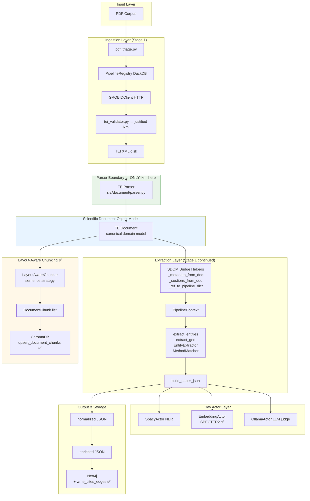
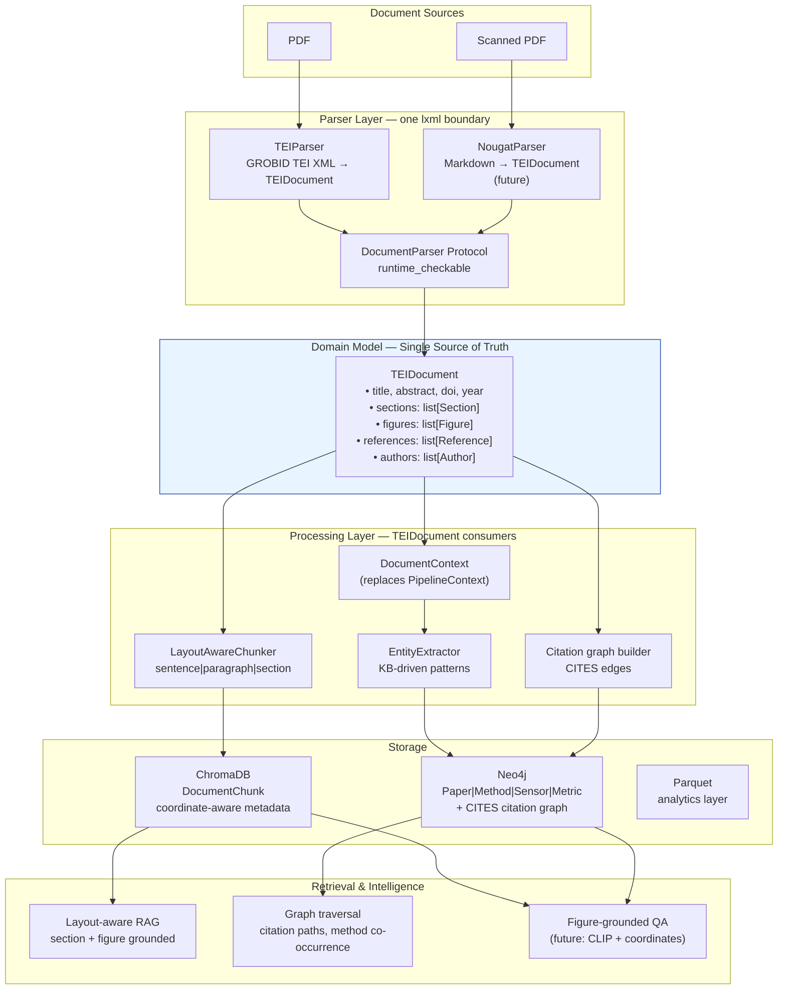
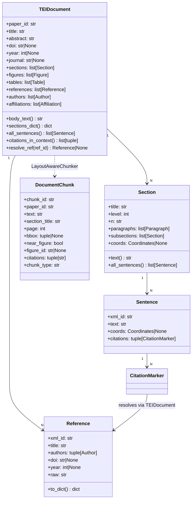
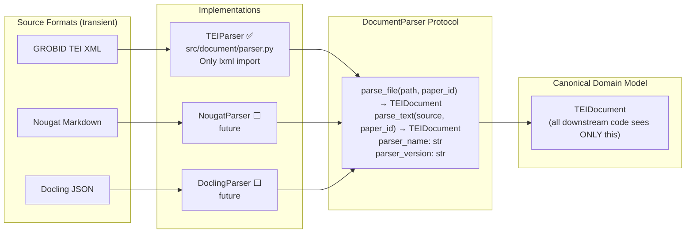
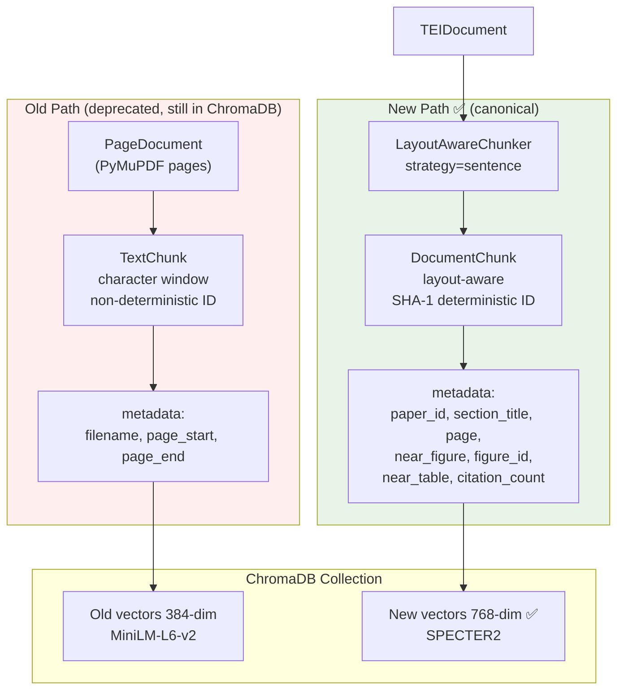
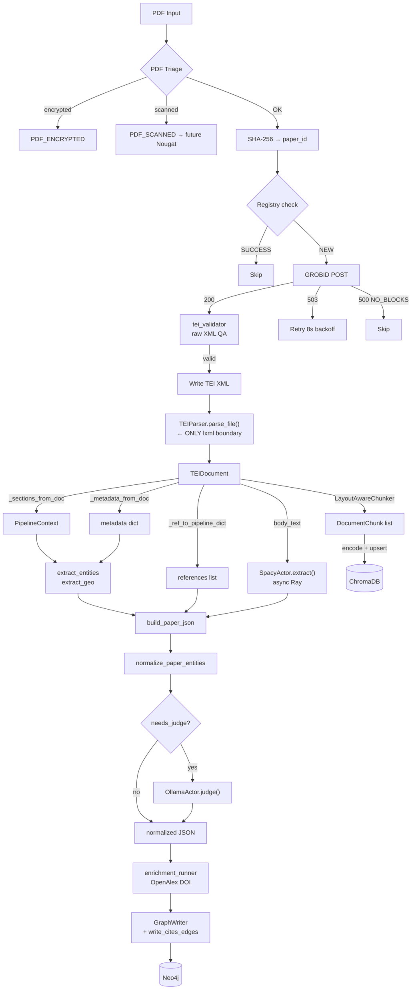
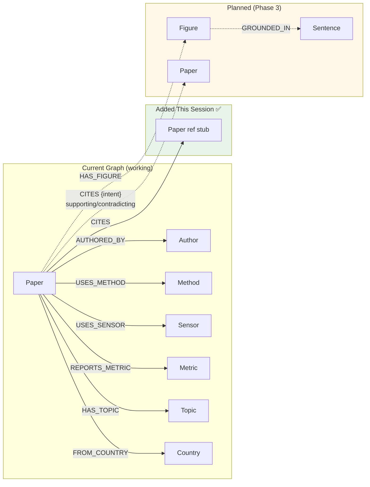
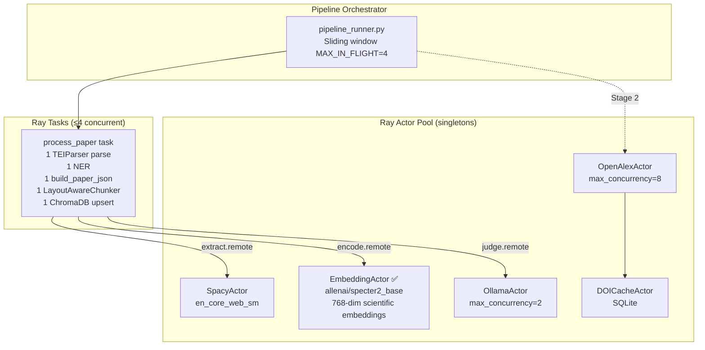
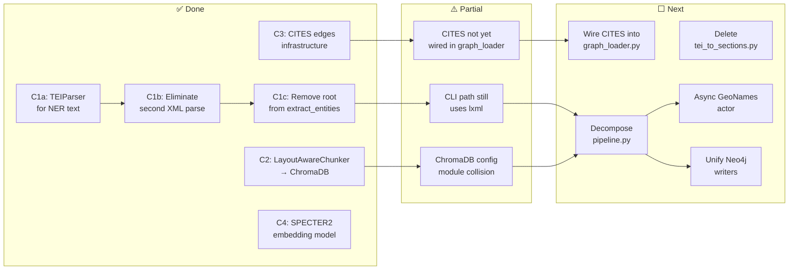

# SDOM Migration: Document-Oriented Architecture
### GeoHydroAI — Principal Engineering Migration Plan

**Date:** 2026-05-13  
**Status:** Phase 1 complete. Phase 2 in progress.  
**Companion doc:** `ARCHITECTURE_REVIEW.md` (full audit)

---

## 1. Executive Summary

The system has two parallel architectures. This document is the authoritative migration plan for collapsing them into one: a **document-oriented scientific intelligence platform** where `TEIDocument` is the single source of truth and XML is a transport format only.

**What was done in this session:**

| Change | File | Status |
|---|---|---|
| C1-a: Wire TEIParser for NER text | `process_paper.py` | ✅ Done |
| C1-b: Eliminate second XML parse | `pipeline.py` + `process_paper.py` | ✅ Done |
| C1-c: Remove `root` from extraction pipeline | `pipeline.py` (extract_entities, extract_geo) | ✅ Done |
| C2: Connect LayoutAwareChunker → ChromaDB | `chroma_store.py` | ✅ Done |
| C3: Citation graph CITES edges | `neo4j_writer.py` + `graph_constraints.py` | ✅ Done |
| C4: EmbeddingActor → SPECTER2 | `embedding_actor.py` | ✅ Done |

**What remains:**

| Priority | Change | File(s) | Effort |
|---|---|---|---|
| P0 | Delete `tei_to_sections.py` | `src/ingestion/tei_to_sections.py` | 0.5 day |
| P0 | Remove lxml from `pipeline.py` CLI path | `pipeline.py` | 2 days |
| P1 | Decompose `pipeline.py` god object | Multiple new files | 1–2 weeks |
| P1 | Wire CITES edge building into graph loader | `graph_loader.py` | 1 day |
| P1 | Async GeoNames actor | New `geonames_actor.py` | 2–3 days |
| P2 | Add `parser_capabilities` to TEIDocument | `models.py` | 0.5 day |
| P2 | Add `schema_version` to TEIDocument | `models.py` | 0.25 day |
| P2 | Unify duplicate Neo4j writers | `src/graph/` vs `src/graphstore/` | 0.5 day |

---

## 2. Phase 1 — Architectural Analysis

### 2.1 XML Boundary Violations (Current State)

After this session's changes:

| File | Violation | Status |
|---|---|---|
| `src/document/parser.py` | lxml import — CORRECT (designated boundary) | ✅ Correct |
| `src/orchestration/process_paper.py` | `from lxml import etree` — removed | ✅ Fixed |
| `src/ingestion/pipeline.py` | lxml at top-level; used in CLI `run()` only | ⚠️ Partial (CLI path) |
| `src/ingestion/extract_references.py` | Receives lxml root; used by `pipeline.py` legacy path | ⚠️ Vestigial |
| `src/ingestion/tei_validator.py` | lxml for pre-write validation | ✅ Justified |
| `src/ingestion/tei_to_sections.py` | lxml throughout — 3,221 lines dead code | ❌ Delete |

**Net change**: The Ray task path (production) no longer imports or uses lxml. The CLI `run()` path in `pipeline.py` still uses it as a fallback, which is acceptable during the transition.

### 2.2 Architectural Dependency Map (Post-Migration)

```
PDF
 │
 ▼
[pdf_triage.py]   SHA-256 → paper_id
 │
 ▼
[PipelineRegistry]   DuckDB idempotency ledger
 │
 ▼
[GROBIDClient]   HTTP → TEI XML bytes
 │
 ▼
[tei_validator.py]   ← LEGITIMATE lxml use (raw bytes validation before disk write)
 │
 ▼
[TEI XML]   written to disk
 │           ← PARSER BOUNDARY — only TEIParser crosses this
 ▼
[TEIParser]   ← THE ONLY lxml import (src/document/parser.py)
 │
 ▼
[TEIDocument]   ← CANONICAL DOMAIN MODEL (all downstream uses this)
 │
 ├─────────────────────────────────────────────────────────┐
 ▼                                                         ▼
[_sections_from_doc()]    [_metadata_from_doc()]    [_ref_to_pipeline_dict()]
 │                         │                         │
 └─────────────────────────┴─────────────────────────┘
                           │
                    [PipelineContext]   section-aware text buckets
                           │
                    [extract_entities()]   KB-driven pattern matching
                           │
                    [build_paper_json()]   assembles paper dict
                           │
                    ┌──────┴──────┐
                    ▼             ▼
            [LayoutAwareChunker]  [normalize_paper_entities()]
                    │                       │
                    ▼                       ▼
             [VectorStore]           [OllamaActor.judge()]
           (DocumentChunks)                 │
                                    [normalized JSON]
                                           │
                                    [enrichment_runner]
                                           │
                                    [GraphWriter]
                                    + write_cites_edges()
```

### 2.3 Duplication Analysis

| System | Old path | New path | Status |
|---|---|---|---|
| XML parsing | `etree.parse()` in `build_paper_json` | `TEIParser().parse_file()` in `process_paper` | ✅ Merged (one parse) |
| Section extraction | `parse_sections(root)` | `_sections_from_doc(doc)` via `section_tags()` | ✅ Unified |
| Author extraction | `parse_authors(root)` | `_metadata_from_doc(doc)` from `doc.authors` | ✅ Unified |
| Reference extraction | `extract_references(root)` (lxml) | `_ref_to_pipeline_dict(r) for r in doc.references` | ✅ Unified |
| Chunking | `src/processing/chunker.py` (character window) | `src/document/chunker.py` (layout-aware) | ⚠️ Both exist |
| Neo4j writer | `src/graph/neo4j_writer.py` + `src/graphstore/neo4j_writer.py` | Keep `src/graph/` | ⚠️ Duplicate |
| Citation edges | Not built | `write_cites_edges()` added | ✅ Infrastructure ready |

---

## 3. Phase 2 — SDOM Migration Design

### 3.1 Parser Boundary Contract

**Rule:** Only `src/document/parser.py` may import lxml.

**Enforcement mechanism:** No other file may contain:
- `from lxml import etree`
- `import lxml`
- `etree.parse()`
- `.xpath(namespaces=...)`
- `etree._Element`

**Current violations (post-session):**
- `src/ingestion/pipeline.py` line 48: `from lxml import etree` — used in CLI `run()` only. Remove when CLI path migrated.
- `src/ingestion/extract_references.py`: receives `root` parameter (lxml element). Vestigial; pipeline now uses SDOM path.
- `src/ingestion/tei_to_sections.py`: 3,221 lines, dead code. Delete.

### 3.2 Canonical Representation Contract

All downstream systems must accept `TEIDocument`, not XML. The migration shim functions (`_metadata_from_doc`, `_sections_from_doc`, `_ref_to_pipeline_dict`) are the compatibility layer during transition. They map TEIDocument → the dict shapes that existing extraction functions expect, requiring zero changes to the extraction layer itself.

**Forward contract:** Once migration is complete:
- `PipelineContext` is replaced by a `DocumentContext(doc: TEIDocument)` that accesses section text directly from `doc` without the category-based bucketing.
- `extract_entities()` accepts `DocumentContext` not `PipelineContext`.
- The `section_tags()` heuristic is retired.

### 3.3 Unified Chunking Architecture

Two chunking systems coexist. The target state:

```
DEPRECATED (keep for read-only compat):
  src/processing/chunker.py → TextChunk
  VectorStore.upsert()

CANONICAL (new):
  src/document/chunker.py → DocumentChunk
  VectorStore.upsert_document_chunks()
```

**Migration path:**
1. New papers ingest via `LayoutAwareChunker` → `upsert_document_chunks()` ✅ Done
2. Old chunks remain in ChromaDB with old metadata schema
3. When re-processing old papers, overwrite by chunk_id (idempotent)
4. After full re-processing: delete old `TextChunk` collection; rename new one to canonical

**Canonical chunk schema:**

| Field | Type | Description |
|---|---|---|
| `chunk_id` | `str` | SHA-1(paper_id:key) — deterministic |
| `paper_id` | `str` | SHA-256 content hash |
| `text` | `str` | Chunk text |
| `chunk_type` | `str` | `abstract | sentence | paragraph | section` |
| `section_title` | `str` | Exact section title |
| `section_level` | `int` | Nesting depth (1=top) |
| `section_n` | `str` | Section number ("1.2" or "") |
| `page` | `int` | PDF page number |
| `near_figure` | `bool` | Within 150pt of a figure |
| `figure_id` | `str` | GROBID figure xml:id |
| `near_table` | `bool` | Within 150pt of a table |
| `citation_count` | `int` | Number of cited references |

**Retrieval capabilities enabled by this schema:**
- Filter by section: `where={"section_level": 1, "section_title": "Methods"}`
- Figure-grounded retrieval: `where={"near_figure": True}`
- Citation-context retrieval: `where={"citation_count": {"$gte": 1}}`
- Page-aware retrieval: `where={"page": {"$gte": 3, "$lte": 7}}`

### 3.4 Knowledge Graph Alignment

**Current graph schema (working):**
```
(:Paper)-[:AUTHORED_BY]->(:Author)
(:Paper)-[:USES_METHOD]->(:Method)
(:Paper)-[:USES_SENSOR]->(:Sensor)
(:Paper)-[:REPORTS_METRIC]->(:Metric)
(:Paper)-[:HAS_TOPIC]->(:Topic)
(:Paper)-[:FROM_COUNTRY]->(:Country)
```

**Added this session:**
```
(:Paper)-[:CITES]->(:Paper)   ← citation graph edges
```

**Planned (Phase 3):**
```
(:Paper)-[:HAS_FIGURE]->(:Figure)
(:Figure)-[:GROUNDED_IN]->(:Sentence)
(:Paper)-[:CITES {intent: "supporting|contradicting|mentioning"}]->(:Paper)
```

**CITES edge strategy:**
- DOI-keyed papers: `MERGE (tgt:Paper {doi: ...})` → links to existing papers or creates stubs
- Title-only papers: `MERGE (tgt:Paper {title: ...})` as last resort
- Stub nodes: `is_reference_stub=true` — queryable to find papers not yet ingested
- The DOI index added to `graph_constraints.py` makes these merges fast

### 3.5 Coordinate-aware Retrieval Architecture

The coordinate infrastructure is in place. The missing connection is from chunk coordinates to retrieval filters.

**Current capability (after C2):**
- `DocumentChunk.page` → page-filtered retrieval
- `DocumentChunk.near_figure` → figure-grounded retrieval
- `DocumentChunk.bbox` → stored in `DocumentChunk` but not in ChromaDB metadata (ChromaDB doesn't support tuple types)

**Path to full coordinate retrieval:**
```python
# Phase 3: query "sentences near figures on page 4"
results = vectorstore.query(
    query_embedding,
    where={"near_figure": True, "page": 4},
)
# Then resolve figure by chunk.figure_id → doc.resolve_figure(figure_id) → Figure.coords
```

**PDF annotation overlay (Semantic Reader-style):**
```python
# Future: given a query result, highlight the sentence in the PDF
chunk = results[0]
# chunk.bbox = (x, y, w, h) in PDF points on chunk.page
import fitz  # PyMuPDF
page = pdf_doc[chunk.page - 1]
page.draw_rect(fitz.Rect(x, y, x+w, y+h), color=(1, 0.8, 0))
```

---

## 4. Phase 3 — Implementation Status

### 4.1 Completed (this session)

#### C1: Eliminate double XML parse

**Before:**
```python
# process_paper.py — parse #1 for NER
tree      = etree.parse(str(xml_path))
root      = tree.getroot()
sections  = parse_sections(root)
full_text = build_full_text(sections)

del tree, root, sections, full_text  # freed
gc.collect()

# pipeline.py build_paper_json — parse #2 for extraction
tree     = etree.parse(str(xml_path))   # ← second parse
root     = tree.getroot()
metadata = parse_metadata(root, xml_path)
sections = parse_sections(root)
```

**After:**
```python
# process_paper.py — ONE parse, used for both NER and extraction
doc       = TEIParser().parse_file(xml_path, paper_id)
full_text = doc.body_text()
ner_future = spacy_actor.extract.remote(full_text)
del full_text  # free string; keep doc
gc.collect()

# ... NER runs concurrently ...

# build_paper_json uses doc — no second parse
paper = build_paper_json(xml_path, doc=doc, ...)
del doc  # free after extraction
```

**Net change:** 2 × file I/O + 2 × lxml parse → 1 × file I/O + 1 × lxml parse per paper. Memory reduction on large papers.

#### C1b: Remove `root` from extraction pipeline

`extract_entities(root, ctx, metadata, ...)` and `extract_geo(root, ctx, metadata, ...)` both received `root` but **never used it** — it was dead code threaded through two function calls. Removed from both signatures.

#### C1c: SDOM bridge helpers

Three helpers replace the old lxml-based functions:

```python
def _metadata_from_doc(doc, xml_path) -> dict:
    """TEIDocument → parse_metadata() output shape."""
    # Uses doc.authors, doc.affiliations, doc.title, doc.doi, doc.year, doc.journal

def _sections_from_doc(doc) -> dict:
    """TEIDocument → parse_sections() output shape."""
    # Applies section_tags() heuristic to doc.sections
    # Identical bucketing behavior to parse_sections(root)

def _ref_to_pipeline_dict(ref) -> dict:
    """TEIDocument Reference → extract_references() output shape."""
    # Maps ref.title, ref.authors, ref.year, ref.doi, ref.journal, ref.raw
```

These maintain 100% backward compatibility with all downstream extraction code.

#### C2: LayoutAwareChunker → ChromaDB

```python
# VectorStore.upsert_document_chunks() — new canonical write path
vs = VectorStore()
chunks = LayoutAwareChunker(strategy="sentence").chunk(doc)
vecs   = np.array(encode_fn([c.text for c in chunks]))
vs.upsert_document_chunks(chunks, vecs)
```

This fires automatically inside `process_paper.py` after `build_paper_json` returns (while `doc` is still alive). Wrapped in `try/except` so a ChromaDB error never fails the main ingestion.

#### C3: Citation graph edges

```python
# GraphWriter.write_cites_edges() — new citation graph method
# GraphWriter.build_cites_rows() — helper to convert reference list
rows = gw.build_cites_rows(paper_id, paper["references"])
gw.write_cites_edges(rows)
```

Wire into `graph_loader.py` Stage 3:
```python
# In graph_loader.py after write_papers():
for paper in papers:
    rows = gw.build_cites_rows(
        paper["metadata"]["paper_id"],
        paper.get("references", []),
    )
    gw.write_cites_edges(rows)
```

#### C4: EmbeddingActor → SPECTER2

```python
_PREFERRED_MODEL = os.getenv("EMBEDDING_MODEL", "allenai/specter2_base")
# Falls back to all-MiniLM-L6-v2 if SPECTER2 unavailable
# Adds: batch_size control, error handling, model_info() provenance method
```

**Re-embedding required:** Existing ChromaDB vectors were encoded with MiniLM-L6-v2 (384-dim). SPECTER2 produces 768-dim vectors. The collection must be cleared and re-populated after the model change:
```python
vs = VectorStore()
vs.clear()    # clears old 384-dim vectors
# then re-run the ingestion pipeline to re-embed with SPECTER2
```

---

## 5. File-by-File Migration Plan

### `src/orchestration/process_paper.py`

| Aspect | Before | After |
|---|---|---|
| Role | Ray task: parse + NER + extract + normalize + judge | Same, plus: chunking → ChromaDB |
| lxml | Imported (line 129) | ✅ Removed |
| XML parse | 2× (for NER + build_paper_json) | ✅ 1× (TEIParser once) |
| Chunking | Not present | ✅ Added (LayoutAwareChunker) |
| Migration complexity | Low | Done |
| Risk | None — backward compat maintained | None |

### `src/ingestion/pipeline.py`

| Aspect | Before | After |
|---|---|---|
| Role | 2,148-line god object: parsing + extraction + geo + judge | Same, minus duplicate XML parse |
| lxml | `from lxml import etree` at top | Used only in CLI `run()` path |
| `extract_entities` signature | `(root, ctx, metadata, ...)` | ✅ `(ctx, metadata, ...)` |
| `extract_geo` signature | `(root, ctx, metadata, ...)` | ✅ `(ctx, metadata, ...)` |
| `build_paper_json` | Parses XML internally | ✅ Uses `doc` when provided |
| Bridge helpers | None | ✅ `_metadata_from_doc`, `_sections_from_doc`, `_ref_to_pipeline_dict` |
| Remaining work | Break into focused modules (I1) | P1 — 1–2 weeks |

**Future decomposition target:**
```
pipeline.py (2,148 lines) → split into:
  src/ingestion/geo_extractor.py    (geonames, rivers, regions)
  src/ingestion/section_classifier.py (section_tags, PipelineContext)
  src/ingestion/embedding_classifier.py (classify_with_embeddings, study type)
  src/ingestion/paper_assembler.py  (build_paper_json, apply_constraints)
  src/ingestion/knowledge/         (already separate — KB, EntityExtractor)
```

### `src/ingestion/extract_references.py`

| Aspect | Status |
|---|---|
| Role | Parse bibliography from lxml root | 
| SDOM status | ✅ Superseded by `TEIParser._parse_references()` |
| Production path | Still imported by `pipeline.py` legacy/CLI path |
| Action | Keep until `pipeline.py` CLI path migrated; then delete |

### `src/ingestion/tei_to_sections.py`

| Aspect | Status |
|---|---|
| Role | Original monolithic script (predecessor to pipeline.py) |
| Lines | 3,221 |
| Usage | Zero — dead code |
| Action | **DELETE** — no migration needed |

### `src/ingestion/tei_validator.py`

| Aspect | Status |
|---|---|
| Role | Validates raw TEI XML text before writing to disk |
| lxml | Justified — operates on raw bytes from GROBID, before TEIParser |
| Action | Keep as-is — this is the right layer for this logic |

### `src/vectorstore/chroma_store.py`

| Aspect | Before | After |
|---|---|---|
| Role | ChromaDB wrapper for TextChunk | Same + DocumentChunk |
| `upsert()` | `list[TextChunk]` | Unchanged |
| `upsert_document_chunks()` | Not present | ✅ Added |
| `_document_chunk_meta()` | Not present | ✅ Added |
| Pre-existing issue | `from src.config import CHROMA_DIR` fails (config module collision) | Not introduced by this change |

### `src/document/chunker.py`

| Aspect | Status |
|---|---|
| Role | LayoutAwareChunker → DocumentChunk |
| Production wired | ✅ Via process_paper.py step 5 |
| Strategy | `sentence` (default), `paragraph`, `section` |
| Proximity threshold | 150pt (≈2 inches) |

### `src/actors/embedding_actor.py`

| Aspect | Before | After |
|---|---|---|
| Model | `all-MiniLM-L6-v2` (384-dim, general) | `allenai/specter2_base` (768-dim, scientific) |
| Error handling | None | ✅ Try/except with fallback |
| Logging | None | ✅ Model name, fallback warning |
| Batch control | None | ✅ `EMBEDDING_BATCH_SIZE` env var |
| `model_info()` | Not present | ✅ Added for provenance |

### `src/graph/neo4j_writer.py`

| Aspect | Before | After |
|---|---|---|
| CITES edges | Not supported | ✅ `write_cites_edges()` |
| Helper | Not present | ✅ `build_cites_rows()` |
| DOI index | Not indexed | ✅ Added to `graph_constraints.py` |

### `src/graphstore/neo4j_writer.py`

| Aspect | Status |
|---|---|
| Role | Duplicate Neo4j writer (fact-centric schema) |
| Action | Audit: determine which schema is in use; delete the other |

---

## 6. Architecture Diagrams

### 6.1 Current Architecture (Post-Migration)



### 6.2 Target Architecture (Fully Migrated)



### 6.3 SDOM Domain Model



### 6.4 Parser Virtualization



### 6.5 Chunking Pipeline



### 6.6 Ingestion Pipeline (Complete)



### 6.7 Knowledge Graph (Current + Target)



### 6.8 Actor Architecture



### 6.9 Migration Flow



---

## 7. Remaining Blockers & Action Items

### P0 — Do immediately

**Delete `tei_to_sections.py`** (3,221 lines dead code):
```bash
rm src/ingestion/tei_to_sections.py
```
No imports reference it from the production path. Safe to delete.

**Wire CITES edges into `graph_loader.py`:**
After `write_papers(rows)`, add:
```python
for paper_row in paper_data:
    cites_rows = gw.build_cites_rows(
        paper_row["paper_id"],
        paper_row.get("references", []),
    )
    gw.write_cites_edges(cites_rows)
```

**Fix ChromaDB config module collision:**
`src/vectorstore/chroma_store.py` imports `from src.config import CHROMA_DIR` but the `src/config/` package directory shadows `src/config.py`. Fix:
```python
# chroma_store.py — change import to:
from src.config.settings import CHROMA_DIR, COLLECTION_NAME
# if settings.py has them; otherwise add them there
```

### P1 — Within 2 weeks

**Decompose `pipeline.py`** into focused modules. The `build_paper_json` function is the main assembly point that calls everything else. Decompose by splitting extraction concerns into:
- `src/ingestion/geo_extractor.py` — all geo functions (geonames, rivers, regions)
- `src/ingestion/embedding_classifier.py` — `classify_with_embeddings`, study type detection
- `src/ingestion/paper_assembler.py` — `build_paper_json` + `PipelineContext`

**Async GeoNames actor** with SQLite cache:
```python
# Parallel to DOICacheActor
@ray.remote(max_concurrency=4)
class GeoNamesActor:
    def __init__(self):
        self._cache = {}  # eventually SQLite
    
    def geocode(self, name: str) -> Optional[dict]:
        if name in self._cache:
            return self._cache[name]
        result = geonames_lookup(name)  # existing function
        self._cache[name] = result
        return result
```
Replace synchronous `geocode_place(name)` calls with `ray.get(geonames_actor.geocode.remote(name))`.

**Unify Neo4j writers:**
`src/graphstore/neo4j_writer.py` (fact-centric schema for `ScientificFact`) and `src/graph/neo4j_writer.py` (batch writer for `Paper/Method/Sensor`). Audit which is in use; delete the dead one or merge into a single coherent schema.

### P2 — Quality improvements

**`parser_capabilities` on TEIDocument:**
```python
@dataclass
class TEIDocument:
    ...
    parser_capabilities: frozenset[str] = field(default_factory=frozenset)
    # e.g. frozenset({"coordinates", "sentence_segmentation", "raw_citations"})
```
`TEIParser` sets this based on what it finds in the XML. Downstream code checks before using coordinate-dependent features.

**`schema_version` on TEIDocument:**
```python
    schema_version: str = "1.0"
```
Increment when models change. Required before serializing TEIDocument to disk/document stores.

---

## 8. Validation Checklist

After each migration step, verify:

- [ ] `process_paper.py` contains no `from lxml` or `etree` references
- [ ] `build_paper_json(xml_path, doc=doc)` produces identical output to `build_paper_json(xml_path)` for the same paper
- [ ] `LayoutAwareChunker.chunk(doc)` produces chunks with `paper_id` matching `paper["metadata"]["paper_id"]`
- [ ] ChromaDB query with `where={"paper_id": paper_id}` returns chunks for a processed paper
- [ ] `write_cites_edges()` creates `CITES` edges in Neo4j (verify with `MATCH ()-[:CITES]->() RETURN count(*)`)
- [ ] `EmbeddingActor.model_info()` returns `allenai/specter2_base` with `embedding_dim: 768`
- [ ] No `tei_to_sections.py` import anywhere in the codebase after deletion
