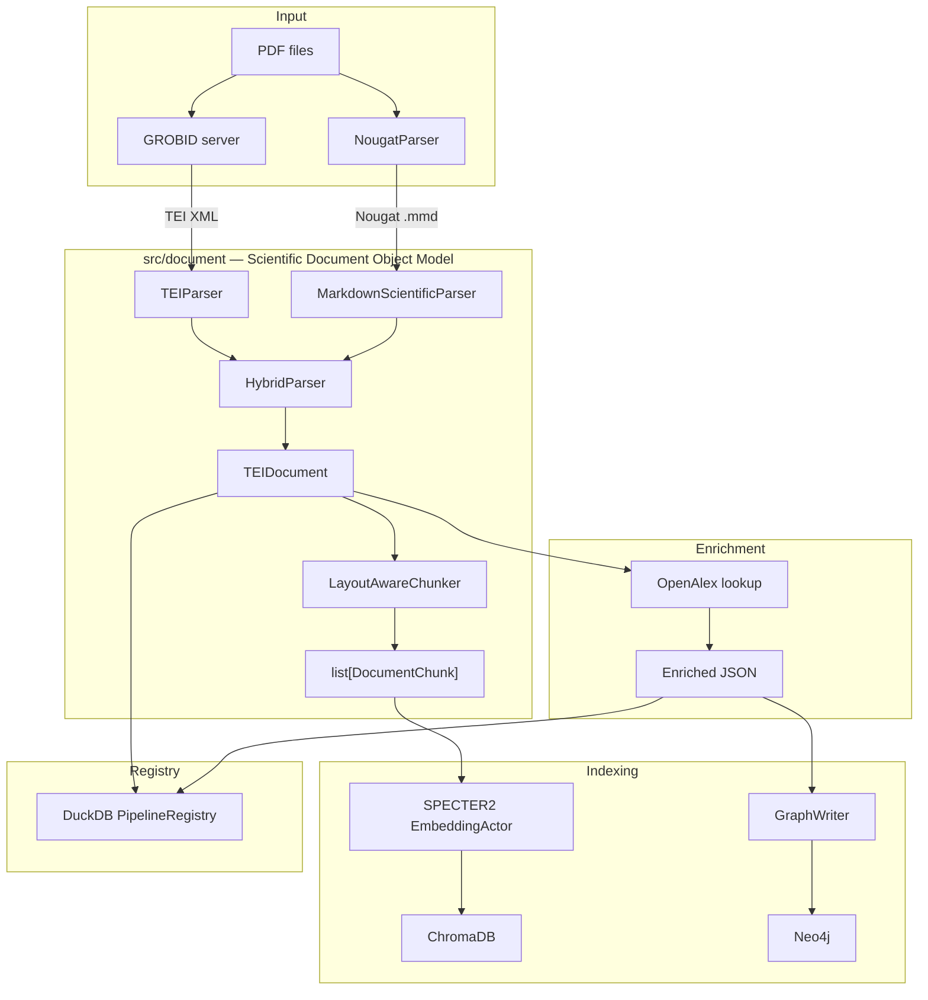

# GeoHydroAI — Scientific Document Intelligence Platform

A production-grade pipeline for ingesting, parsing, enriching, and querying hydrological and geospatial research literature. Transforms raw PDFs into a queryable knowledge graph with structured entity extraction, citation networks, semantic embeddings, and hybrid visual/structural document parsing.

```
PDF corpus
  │
  ├─ GROBID (structure + coords)   ─┐
  │                                  ├─ HybridParser ─→ TEIDocument
  └─ Nougat (OCR + formulas)        ─┘        │
                                              ↓
                                    LayoutAwareChunker
                                              │
                          ┌───────────────────┼───────────────────┐
                          ↓                   ↓                   ↓
                    ChromaDB             Neo4j KG            OpenAlex
                  (semantic search)   (citation graph)     (metadata)
```

---

## Table of Contents

1. [Quick Start](#quick-start)
2. [System Requirements](#system-requirements)
3. [Architecture Overview](#architecture-overview)
4. [Runtime Data Flow](#runtime-data-flow)
5. [Five-Stage Pipeline](#five-stage-pipeline)
6. [Document Parsing Layer (SDOM)](#document-parsing-layer-sdom)
   - [TEIDocument — Canonical Domain Object](#teidocument--canonical-domain-object)
   - [Parser Hierarchy](#parser-hierarchy)
   - [Hybrid Parsing Strategy](#hybrid-parsing-strategy)
   - [Parser Router](#parser-router)
   - [Parser Quality Assessment](#parser-quality-assessment)
   - [Layout-Aware Chunking](#layout-aware-chunking)
7. [Memory Architecture](#memory-architecture)
8. [Knowledge Graph (Neo4j)](#knowledge-graph-neo4j)
9. [Semantic Search (ChromaDB + SPECTER2)](#semantic-search-chromadb--specter2)
   - [Why SPECTER2?](#why-specter2)
   - [Why ChromaDB?](#why-chromadb)
10. [Formula-Aware Retrieval](#formula-aware-retrieval)
11. [Figure-Grounded Retrieval](#figure-grounded-retrieval)
12. [OpenAlex Enrichment](#openalex-enrichment)
13. [Why Ray?](#why-ray)
14. [Observability](#observability)
15. [Pipeline Registry (DuckDB)](#pipeline-registry-duckdb)
16. [Ontology v2](#ontology-v2)
17. [Scientific Use-Cases](#scientific-use-cases)
18. [Security & Trust Boundaries](#security--trust-boundaries)
19. [Configuration Reference](#configuration-reference)
20. [Installation](#installation)
21. [Running the Pipeline](#running-the-pipeline)
22. [Testing](#testing)
23. [Project Structure](#project-structure)
24. [Extending the Platform](#extending-the-platform)
25. [Failure Types Reference](#failure-types-reference)
26. [Roadmap](#roadmap)

---

## Quick Start

Get from zero to a running system in under 5 minutes (CPU-only, 3 sample papers).

```bash
# 1. Clone
git clone <repo-url> knoweledg_graf
cd knoweledg_graf

# 2. Python environment
python3.11 -m venv .venv
source .venv/bin/activate
pip install -r requirements.txt
python -m spacy download en_core_web_sm

# 3. Start services (Docker)
docker run -d --name neo4j \
  -p 7474:7474 -p 7687:7687 \
  -e NEO4J_AUTH=neo4j/password123 \
  neo4j:5

docker run -d --name grobid \
  -p 8070:8070 \
  lfoppiano/grobid:0.8.0

# 4. Configure
cp .env.example .env
# Edit .env — set NEO4J_PASSWORD=password123, NOUGAT_ENABLED=false (CPU-only run)

# 5. Drop PDFs
cp /path/to/papers/*.pdf data/literature/

# 6. Ingest (parses PDFs, extracts structure, embeds chunks)
python -m src.ingestion.pipeline --limit 3

# 7. Query
python main.py --query
```

**Expected output** after step 6:
```
[pipeline] 3 papers queued
[p001] GROBID parse: 14 sections, 312 refs, 0.91 quality score
[p002] GROBID parse: 8 sections, 201 refs, quality score 0.38 → Nougat fallback
[p003] GROBID parse: 11 sections, 189 refs, 0.84 quality score
[pipeline] 3/3 done  elapsed 47s
```

**With GPU + full Nougat** (recommended for production):
```bash
# In .env
NOUGAT_ENABLED=true
NOUGAT_DEVICE=cuda
PARSER_STRATEGY=grobid_with_nougat_fallback
EMBEDDING_DEVICE=cuda
```

---

## System Requirements

### Minimum (CPU-only, Nougat disabled)

| Resource | Minimum | Notes |
|---|---|---|
| CPU | 4 cores | 8+ recommended for Ray parallelism |
| RAM | 8 GB | 16 GB recommended for large corpora |
| Storage | 10 GB | PDF + GROBID XML + ChromaDB + Neo4j |
| Python | 3.11+ | |
| Docker | 20.10+ | For GROBID and Neo4j |

### Recommended (GPU, full Nougat + SPECTER2)

| Resource | Recommended | Notes |
|---|---|---|
| CPU | 8–16 cores | Ray task concurrency |
| RAM | 32 GB | TEIDocument objects stay in-process during ingestion |
| GPU VRAM | 8 GB | NougatActor (0.5) + EmbeddingActor (0.25) share one GPU |
| GPU VRAM | 16 GB | Comfortable headroom; allows `NOUGAT_GPU_FRACTION=0.75` |
| Storage | 50 GB | Large corpus: PDFs + XML + enriched JSON + Neo4j + Chroma |
| CUDA | 12.x | Required for GPU path |

### Component Memory Breakdown

| Component | Peak RAM | Notes |
|---|---|---|
| GROBID server (JVM) | 2–4 GB | Configured in GROBID's JVM args |
| Neo4j | 2–4 GB | `dbms.memory.heap.max_size` in neo4j.conf |
| NougatParser (model) | 1.4 GB VRAM | facebook/nougat-base |
| SPECTER2 (model) | 1.5 GB VRAM | allenai/specter2_base |
| ChromaDB | 0.5–2 GB RAM | Grows with collection size |
| Ray overhead | 0.5 GB RAM | Per-worker baseline |
| TEIDocument (per paper) | 2–20 MB RAM | Held during processing, then released |

**Storage growth rate**: approximately 15 MB per ingested paper (XML + JSON + embeddings + graph).

---

## Architecture Overview



### Key Design Principles

| Principle | Implementation |
|---|---|
| Single canonical representation | `TEIDocument` is the only domain object; all parsers produce it |
| Parser virtualization | `DocumentParser` protocol; swap backends without touching downstream |
| Coordinates ownership | Only GROBID claims `COORDINATES` capability; Nougat never does |
| Conservative merge | GROBID wins structure/metadata; Nougat wins formulas/OCR |
| Lazy heavy loads | NougatParser loads model on first `parse_pdf()` call; EmbeddingActor on first encode |
| Idempotent pipeline | Two-level guard: registry pre-filter + task-level check |
| Ray-native actors | All stateful resources (GPU models, DB connections) live in Ray actors |
| Immutable domain objects | `TEIDocument` is a frozen dataclass; no in-place mutation after construction |

---

## Runtime Data Flow

This diagram shows what happens to a single PDF from disk read to fully indexed state.

```
┌─────────────────────────────────────────────────────────────────────────────┐
│  STAGE 1 — INGESTION                                                        │
│                                                                             │
│  disk: paper.pdf                                                            │
│       │                                                                     │
│       ├── GROBID server ──────────────► paper.tei.xml  (disk: grobid_xml/) │
│       │        (Java, REST API)                                             │
│       │                                                                     │
│       └── ParserRouter.parse_pdf()                                          │
│                │                                                            │
│                ├─ TEIParser(xml) ─────► TEIDocument  (in-memory)           │
│                │   quality_score ≥ 0.4? ──► return as-is                   │
│                │   quality_score < 0.4? ──► trigger Nougat                 │
│                │                                                            │
│                └─ NougatParser(pdf)                                         │
│                    │  fitz renders pages to PIL @ 150 DPI                  │
│                    │  NougatProcessor.batch_decode()                        │
│                    │  MarkdownScientificParser.parse_text()                 │
│                    └──────────────────► nougat TEIDocument (in-memory)     │
│                                                                             │
│                HybridParser._merge()                                        │
│                    GROBID wins: title, abstract, refs, coords               │
│                    Nougat wins: formulas, visual_text, markdown_text        │
│                    └──────────────────► merged TEIDocument (in-memory)     │
│                                                                             │
│                LayoutAwareChunker.chunk()                                   │
│                    └──────────────────► list[DocumentChunk] (in-memory)    │
│                                                                             │
│                EmbeddingActor.encode(chunk.text for each chunk)             │
│                    └──────────────────► float32 tensors (GPU → CPU)        │
│                                                                             │
│                ChromaDB.add(chunks, vectors)                               │
│                    └──────────────────► persisted in .chromadb/             │
│                                                                             │
│                TEIDocument → paper_json/paper_id.json  (disk)              │
│                PipelineRegistry.upsert(paper_id, "ingestion", "DONE")      │
└─────────────────────────────────────────────────────────────────────────────┘

┌─────────────────────────────────────────────────────────────────────────────┐
│  STAGE 2 — OPENALEX                                                         │
│                                                                             │
│  disk: paper_json/paper_id.json                                             │
│       │                                                                     │
│       └── OpenAlex API (DOI lookup) ──► enriched JSON  (disk: enriched/)   │
│           citation count, oa_url, ROR institutions, concept tags            │
└─────────────────────────────────────────────────────────────────────────────┘

┌─────────────────────────────────────────────────────────────────────────────┐
│  STAGE 4 — GRAPH BUILD                                                      │
│                                                                             │
│  disk: enriched/paper_id.json                                               │
│       │                                                                     │
│       └── graph_loader.load_*() ──► list[dict] row batches                  │
│              │                                                              │
│              └── GraphWriter.write_*() ──► Neo4j MERGE (Cypher)            │
│                   nodes: Paper, Author, Institution, Keyword, …             │
│                   edges: AUTHORED_BY, CITES, AFFILIATED_WITH, …            │
└─────────────────────────────────────────────────────────────────────────────┘

Memory lifetime:
  TEIDocument ────────── alive during ingestion task; GC'd after JSON write
  DocumentChunk list ─── alive during embedding; GC'd after ChromaDB write
  embedding tensors ───── GPU memory; cleared per-page in NougatParser
  Enriched JSON ────────── on disk; never fully loaded into RAM as one object
```

---

## Five-Stage Pipeline

```
Stage 1 — Ingestion          PDF → GROBID/Nougat → TEIDocument → Enriched JSON
Stage 2 — OpenAlex           Paper IDs → OpenAlex API → citation graph metadata
Stage 3 — Reference Enrich   Bibliography entries → DOI resolution → stub nodes
Stage 4 — Graph Build        Enriched JSON → Neo4j nodes + edges
Stage 5 — Analytics          Neo4j → Parquet → DuckDB for analytics queries
```

### Stage Entry Points

| Stage | Script | Orchestrator |
|---|---|---|
| 1 — Ingestion | `src/ingestion/pipeline.py` | Ray remote tasks |
| 2 — OpenAlex | `src/enrichment/openalex_enricher.py` | single-threaded, rate-limited |
| 3 — Reference | `src/enrichment/reference_enricher.py` | async batch |
| 4 — Graph | `src/graph/build_graph.py` | `GraphWriter` + `graph_loader` |
| 5 — Analytics | `src/analytics/export_parquet.py` | DuckDB |

**Critical invariant**: Never mix XML parsing, OpenAlex HTTP requests, and Neo4j writes in one stage. Each stage operates on its own input/output directory and can be re-run independently.

---

## Document Parsing Layer (SDOM)

The Scientific Document Object Model lives in `src/document/`. All scientific document concepts are modeled here; nothing downstream knows about XML, PDF rendering, or Nougat markdown.

### TEIDocument — Canonical Domain Object

`TEIDocument` (`src/document/models.py`) is the single output of every parser and the single input to every downstream consumer. It is a frozen dataclass — immutable after construction.

```python
@dataclass(frozen=True)
class TEIDocument:
    # ── Identity ──────────────────────────────────────────────────────────────
    paper_id:   str
    title:      str
    abstract:   str

    # ── Bibliographic ─────────────────────────────────────────────────────────
    authors:      list[Author]
    affiliations: list[Affiliation]
    references:   list[Reference]
    year:         int | None
    doi:          str | None
    journal:      str | None
    keywords:     list[str]

    # ── Body ──────────────────────────────────────────────────────────────────
    sections:         list[Section]
    figures:          list[Figure]
    tables:           list[Table]
    formulas:         list[Formula]
    citation_markers: list[CitationMarker]

    # ── Parser provenance ─────────────────────────────────────────────────────
    parser_kind:         ParserKind                  = ParserKind.GROBID
    parser_capabilities: frozenset[ParserCapability] = frozenset()
    parser_provenance:   list[ParserProvenance]      = field(default_factory=list)
    document_quality:    DocumentQuality | None       = None
    source_paths:        list[str]                   = field(default_factory=list)

    # ── Visual parser outputs ─────────────────────────────────────────────────
    markdown_text: str | None = None   # raw Nougat .mmd output
    visual_text:   str | None = None   # plain body text from Nougat
```

`summary()` returns a serialisable dict used by Ray actors for cross-process transport.

#### Structured Sub-objects

| Class | Key Fields |
|---|---|
| `Section` | title, level (1–6), text, paragraphs, figures, tables, formulas |
| `Paragraph` | text, sentences, section_id |
| `Sentence` | text, start_char, end_char |
| `Figure` | xml_id, label, caption, coords |
| `Table` | xml_id, label, caption, rows (list of tuples) |
| `Formula` | xml_id, text, mathml |
| `Author` | given, surname, orcid, affiliations |
| `Affiliation` | institution, department, country, coords |
| `Reference` | xml_id, title, authors, year, doi, journal, volume, pages |
| `CitationMarker` | xml_id, ref_ids, text, coords |

### Parser Hierarchy

```
DocumentParser (Protocol)
 ├── TEIParser            — GROBID TEI XML → TEIDocument     (primary; text PDFs)
 ├── NougatParser         — PDF images → Nougat markdown → TEIDocument (scanned/formula-heavy)
 ├── MarkdownScientificParser — raw .mmd → TEIDocument        (no model; pure Python)
 └── HybridParser         — GROBID + Nougat → merged TEIDocument
         ↑
     ParserRouter         — dispatches any PDF to the right parser by strategy
```

All parsers satisfy the `DocumentParser` protocol:
```python
class DocumentParser(Protocol):
    parser_name:    str
    parser_version: str

    def parse_file(self, path: Path, paper_id: str) -> TEIDocument: ...
```

#### `TEIParser` (GROBID)

- Input: GROBID TEI XML produced by the GROBID server (`grobid_xml/` directory)
- Capabilities: `STRUCTURE, COORDINATES, REFERENCES, CITATIONS, FIGURES, TABLES, FORMULAS`
- **Only parser allowed to import lxml** — all other code consumes `TEIDocument`
- Coordinates are parsed into `BoundingBox` objects (page, x0, y0, x1, y1)
- Citation markers are cross-referenced against the reference list by `xml:id`

#### `NougatParser` (Visual/OCR)

- Input: PDF file; renders pages to PIL images via PyMuPDF at 150 DPI
- Model: `facebook/nougat-base` (HuggingFace VisionEncoderDecoder, ~350 MB)
- Capabilities: `STRUCTURE, OCR, MARKDOWN, VISUAL_CONTENT, FORMULAS, TABLES`
- **Never claims `COORDINATES`** — it reads images, not PDF geometry
- Lazy model loading: model is loaded on first `parse_pdf()` call, not on import
- Page-by-page inference with CUDA cache cleared between pages
- OOM → raises `NougatParseError(failure_kind="NOUGAT_OOM")`
- Disabled entirely when `NOUGAT_ENABLED=false`

```python
from src.document import NougatParser

parser = NougatParser()                           # model not loaded yet
doc = parser.parse_pdf(Path("paper.pdf"), "p001") # model loaded here
print(doc.markdown_text[:500])
```

#### `MarkdownScientificParser`

- Input: Nougat `.mmd` or `.md` text (string or file path)
- Zero model dependencies — uses regex only
- Extracts display math `$$...$$` and `\[...\]` before paragraph splitting
- Heading detection by `#{1,6}` prefix → `Section` objects
- Table detection: pipe-separated rows after separator row
- Reference section detection by heading text (`references`, `bibliography`, …)
- Never raises — malformed input returns an empty-but-valid `TEIDocument`

### Hybrid Parsing Strategy

`HybridParser` (`src/document/hybrid_parser.py`) runs GROBID and Nougat and merges the results following a conservative V1 merge policy:

```
GROBID wins:   title, abstract, authors, affiliations, sections, references,
               citation markers, figures, coordinates

Nougat wins:   formulas (union, dedup by .text), tables (if GROBID has none),
               markdown_text, visual_text
```

**Formula deduplication**: Nougat formulas are merged into the GROBID formula list only when their `.text` is not already present. Nougat-sourced formulas receive an `xml_id` prefixed with `"nougat-"` for provenance traceability.

**Provenance tracking**: The merged `TEIDocument` carries `parser_provenance` records from both parsers, including elapsed time, parser version, and capabilities exercised.

**Fallback chain**:
1. GROBID parse succeeds → assess quality
2. Quality good → return GROBID result
3. Quality poor → run Nougat
4. Both available → merge
5. GROBID failed entirely → return Nougat result alone
6. Both failed → re-raise last exception

### Parser Router

`ParserRouter` (`src/document/parser_router.py`) is the single entry point for all PDF parsing. It dispatches to the appropriate parser based on the configured strategy.

```python
from src.document import ParserRouter, RouterConfig

router = ParserRouter(RouterConfig(strategy="auto"))
doc = router.parse_pdf(pdf_path, paper_id, grobid_xml=xml_path)
```

#### Routing Strategies

| Strategy | Behaviour |
|---|---|
| `auto` | Inspect PDF; scanned PDFs go to Nougat, text PDFs to GROBID, then quality-gate |
| `grobid_only` | Always use GROBID TEIParser; never invoke Nougat |
| `nougat_only` | Always use NougatParser; ignore any GROBID XML |
| `hybrid` | Always run both and merge |
| `grobid_with_nougat_fallback` | GROBID first; quality-gate; Nougat only if quality < 0.4 (**default**) |

Set via `PARSER_STRATEGY` env var.

#### `RouterConfig`

```python
@dataclass
class RouterConfig:
    strategy:          str  = "grobid_with_nougat_fallback"
    augment_formulas:  bool = True   # copy Nougat formulas into hybrid result
    augment_tables:    bool = True   # copy Nougat tables when GROBID has none
    augment_visual:    bool = True   # copy markdown_text / visual_text
    nougat_enabled:    bool = True   # master kill-switch; respects NOUGAT_ENABLED
```

### Parser Quality Assessment

`assess_quality()` (`src/document/parser_quality.py`) scores a `TEIDocument` on a weighted 0–1 scale:

| Feature | Weight |
|---|---|
| Has title | 0.15 |
| Has abstract | 0.10 |
| ≥ 1 section | 0.20 |
| ≥ 3 sections | 0.10 |
| Has references | 0.15 |
| Has citation markers | 0.10 |
| Has coordinates | 0.10 |
| Has figures or tables | 0.10 |

`needs_nougat_augmentation(quality)` returns `True` when `quality_score < 0.4`.

`is_grobid_output_usable(quality)` returns `True` when `has_structure and quality_score >= 0.2`.

### Layout-Aware Chunking

`LayoutAwareChunker` (`src/document/chunker.py`) splits `TEIDocument` into `DocumentChunk` objects that preserve document structure in their metadata.

```python
@dataclass
class DocumentChunk:
    chunk_id:   str    # deterministic SHA-256 hash of paper_id + content
    paper_id:   str
    text:       str
    section:    str    # section title
    chunk_type: str    # "abstract" | "body" | "figure" | "table" | "formula"
    page_range: tuple[int, int] | None
    coords:     BoundingBox | None
    position:   int    # 0-based index within paper
```

Chunks are used downstream for:
- SPECTER2 embedding and ChromaDB indexing
- Retrieval context window assembly
- LLM extraction prompts

---

## Memory Architecture

`TEIDocument` is intentionally in-memory only. It is never stored as a Python object — it lives for the duration of one ingestion task and is then serialised to JSON and released.

```
PDF bytes (disk)
  │
  ↓  GROBID REST call
TEI XML bytes (disk: grobid_xml/)      ← persisted for re-runs
  │
  ↓  TEIParser.parse_file()
TEIDocument (in-process RAM)           ← frozen dataclass, ~2–20 MB per paper
  │                                       released after this stage
  ├──► .json (disk: paper_json/)       ← serialised via summary() + field dump
  │
  ↓  LayoutAwareChunker.chunk()
list[DocumentChunk] (in-process RAM)   ← peak: ~N × 3 KB; typically 30–200 chunks
  │
  ↓  EmbeddingActor.encode()  [Ray remote — GPU memory]
float32 tensors (GPU VRAM)             ← 768-dim per chunk; cleared after batch
  │
  ↓  CPU transfer
numpy arrays (in-process RAM)          ← transient; passed to ChromaDB
  │
  ↓  ChromaDB.add()
Chroma vectors (disk: .chromadb/)      ← persisted; HNSW index in-memory on query
```

### Why Each Layer Is Where It Is

| Object | Lives in | Reason |
|---|---|---|
| TEI XML | Disk | Idempotent re-runs; GROBID is expensive |
| TEIDocument | RAM only | Too large and structured for cheap serialisation; JSON is the checkpoint |
| DocumentChunk | RAM only | Derived from TEIDocument; always re-derivable from JSON |
| Embeddings | GPU → ChromaDB | Inference must happen on GPU; storage belongs to Chroma's HNSW |
| Enriched JSON | Disk | Stage boundary; stage 2 and 4 are independently restartable |
| Graph data | Neo4j | Relationship traversal; MERGE semantics for idempotency |

**Peak RAM** during ingestion of one paper: `TEIDocument (~10 MB) + chunk list (~500 KB) + embedding batch (~25 MB VRAM) ≈ 36 MB`. After the task completes, all of this is GC'd.

---

## Knowledge Graph (Neo4j)

The graph captures the full citation network and entity relationships extracted from parsed documents.

### Node Labels

| Label | Description |
|---|---|
| `Paper` | One node per ingested paper; `paper_id` is the primary key |
| `Author` | Disambiguated researchers; `orcid` when available |
| `Institution` | Author affiliations; `ror_id` from OpenAlex |
| `Country` | ISO 3166-1 alpha-2 countries |
| `Keyword` | Normalised MeSH / author-provided keywords |
| `StudyType` | `field_study`, `review`, `lab`, `model`, `remote_sensing`, … |
| `Method` | Classification/mapping methods (U-Net, Random Forest, …) |
| `Sensor` | Remote sensing platforms (Sentinel-1, Landsat-8, …) |
| `FloodEvent` | Named historical flood events |

### Relationship Types

| Relationship | Source → Target | Key Properties |
|---|---|---|
| `AUTHORED_BY` | Paper → Author | position, is_corresponding |
| `AFFILIATED_WITH` | Author → Institution | at time of paper |
| `LOCATED_IN` | Institution → Country | |
| `HAS_KEYWORD` | Paper → Keyword | |
| `STUDIES` | Paper → StudyType | confidence |
| `USES_METHOD` | Paper → Method | |
| `USES_SENSOR` | Paper → Sensor | |
| `CITES` | Paper → Paper | — stub nodes for unprocessed refs |
| `MENTIONS_EVENT` | Paper → FloodEvent | |
| `PUBLISHED_IN` | Paper → Journal | volume, year |

### CITES Stub Nodes

Papers that appear in bibliographies but have not been ingested are represented as `Paper` nodes with `is_reference_stub: true`. When a stub is later ingested, the flag is cleared and all other properties are populated. This preserves citation graph continuity without requiring complete corpus coverage.

### Graph Loading

`src/graph/build_graph.py` orchestrates graph construction in 9 phases:

```
Phase 1  — Paper nodes
Phase 2  — Author nodes + AUTHORED_BY
Phase 3  — Institution nodes + AFFILIATED_WITH
Phase 4  — Keyword nodes + HAS_KEYWORD
Phase 5  — Method/Sensor nodes + USES_*
Phase 6  — Study type nodes + STUDIES
Phase 7  — Country nodes + LOCATED_IN
Phase 8  — Flood event nodes + MENTIONS_EVENT
Phase 9  — CITES edges (stub nodes for unresolved references)
```

All phases are idempotent via `MERGE` constraints on unique properties.

---

## Semantic Search (ChromaDB + SPECTER2)

### Why SPECTER2?

The default embedding model is `allenai/specter2_base` (768-dim), not `all-MiniLM-L6-v2` (384-dim). This is a deliberate architectural choice.

**MiniLM** was trained on general web text (MSMARCO, NLI datasets). It encodes the sentence "the model achieved 0.92 IoU on the Mekong Delta" similarly to "our results were good." Scientific numeric claims and domain terminology are underrepresented in its training signal.

**SPECTER2** was trained on 146 million scientific citation pairs — papers that cite each other are pulled together in embedding space; papers that do not cite each other are pushed apart. This creates embeddings where:

- "Manning equation flood routing" clusters with HEC-RAS and hydraulic papers
- "U-Net semantic segmentation SAR" clusters with flood detection papers even without exact keyword overlap
- Formula-containing abstracts are placed near papers that use the same mathematical frameworks

The cost is 2× the vector dimensionality (768 vs 384) and ~6× the model weight (420 MB vs 90 MB). For a scientific literature system, this is the correct trade-off.

### Why ChromaDB?

| Alternative | Reason not chosen |
|---|---|
| **FAISS** | In-process only; no persistence; no metadata filtering; requires manual index serialisation |
| **Qdrant** | Excellent for production scale, but requires a separate service and adds operational complexity for a single-node corpus |
| **Weaviate** | Schema-first; forces up-front ontology commitment; heavy Docker footprint |
| **pgvector** | Good if Postgres is already in the stack; not justified when Neo4j handles graph queries |
| **ChromaDB** | Embedded-first; persistent by default; metadata filtering via dict; zero config; Python-native API |

ChromaDB runs embedded in the ingestion process. No separate service, no port, no auth. At corpus scales above ~5M chunks, consider migrating to Qdrant — ChromaDB's HNSW index holds the full collection in RAM during query.

### SPECTER2 in the Ray Actor

```python
from src.actors.embedding_actor import EmbeddingActor
import ray

actor = EmbeddingActor.remote()
vectors = ray.get(actor.encode.remote(texts, batch_size=64))
```

SPECTER2 runs in `EmbeddingActor` (Ray, 0.25 GPU fraction by default). The actor is created once per Ray cluster session. The model is warm for all subsequent encode calls — no per-paper cold start.

### Multi-Query Retrieval

The retriever issues multiple query variants and deduplicates results by `chunk_id`:

```python
RETRIEVAL_QUERIES = [
    "flood mapping accuracy metrics overall accuracy F1 IoU",
    "remote sensing classification performance evaluation",
    "Sentinel SAR flood detection accuracy assessment",
    # ...
]
```

---

## Formula-Aware Retrieval

One of GeoHydroAI's differentiating capabilities is that mathematical formulas are first-class retrieval targets — not discarded text.

### How it works

1. `MarkdownScientificParser` extracts all display math blocks (`$$...$$`, `\[...\]`) from Nougat output as `Formula` objects with `.text` (LaTeX) and `.mathml` (when available from GROBID).
2. `LayoutAwareChunker` emits `chunk_type="formula"` chunks containing the formula text in context.
3. Formula chunks are embedded with SPECTER2 alongside body text.
4. Retrieval queries for equation names pull the formula chunks to the top.

### Example queries

```python
# Find all papers mentioning the Manning equation
retriever.query("Manning equation n roughness coefficient flow velocity")

# Retrieve shallow water equation formulations
retriever.query("shallow water equations Saint-Venant continuity momentum")

# HEC-RAS hydraulic routing formulas
retriever.query("HEC-RAS energy equation water surface profile hydraulic")

# SAR backscatter flood detection threshold
retriever.query("SAR backscatter sigma nought threshold flood inundation dB")
```

### Formula chunk structure

```
chunk_type: "formula"
text:       "Q = \\frac{1}{n} A R^{2/3} S^{1/2}"
section:    "Methods — Hydraulic Routing"
paper_id:   "p0431"
```

The formula text is LaTeX-escaped and searchable as plain text. Future work (V4): normalise LaTeX to a canonical form before embedding so `1/n A R^{2/3}` and `(1/n)AR^{2/3}S^{1/2}` return the same paper.

---

## Figure-Grounded Retrieval

Figures (maps, accuracy plots, confusion matrices) are indexed with their captions as retrieval targets.

### Current state (V2)

- `Figure` objects carry `caption` text from GROBID XML
- Caption text is chunked as `chunk_type="figure"` chunks
- Retrieval by caption content works: "Figure 3. Flood extent map Sentinel-1 2021"
- Figure coordinates (`BoundingBox`) stored but not yet used for rendering

### Example

```python
# Find papers with figures showing flood extent maps
retriever.query("flood extent inundation map Sentinel SAR result figure")

# Find confusion matrix figures from classification papers
retriever.query("confusion matrix classification accuracy figure table results")
```

### V3 roadmap: image-grounded retrieval

In V3, figure images will be extracted from PDFs (via PyMuPDF page crop + BoundingBox), embedded with a multimodal encoder (CLIP or SciCLIP), and stored as a separate ChromaDB collection. This enables:

```python
# Image similarity search
retriever.query_image(figure_image_path)

# Cross-modal: text query → figure results
retriever.query_figures("DEM elevation error spatial distribution map")
```

---

## OpenAlex Enrichment

`src/enrichment/openalex_enricher.py` fetches metadata for each paper from the OpenAlex API:

- DOI lookup → OpenAlex Work object
- Author → Institution → Country resolution via OpenAlex Author objects
- Citation count, open-access status, concept tags
- `is_oa`, `oa_url`, `openalex_id` added to enriched JSON
- **Single fetch per paper** — results cached in `data/enriched/`; never re-fetched

Rate limiting: 1-second delay between requests by default (`GEONAMES_DELAY`). Provide `OPEN_ALEX_EMAIL` in `.env` for polite pool access (higher rate limits).

---

## Why Ray?

Ray could be replaced by `ThreadPoolExecutor` for a small corpus. For this system it is the correct choice. Here is why each decision was made.

### 1. GPU actor reuse (primary reason)

Without Ray, each ingestion task would have to load NougatParser and SPECTER2 from disk on every call — or share them unsafely across threads. Ray actors encapsulate the model as an object whose `__init__` runs once per cluster session:

```
Without Ray (naive):
  task 1: load Nougat (12s) → infer → unload
  task 2: load Nougat (12s) → infer → unload
  task 3: load Nougat (12s) → infer → unload
  total overhead: 36s for 3 papers

With Ray NougatActor:
  NougatActor.__init__: load Nougat (12s) — once
  task 1: parse_pdf.remote() → 3s
  task 2: parse_pdf.remote() → 3s
  task 3: parse_pdf.remote() → 3s
  total overhead: 12s for 3 papers
```

### 2. GPU fractional allocation

`@ray.remote(num_gpus=0.5)` and `@ray.remote(num_gpus=0.25)` allow `NougatActor` and `EmbeddingActor` to share one GPU without manual CUDA stream management. Ray's scheduler ensures they do not both try to peak simultaneously.

### 3. Backpressure and concurrency control

`RAY_MAX_CONCURRENT=4` limits how many papers are in-flight simultaneously. Without this, a 10,000-paper corpus would submit 10,000 tasks immediately, exhausting RAM from open file handles and in-progress `TEIDocument` objects.

### 4. Fault isolation

A `NougatParseError` or OOM in one task crashes that task's worker, not the orchestrator. The registry records `FAILED` or `RETRY` for that paper. All other papers continue. With threads, an OOM in one thread can corrupt the heap of the entire process.

### 5. Cross-machine distribution (future)

The current system runs single-node. The Ray actor API (`actor.method.remote()`) is identical whether the actor runs on the local machine or a remote worker. Distributing across a cluster requires changing one configuration file, not the application code.

---

## Observability

The system emits three levels of telemetry.

### 1. Ingestion-level

`src/ingestion/pipeline.py` logs aggregate metrics at the end of each run:

```
[pipeline] papers_queued=847  papers_done=841  papers_failed=4  papers_skipped=2
[pipeline] elapsed=1423s  throughput=0.59 papers/s
[pipeline] nougat_triggered=73/841 (8.7%)
[pipeline] mean_quality_score=0.81  p10=0.41  p90=0.96
```

### 2. Paper-level

Each paper task logs a structured line on completion:

```
[p0431] DONE  parser=hybrid  quality=0.38  sections=9  formulas=14  elapsed=18.4s
[p0432] DONE  parser=grobid  quality=0.91  sections=22 formulas=2   elapsed=3.1s
[p0433] FAIL  parser=nougat  failure=NOUGAT_OOM  elapsed=41.2s  → RETRY
```

### 3. Parser-level

`TEIDocument.parser_provenance` carries a structured record from every parser that touched the document:

```python
[
    ParserProvenance(
        parser_name="grobid",
        parser_version="0.8.0",
        source_format="tei_xml",
        capabilities=frozenset({STRUCTURE, COORDINATES, REFERENCES}),
        elapsed_sec=2.1,
        confidence=0.91,
    ),
    ParserProvenance(
        parser_name="nougat_base",
        parser_version="facebook/nougat-base",
        source_format="pdf_images",
        capabilities=frozenset({FORMULAS, OCR, MARKDOWN}),
        elapsed_sec=14.3,
        confidence=0.85,
    ),
]
```

This is serialised into the enriched JSON and queryable in Neo4j via paper-level properties.

### Retry Strategy

| FailureType | First failure | After 2nd | After 3rd |
|---|---|---|---|
| `GROBID_TIMEOUT` | RETRY | RETRY | SKIP |
| `NOUGAT_OOM` | RETRY | RETRY | SKIP |
| `NOUGAT_INFERENCE_ERROR` | RETRY | SKIP | — |
| `OPENALEX_RATE_LIMIT` | RETRY + 5s sleep | RETRY + 30s | SKIP |
| `NEO4J_WRITE_ERROR` | RETRY | RETRY | FAIL |
| `GROBID_PARSE_ERROR` | SKIP | — | — |
| `NOUGAT_MODEL_LOAD_ERROR` | SKIP | — | — |

`PipelineRegistry` tracks status transitions. Re-running the pipeline script picks up all `RETRY` papers automatically.

### Log configuration

```bash
LOG_LEVEL=DEBUG   # very verbose; includes per-section parse events
LOG_LEVEL=INFO    # default; per-paper summaries
LOG_LEVEL=WARNING # quiet; only failures and pipeline totals
```

Logs go to stdout and `rag_pipeline.log` (configurable via `LOG_FILE`).

---

## Pipeline Registry (DuckDB)

`src/registry/` provides idempotency and progress tracking across all pipeline stages.

```python
from src.registry import PipelineRegistry

reg = PipelineRegistry()                          # opens/creates data/registry/pipeline.duckdb
reg.upsert(paper_id, stage="ingestion", status="DONE", version="2.0.0")
done_ids = reg.get_completed(stage="ingestion")   # set[str] — skip these
```

### Registry Schema

```sql
CREATE TABLE pipeline_runs (
    paper_id    TEXT,
    stage       TEXT,      -- ingestion | openalex | reference | graph | analytics
    status      TEXT,      -- DONE | FAILED | RETRY | SKIP
    version     TEXT,      -- PIPELINE_VERSION env var
    updated_at  TIMESTAMP,
    error_msg   TEXT,
    PRIMARY KEY (paper_id, stage)
);
```

Single-writer model with `threading.RLock` for thread safety. PyArrow `ParquetFile` API used for reads to avoid holding locks during large scans.

---

## Ontology v2

`src/ontology/` contains the full semantic ontology for hydrological and geospatial research:

- **1,118 entities** across 8 domains (hydrology, remote sensing, ML methods, sensors, geographic features, climate, ecology, policy)
- **3,161 aliases** for entity disambiguation
- **46 Pydantic v2 models** for structured extraction results
- Disambiguation pipeline: exact match → alias match → fuzzy match → LLM fallback

Entity types: `StudyType`, `HydrologicalMethod`, `RemoteSensingPlatform`, `GeographicFeature`, `ClimateVariable`, `EcosystemType`, `PolicyFramework`, `DataProduct`

---

## Scientific Use-Cases

GeoHydroAI was designed for research workflows in hydrology, flood risk, and remote sensing. The following are real queries it supports today.

### 1. Find all papers on SAR-based flood mapping

```python
retriever.query("SAR Sentinel-1 C-band flood inundation mapping backscatter threshold")
```

Returns chunks from papers using Sentinel-1 GRD products, with their methods, accuracy scores, and study regions tagged in the knowledge graph.

### 2. Compare U-Net vs Random Forest accuracy on flood detection

```cypher
MATCH (p:Paper)-[:USES_METHOD]->(m:Method)
WHERE m.name IN ["U-Net", "Random Forest"]
RETURN p.title, m.name, p.overall_accuracy, p.f1_score
ORDER BY p.overall_accuracy DESC
```

### 3. Extract Manning equation usage from hydraulic papers

```python
retriever.query("Manning roughness coefficient n channel hydraulic radius slope")
```

Returns `chunk_type="formula"` chunks containing `n = ...` and `Q = (1/n)AR^{2/3}S^{1/2}` in context.

### 4. Find DEM validation studies in the Mekong Delta

```cypher
MATCH (p:Paper)-[:USES_SENSOR]->(s:Sensor),
      (p)-[:MENTIONS_EVENT|STUDIES]->(g)
WHERE s.name IN ["TanDEM-X", "SRTM", "ALOS DEM"]
  AND (p.abstract CONTAINS "Mekong" OR p.title CONTAINS "Vietnam")
RETURN p.title, p.year, p.doi
```

### 5. Trace the citation network of a key paper

```cypher
MATCH path = (seed:Paper {doi: "10.1016/j.rse.2019.01.001"})-[:CITES*1..3]->(cited:Paper)
RETURN [n IN nodes(path) | n.title] AS chain, length(path) AS depth
ORDER BY depth
```

### 6. SWE / shallow water equation formulations

```python
retriever.query("shallow water equations continuity momentum depth-averaged 2D hydraulic")
```

Retrieves sections from hydrodynamic modelling papers containing 2D SWE formulations, HEC-RAS model setups, and LISFLOOD-FP configurations.

### 7. Hydrograph extraction from remote sensing

```python
retriever.query("flood hydrograph discharge estimation SAR time series inundation extent")
```

### 8. Find papers using Sentinel-2 optical + SAR data fusion

```cypher
MATCH (p:Paper)-[:USES_SENSOR]->(s1:Sensor {name: "Sentinel-1"}),
      (p)-[:USES_SENSOR]->(s2:Sensor {name: "Sentinel-2"})
RETURN p.title, p.year
```

---

## Security & Trust Boundaries

The system enforces strict module-level trust zones. Code in one zone may not directly access the raw data of another zone.

```
┌─────────────────────────────────────────────────────────┐
│  ZONE 0 — RAW INPUTS (untrusted)                        │
│  PDF files, GROBID TEI XML, Nougat .mmd output          │
│  May contain: malformed XML, massive files, binary data  │
└────────────────────────┬────────────────────────────────┘
                         │  only via parsers
                         ▼
┌─────────────────────────────────────────────────────────┐
│  ZONE 1 — PARSER BOUNDARY (controlled access)           │
│  src/document/parser.py     ← only file allowed to      │
│  src/document/nougat_parser.py     import lxml or       │
│  src/document/markdown_parser.py   call fitz directly   │
│                                                          │
│  Output: TEIDocument (validated, typed, frozen)          │
└────────────────────────┬────────────────────────────────┘
                         │  only TEIDocument
                         ▼
┌─────────────────────────────────────────────────────────┐
│  ZONE 2 — DOMAIN LAYER (trusted)                        │
│  src/document/chunker.py                                 │
│  src/document/hybrid_parser.py                          │
│  src/document/parser_router.py                          │
│  src/ingestion/process_paper.py                         │
│                                                          │
│  All code here receives only TEIDocument or             │
│  DocumentChunk — no raw bytes, no XML, no fitz objects  │
└────────────────────────┬────────────────────────────────┘
                         │  only typed domain objects
                         ▼
┌─────────────────────────────────────────────────────────┐
│  ZONE 3 — PERSISTENCE (isolated writes)                  │
│  src/graph/graph_writer.py   — Neo4j Cypher MERGE only  │
│  src/vectorstore/            — ChromaDB add/query       │
│  src/registry/               — DuckDB upsert/read       │
│                                                          │
│  No parser code may write to Neo4j.                     │
│  No graph code may read raw XML.                         │
└─────────────────────────────────────────────────────────┘
```

### Enforced Boundaries

| Rule | Why |
|---|---|
| Only `parser.py` may import `lxml` | lxml exposes raw XML to Python; a parsing bug there must not propagate into the domain layer |
| Only `parser.py` and `nougat_parser.py` may import `fitz` | PyMuPDF directly reads PDF bytes; isolating it limits the attack surface of malformed PDFs |
| `TEIDocument` is frozen | Downstream code cannot silently mutate parsed content; every modification requires constructing a new document |
| `GraphWriter` uses only Cypher `MERGE` | Prevents accidental `DELETE` or `DROP` from reaching Neo4j in application code |
| Ray actors are the only holders of GPU handles | No application code directly allocates CUDA tensors; GPU memory management is centralised |
| OpenAlex HTTP calls only in `src/enrichment/` | Network I/O is never triggered from parser or graph code; easy to stub in tests |

### Secrets

- `NEO4J_PASSWORD`, `HF_TOKEN`, `OPEN_ALEX_API` are read only from environment variables or `.env`
- `.env` is in `.gitignore`; `.env.example` contains no real credentials
- No credentials appear in log output (connection URIs are logged without the password component)

---

## Configuration Reference

All configuration is via environment variables (loaded from `.env`). See `src/config/settings.py`.

### Core Paths

| Variable | Default | Description |
|---|---|---|
| `XML_DIR` | `data/literature/grobid_xml` | GROBID XML output directory |
| `OUT_DIR` | `data/literature/paper_json` | Parsed paper JSON output |
| `NORMALIZED_DIR` | `data/normalized` | Normalized/cleaned JSON |
| `ENRICHED_DIR` | `data/enriched` | OpenAlex-enriched JSON |
| `REGISTRY_DIR` | `data/registry` | DuckDB pipeline state |
| `PARQUET_DIR` | `data/parquet` | Analytics Parquet files |
| `HF_HOME` | `.hf_cache` | HuggingFace model cache |

### Parser & Nougat

| Variable | Default | Description |
|---|---|---|
| `PARSER_STRATEGY` | `grobid_with_nougat_fallback` | Routing strategy |
| `NOUGAT_ENABLED` | `true` | Master kill-switch for Nougat |
| `NOUGAT_MODEL` | `facebook/nougat-base` | HuggingFace model ID |
| `NOUGAT_MAX_PAGES` | `20` | Maximum pages per PDF |
| `NOUGAT_MAX_NEW_TOKENS` | `4096` | Tokens per page inference |
| `NOUGAT_DEVICE` | `auto` | `cuda` / `cpu` / `auto` |
| `NOUGAT_GPU_FRACTION` | `0.5` | Ray GPU allocation for NougatActor |
| `HYBRID_AUGMENT_FORMULAS` | `true` | Copy Nougat formulas in hybrid mode |
| `HYBRID_AUGMENT_TABLES` | `true` | Copy Nougat tables when GROBID has none |
| `HYBRID_AUGMENT_VISUAL_TEXT` | `true` | Copy markdown_text / visual_text |

### Embedding & Retrieval

| Variable | Default | Description |
|---|---|---|
| `EMBEDDING_MODEL` | `sentence-transformers/all-MiniLM-L6-v2` | Embedding model |
| `EMBEDDING_BATCH_SIZE` | `64` | Batch size for encoding |
| `EMBEDDING_DEVICE` | `cpu` | Device for embedding model |
| `RETRIEVAL_TOP_K` | `12` | Chunks retrieved per query |
| `CHUNK_SIZE` | `2000` | Characters per chunk |
| `CHUNK_OVERLAP` | `300` | Overlap between chunks |
| `CHUNK_MIN` | `120` | Minimum chunk size (shorter discarded) |

### Scoring Thresholds

| Variable | Default | Description |
|---|---|---|
| `ENTITY_SCORE_THRESHOLD` | `0.3` | Minimum entity confidence to include |
| `GEO_CONFIDENCE_THRESHOLD` | `0.75` | Minimum geoname match confidence |
| `STUDY_TYPE_CONFIDENCE_THRESHOLD` | `0.85` | Minimum study type classification confidence |
| `JUDGE_TASK_CONFIDENCE_THRESHOLD` | `0.85` | LLM judge confidence threshold |

### Neo4j & Ray

| Variable | Default | Description |
|---|---|---|
| `NEO4J_URI` | `bolt://localhost:7687` | Neo4j connection URI |
| `NEO4J_USER` | `neo4j` | Neo4j username |
| `NEO4J_PASSWORD` | — | Required; set in `.env` |
| `RAY_MAX_CONCURRENT` | `4` | Maximum concurrent Ray tasks |

### OpenAlex & Geonames

| Variable | Default | Description |
|---|---|---|
| `OPEN_ALEX_API` | — | OpenAlex API key (optional) |
| `OPEN_ALEX_EMAIL` | `viktornikoriak@uhmi.org.ua` | Email for polite pool |
| `GEONAMES_USER` | `viktornikoriak` | Geonames username |
| `GEONAMES_DELAY` | `1.0` | Seconds between Geonames API calls |

### Ollama (LLM extraction)

| Variable | Default | Description |
|---|---|---|
| `OLLAMA_MODEL` | `mistral-nemo:12b` | Ollama model name |
| `OLLAMA_URL` | `http://localhost:11434` | Ollama API base URL |

---

## Installation

### Prerequisites

- Python 3.11+
- GROBID server (Java 11+) — see [GROBID docs](https://grobid.readthedocs.io/)
- Neo4j 5.x (Docker recommended)
- CUDA 12.x (optional; for GPU-accelerated Nougat and embeddings)
- Ollama (optional; for LLM-based extraction)

### Setup

```bash
# 1. Clone and create virtual environment
git clone <repo-url> knoweledg_graf
cd knoweledg_graf
python3.11 -m venv .venv
source .venv/bin/activate

# 2. Install dependencies
pip install -r requirements.txt

# 3. Install spaCy model
python -m spacy download en_core_web_sm

# 4. Copy and edit configuration
cp .env.example .env
# Edit .env: set NEO4J_PASSWORD, OPEN_ALEX_EMAIL, HF_TOKEN (if needed)

# 5. Create data directories
mkdir -p data/{literature/{grobid_xml,paper_json},normalized,enriched,registry,parquet,cache,reference_enriched}
mkdir -p .hf_cache outputs
```

### Start Services

```bash
# Neo4j (Docker)
docker run -d \
  --name neo4j \
  -p 7474:7474 -p 7687:7687 \
  -e NEO4J_AUTH=neo4j/<your-password> \
  neo4j:5

# GROBID (Docker)
docker run -d \
  --name grobid \
  -p 8070:8070 \
  lfoppiano/grobid:0.8.0

# Ollama (optional)
ollama serve &
ollama pull mistral-nemo:12b
```

---

## Running the Pipeline

### Stage 1 — Ingest PDFs

```bash
# Process all PDFs in data/literature/
python -m src.ingestion.pipeline

# Limit to N papers (for testing)
python -m src.ingestion.pipeline --limit 10

# Force re-process papers already in registry
python -m src.ingestion.pipeline --force
```

GROBID must be running and accessible. Place PDF files in `data/literature/` or set `XML_DIR` to point to pre-processed GROBID XML.

### Stage 2 — OpenAlex Enrichment

```bash
python -m src.enrichment.openalex_enricher

# Process only papers not yet enriched
python -m src.enrichment.openalex_enricher --skip-existing
```

### Stage 3 — Reference Enrichment

```bash
python -m src.enrichment.reference_enricher
```

Resolves bibliography entries via DOI. Results go to `data/reference_enriched/`.

### Stage 4 — Build Knowledge Graph

```bash
python -m src.graph.build_graph

# With limit and verbose logging
python -m src.graph.build_graph --limit 50 --verbose

# Wipe graph and rebuild from scratch
python -m src.graph.build_graph --wipe
```

### Stage 5 — Analytics Export

```bash
python -m src.analytics.export_parquet
```

Exports Neo4j data to Parquet files in `data/parquet/` for DuckDB analytics.

### Semantic Search (RAG)

```bash
# Ingest chunks into ChromaDB
python -m src.vectorstore.indexer

# Query
python main.py --query
python main.py --query --extractor ollama
```

### Parser Routing — Direct Usage

```python
from src.document import ParserRouter, RouterConfig

router = ParserRouter(RouterConfig(strategy="auto"))

# Parse with pre-computed GROBID XML (most common path)
doc = router.parse_pdf(
    Path("data/literature/paper.pdf"),
    paper_id="p001",
    grobid_xml=Path("data/literature/grobid_xml/paper.tei.xml"),
)

print(f"Parser: {doc.parser_kind.value}")
print(f"Quality: {doc.document_quality.quality_score:.2f}")
print(f"Sections: {len(doc.sections)}")
print(f"Formulas: {len(doc.formulas)}")
print(f"Has visual text: {doc.visual_text is not None}")
```

---

## Testing

```bash
# Full test suite
python -m pytest tests/ -v

# Parser routing only (fast; no GPU required)
python -m pytest tests/test_parser_routing.py -v

# With coverage
python -m pytest tests/ --cov=src --cov-report=term-missing
```

### Test Coverage

| Test File | Tests | Coverage |
|---|---|---|
| `test_parser_routing.py` | 45 | Parser routing, quality, hybrid merge, capabilities |
| `test_tei_parser.py` | 38 | GROBID XML parsing, coordinates, references |
| `test_chunker.py` | 22 | Layout-aware chunking, chunk types |
| `test_graph_loader.py` | 31 | Graph edge construction, CITES stubs |
| `test_registry.py` | 18 | DuckDB idempotency, status transitions |
| `test_ontology.py` | 40 | Entity disambiguation, alias resolution |
| `test_enrichment.py` | 30 | OpenAlex mock responses, DOI resolution |

All 224 pre-existing tests pass alongside the 45 new parser routing tests.

### Parser Tests Without GPU

`NougatParser` is tested via mocks that bypass model loading. Tests requiring GPU inference are skipped automatically when `NOUGAT_ENABLED=false` or when no CUDA device is available.

```bash
NOUGAT_ENABLED=false python -m pytest tests/test_parser_routing.py -v
```

---

## Project Structure

```
knoweledg_graf/
├── src/
│   ├── document/                   ← Scientific Document Object Model (SDOM)
│   │   ├── __init__.py             ← Public API
│   │   ├── models.py               ← TEIDocument, Section, Author, Reference, …
│   │   ├── parser.py               ← TEIParser (GROBID TEI XML → TEIDocument)
│   │   ├── nougat_parser.py        ← NougatParser (PDF → Nougat → TEIDocument)
│   │   ├── markdown_parser.py      ← MarkdownScientificParser (.mmd → TEIDocument)
│   │   ├── hybrid_parser.py        ← HybridParser (GROBID + Nougat → merged)
│   │   ├── parser_router.py        ← ParserRouter, RouterConfig
│   │   ├── parser_quality.py       ← assess_quality(), needs_nougat_augmentation()
│   │   ├── provenance.py           ← ParserKind, ParserCapability, DocumentQuality
│   │   ├── protocols.py            ← DocumentParser Protocol
│   │   ├── chunker.py              ← LayoutAwareChunker, DocumentChunk
│   │   └── coordinates.py          ← BoundingBox, Coordinates, parse_coords()
│   │
│   ├── ingestion/
│   │   ├── pipeline.py             ← Stage 1 orchestrator (Ray tasks)
│   │   ├── process_paper.py        ← Single-paper task (parse → normalize → index)
│   │   └── failure_types.py        ← FailureType enum (all error codes)
│   │
│   ├── enrichment/
│   │   ├── openalex_enricher.py    ← Stage 2: OpenAlex API enrichment
│   │   └── reference_enricher.py  ← Stage 3: DOI resolution for references
│   │
│   ├── graph/
│   │   ├── build_graph.py          ← Stage 4: Neo4j graph construction
│   │   ├── graph_loader.py         ← Row builders for all node/edge types
│   │   ├── graph_writer.py         ← GraphWriter (Cypher MERGE + write_cites_edges)
│   │   └── graph_schema.py         ← Node labels, relationship types, constraints
│   │
│   ├── actors/
│   │   ├── embedding_actor.py      ← Ray: SPECTER2 batch encoding
│   │   ├── spacy_actor.py          ← Ray: spaCy NER + sentence splitting
│   │   └── nougat_actor.py         ← Ray: NougatParser (0.5 GPU fraction)
│   │
│   ├── registry/
│   │   ├── __init__.py
│   │   └── pipeline_registry.py   ← PipelineRegistry (DuckDB single-writer)
│   │
│   ├── ontology/
│   │   ├── entities.py             ← 1,118 entities + 3,161 aliases
│   │   ├── models.py               ← 46 Pydantic v2 extraction models
│   │   └── disambiguator.py        ← Exact → alias → fuzzy → LLM disambiguation
│   │
│   ├── config/
│   │   ├── __init__.py             ← Re-exports all settings (ChromaDB compat)
│   │   └── settings.py             ← All env-var backed configuration
│   │
│   ├── extraction/
│   │   ├── base.py                 ← ExtractionResult, BaseExtractor
│   │   ├── regex_extractor.py      ← Rule-based metric extraction
│   │   └── ollama_extractor.py     ← LLM-backed extraction (Ollama)
│   │
│   ├── retrieval/
│   │   └── retriever.py            ← Multi-query ChromaDB retrieval
│   │
│   ├── vectorstore/
│   │   ├── chroma_store.py         ← ChromaDB CRUD wrapper
│   │   └── indexer.py              ← Chunk → embed → store pipeline
│   │
│   └── analytics/
│       └── export_parquet.py       ← Stage 5: Neo4j → Parquet
│
├── tests/
│   ├── test_parser_routing.py      ← 45 parser routing tests
│   ├── test_tei_parser.py
│   ├── test_chunker.py
│   ├── test_graph_loader.py
│   ├── test_registry.py
│   ├── test_ontology.py
│   └── test_enrichment.py
│
├── data/
│   ├── literature/
│   │   ├── grobid_xml/             ← GROBID TEI XML output
│   │   └── paper_json/             ← Parsed TEIDocument JSON
│   ├── normalized/                 ← Post-normalization JSON
│   ├── enriched/                   ← OpenAlex-enriched JSON
│   ├── reference_enriched/         ← Reference-resolved JSON
│   ├── registry/                   ← pipeline.duckdb
│   ├── parquet/                    ← Analytics exports
│   └── cache/                      ← HTTP response cache
│
├── outputs/                        ← Extraction CSV results
├── .hf_cache/                      ← HuggingFace model cache
├── main.py                         ← RAG query CLI
├── requirements.txt
└── .env.example
```

---

## Extending the Platform

### Add a New Parser

Implement the `DocumentParser` protocol:

```python
from pathlib import Path
from src.document.protocols import DocumentParser
from src.document.models import TEIDocument

class MyParser:
    parser_name    = "my_parser"
    parser_version = "1.0"

    def parse_file(self, path: Path, paper_id: str) -> TEIDocument:
        # ... parse path, return TEIDocument(paper_id=paper_id, ...)
        ...
```

Then register it in `ParserRouter._route()` or use it directly.

### Add a New Graph Node Type

1. Add the node label and constraints to `src/graph/graph_schema.py`
2. Add a row-builder function to `src/graph/graph_loader.py`
3. Add a `write_*()` method to `src/graph/graph_writer.py`
4. Call it from the appropriate phase in `src/graph/build_graph.py`

### Add a New FailureType

```python
# src/ingestion/failure_types.py
class FailureType(str, Enum):
    # ... existing values ...
    MY_NEW_ERROR = "MY_NEW_ERROR"

    def is_skip(self) -> bool:
        return self in {
            # ... existing ...
            FailureType.MY_NEW_ERROR,
        }
```

### Add a New Ontology Domain

1. Add entity definitions to `src/ontology/entities.py`
2. Add Pydantic model to `src/ontology/models.py`
3. Add aliases to the alias map
4. The disambiguator picks them up automatically

---

## Failure Types Reference

| FailureType | is_retriable | is_skip | Notes |
|---|---|---|---|
| `GROBID_TIMEOUT` | ✓ | — | GROBID server unresponsive |
| `GROBID_PARSE_ERROR` | — | ✓ | Malformed TEI XML |
| `NOUGAT_MODEL_LOAD_ERROR` | — | ✓ | Model download or load failed |
| `NOUGAT_INFERENCE_ERROR` | ✓ | — | Per-page inference failure |
| `NOUGAT_OOM` | ✓ | — | GPU out-of-memory; registry → RETRY |
| `NOUGAT_EMPTY_OUTPUT` | — | ✓ | Nougat returned blank text |
| `HYBRID_MERGE_ERROR` | — | — | Merge of GROBID + Nougat failed |
| `PARSER_ROUTING_ERROR` | — | — | Router could not dispatch |
| `MARKDOWN_PARSE_ERROR` | — | — | .mmd parsing failed |
| `OPENALEX_NOT_FOUND` | — | ✓ | DOI not in OpenAlex |
| `OPENALEX_RATE_LIMIT` | ✓ | — | 429 response |
| `NEO4J_WRITE_ERROR` | ✓ | — | Cypher write failed |
| `EMBEDDING_ERROR` | ✓ | — | SPECTER2 encode failed |

---

## Roadmap

| Phase | Status | Goal |
|---|---|---|
| **V1** | Done | GROBID TEI parsing → ChromaDB → Ollama RAG extraction |
| **V2** | Done | Hybrid GROBID + Nougat parsing; formula-aware chunking; SPECTER2 embeddings; Neo4j citation graph; DuckDB registry |
| **V3** | Planned | Figure-grounded retrieval: PyMuPDF crop + CLIP/SciCLIP embeddings; image similarity search; cross-modal text → figure queries |
| **V4** | Planned | Equation-aware retrieval: LaTeX normalisation → canonical form; formula similarity via tree edit distance; "find papers using this equation" |
| **V5** | Planned | Citation-intent classification: `BACKGROUND` / `METHOD` / `RESULT` / `CONTRAST` on every CITES edge; enable "papers that critically compare X" queries |
| **V6** | Planned | Scientific agent workflows: tool-using LLM agent with access to retriever, graph Cypher, formula search, and figure search as tools; multi-hop reasoning over the corpus |

### V3 — Figure-Grounded Retrieval (next)

- Extract figure images from PDFs using `BoundingBox` coordinates via PyMuPDF
- Embed with CLIP or SciCLIP (domain-adapted)
- Store in a second ChromaDB collection (`figures`)
- Enable: `retriever.query_figures("flood extent map Bangladesh 2022")`

### V4 — Equation-Aware Retrieval

- Normalise LaTeX to a canonical AST (using `sympy.parsing.latex`)
- Compare equation trees by structural similarity
- Index equation fingerprints in a DuckDB table for fast lookup
- Enable: `retriever.find_equation("Q = (1/n) * A * R^(2/3) * S^(1/2)")`

### V5 — Citation Intent Classification

- Fine-tune a classifier on SciCite or ACL-ARC dataset
- Run on every `CitationMarker` during ingestion
- Store intent on the `CITES` edge in Neo4j
- Enable graph queries: "papers that use X as a baseline (not background)"

### V6 — Scientific Agent

- Tool-using LLM (via Ollama or API) with registered tools:
  - `search_papers(query)` → retriever
  - `graph_query(cypher)` → Neo4j read-only
  - `find_formula(latex)` → equation index
  - `find_figure(description)` → image retriever
- Multi-hop: "Which U-Net variants outperform Random Forest on SAR flood detection, and what are their citation counts?"

---

## License

MIT
