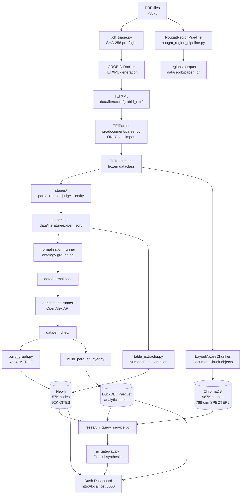

# Архітектура GeoHydroAI

**Версія**: 2.0 | **Дата**: 2026-06-09  
**Підстава**: аналіз src/, AUDIT_v1/, CLAUDE.md, tests/

---

## 1. Що вирішує система

**Наукова проблема**: Наукова література в гідрології (flood mapping, remote sensing, hydrological modelling) надто об'ємна для ручного аналізу. Понад 3,875 статей не можна проаналізувати вручну для написання систематичного огляду.

**Рішення системи**: Автоматизована платформа, яка:
1. Читає PDF-статті через GROBID → структурований XML
2. Витягує наукові сутності (методи, сенсори, метрики, географія) через KB+NLP+LLM
3. Будує граф знань: Paper → [USES] → Method → [REPORTS] → Metric
4. Надає семантичний пошук (SPECTER2) для знаходження релевантних статей
5. Підтримує написання наукових оглядів через evidence-grounded AI synthesis

**Вхід**: PDF-файли (~3,875)  
**Вихід**: Neo4j граф (57K вузлів), ChromaDB (987K чанків), Dash dashboard, generated paper sections

---

## 2. Архітектурний тип

Це **hybrid research platform** — поєднання:
- **NLP data pipeline** (GROBID → TEI → entities → graph)
- **Knowledge graph system** (Neo4j, Cypher MERGE)
- **RAG / semantic search** (SPECTER2 + ChromaDB + Gemini synthesis)
- **Research analytics system** (DuckDB Parquet + Dash dashboard)
- **Scientific writing support** (paper_my/ output)

Підстава: src/pipeline/, src/graph/, src/retrieval/, src/dashboard_dash/, paper_my/

---

## 3. Два паралельні pipeline

**Критично важливо**: система має дві архітектурно різні pipeline, які співіснують.

### A. Legacy Ray Pipeline (operational)

Статус: **використовується у виробництві**, 3,546+ papers оброблено.

```
GROBID TEI XML
    │
    ▼
src/ingestion/pipeline.py (orchestrator, 326 lines)
    │
    ├── stages/parse_stage.py   ← TEI/XML → sections dict
    ├── stages/geo_stage.py     ← GEO constants, NER, geocode
    ├── stages/judge_stage.py   ← OllamaJudge, verdict
    ├── stages/entity_stage.py  ← KB, classification, pipeline (1,681 lines)
    └── stages/sdom_bridge.py   ← lazy SDOM bridge
    │
    ▼
data/literature/paper_json/*.paper.json
    │
    ├── normalization_runner.py → data/normalized/
    ├── enrichment_runner.py    → data/enriched/ (OpenAlex)
    └── build_graph.py          → Neo4j
```

**Розподілений запуск**: `src/orchestration/pipeline_runner.py` (Ray), `src/orchestration/process_paper.py` (Ray remote task)

### B. New SDOM Pipeline (under development)

Статус: **тести проходять (186 тестів), але CLI-оркестратор не існує, повний запуск не виконувався**.

```
PDF
    │
    ▼
Stage 0: src/ingestion/stage0/ingestor.py
    │    SHA-256 content-addressed ingestion → data/raw/
    │
    ▼
Stage 1: src/ingestion/stage1/parser_runner.py
    │    Structured Parquet artifacts → data/parsed/
    │    Читає regions.parquet від NougatRegionPipeline якщо є
    │
    ▼
Stage 2: src/ingestion/stage2/engineer.py
    │    Scientific object classification → data/sodb/
    │
    ▼
Stage 2.5: src/semantic_objects/semantic_validator.py
         15 IF-THEN rules, semantic graph edges → data/sodb/
```

**Підстава**: CLAUDE.md, tests/test_11_stage0.py (48), test_12_stage1.py (51), test_13_stage2.py (51), test_14_stage25.py (84)

### C. NougatRegionPipeline (Stage 1.5 — bridge)

Статус: **180/3,875 papers оброблено**.

```
PDF + TEI XML
    │
    ▼
src/ingestion/nougat_region_pipeline.py
    │    GPU inference (NougatActor)
    │    Produces: regions.parquet, crops/*.png
    │
    ▼
data/sodb/{paper_id}/regions.parquet
data/nougat_regions/{paper_id}/crops/*.png
```

**Критична проблема (задокументована)**: Nougat output не читається Legacy pipeline. Stage1Parser читає regions.parquet тільки якщо він вже є. SODB і Legacy pipeline — ізольовані острови.

Підстава: AUDIT_v1/analiz_v5.md, AUDIT_v1/SODB_DESIGN.md

---

## 4. Компонентна архітектура

| Компонент | Файли / папки | Відповідальність |
|-----------|---------------|-----------------|
| PDF triage | `src/ingestion/pdf_triage.py` | SHA-256, pre-flight gate (encrypted/scanned/no-text reject) |
| GROBID client | `src/ingestion/grobid_client.py` | HTTP POST, exponential backoff, GROBIDResponse typed |
| TEI validator | `src/ingestion/tei_validator.py` | Structural + semantic QA on TEI XML (legitimate lxml use) |
| SDOM parser | `src/document/parser.py` | **ЄДИНИЙ** lxml import → TEIDocument |
| Nougat parser | `src/document/nougat_parser.py` | fitz + Nougat → TEIDocument (visual path) |
| Hybrid parser | `src/document/hybrid_parser.py` | GROBID + Nougat merge (GROBID wins structure/coords) |
| Parser router | `src/document/parser_router.py` | PARSER_STRATEGY dispatch |
| Chunker | `src/document/chunker.py` | TEIDocument → DocumentChunk (section/page/bbox aware) |
| KB + Ontology | `src/ingestion/knowledge/` | 1,118 entities, 3,161 aliases, MetricRecords |
| Entity extractor | `src/ingestion/knowledge/entity_extractor.py` | Regex+KB pattern matching |
| Ontology matcher | `src/normalization/ontology_matcher.py` | canonical_id resolution, disambiguation |
| Embedding matcher | `src/ingestion/stages/embedding_classifier.py` | SPECTER2 semantic scoring |
| LLM judge | `src/ingestion/stages/judge_stage.py` | Ollama validation, task label correction |
| Section router | `src/ingestion/stages/parse_stage.py` | TEI → sections dict (methods/geo/results/other) |
| Pipeline registry | `src/registry/pipeline_registry.py` | DuckDB single-writer, idempotency ledger |
| Ray orchestrator | `src/orchestration/pipeline_runner.py` | Distributed processing, sliding window |
| Ray task | `src/orchestration/process_paper.py` | Per-paper Ray remote function |
| Normalization | `src/orchestration/normalization_runner.py` | Ontology grounding for all papers |
| Enrichment | `src/orchestration/enrichment_runner.py` | OpenAlex API lookup |
| Graph writer | `src/graph/neo4j_writer.py` | Cypher MERGE only (no DELETEs) |
| Graph loader | `src/graph/` | Node/edge loading from enriched JSON + parquet |
| Table extractor | `src/extraction/table_extractor.py` | TEI tables → NumericFact nodes |
| Table KG loader | `src/graph/table_kg_loader.py` | NumericFact → Neo4j |
| ChromaDB store | `src/vectorstore/chroma_store.py` | SPECTER2 chunk indexing |
| ChromaDB reindex | `src/orchestration/reindex_chromadb.py` | Full re-index (768-dim) |
| Parquet builder | `src/enrichment/build_parquet_layer.py` | Analytics parquet tables |
| Retriever | `src/retrieval/retriever.py` | Multi-source retrieval |
| Research query | `src/dashboard_dash/research_query_service.py` | DuckDB+Neo4j+ChromaDB evidence pack |
| AI gateway | `src/dashboard_dash/ai_gateway.py` | Gemini synthesis (anti-hallucination prompt) |
| Dashboard | `src/dashboard_dash/app.py` | Plotly Dash, 11 pages |
| Semantic validator | `src/semantic_objects/semantic_validator.py` | 15 IF-THEN rules (SDOM pipeline) |

---

## 5. Загальна діаграма



---

## 6. Потік виконання (Legacy Pipeline)

1. **pdf_triage.py** — читає PDF, рахує SHA-256, відкидає непридатні (encrypted, scanned, >500p)
2. **PipelineRegistry** (DuckDB) — перевірка idempotency: якщо paper_id вже SUCCESS → skip
3. **GROBIDClient** — HTTP POST → TEI XML (exponential backoff per error class)
4. **tei_validator.py** — структурна/семантична перевірка XML (lxml: єдиний justified use поза parser.py)
5. **TEIParser** (`src/document/parser.py`) — lxml → TEIDocument (frozen dataclass)
6. **parse_stage.py** — sections dict: abstract/methods/results/study_area/other
7. **entity_stage.py** — KB lookup (1,118 entities), regex extraction, embedding scoring
8. **geo_stage.py** — GEO NER (SpaCy), geocode, country/region assignment
9. **judge_stage.py** — OllamaJudge: `needs_judge()` → mistral-nemo:12b → `apply_judge_verdict()`
10. **sdom_bridge.py** — lazy LayoutAwareChunker → ChromaDB upsert
11. **json.dump** — paper.json записується в `data/literature/paper_json/`
12. **normalization_runner** (окремий запуск) — ontology_matcher.py → canonical_id для всіх entities
13. **enrichment_runner** (окремий запуск) — OpenAlex DOI lookup → cited_by_count, authors
14. **build_graph.py** (окремий запуск) — Neo4j MERGE: Paper/Author/Method/Sensor/Metric вузли

Підстава: AUDIT_v1/PIPELINE_ANALYSIS.md, src/orchestration/process_paper.py, src/ingestion/pipeline.py

---

## 7. Архітектурні інваріанти

Ці правила закодовані в CLAUDE.md і є частиною архітектурних рішень:

| Правило | Де | Чому |
|---------|----|------|
| `lxml` тільки в `parser.py` | src/document/parser.py | Ізоляція XML attack surface |
| `fitz` тільки в parser.py і nougat_parser.py | src/document/ | Ізоляція PDF byte handling |
| GROBID — єдине джерело координат | nougat_parser.py без COORDINATES capability | Nougat читає images, не PDF geometry |
| Стадії незалежно restartable | pipeline.py vs normalization_runner vs enrichment_runner | Немає глобального стану між стадіями |
| TEIDocument frozen | @dataclass(frozen=True) | Запобігає тихому мутуванню downstream |
| GraphWriter тільки Cypher MERGE | neo4j_writer.py | Ніяких випадкових DELETE |
| Ray actors — єдині власники GPU handles | src/actors/ | Централізоване CUDA memory management |
| paper.json будується з SODB у новому pipeline | src/ingestion/stage2/ | Немає повторного GPU-inference при downstream змінах |

---

## 8. Сильні сторони архітектури

**Підтверджено кодом:**

- **Двохрівнева idempotency** — `pipeline_runner.py` pre-filter (filesystem check) + task-level guard (DuckDB registry). Запуск можна перервати та продовжити без дублікатів.
- **FailureType taxonomy** — `src/ingestion/failure_types.py`: `is_retriable()`, `to_registry_status()` — правильна інкапсуляція failure policy.
- **DocumentParser Protocol** — `src/document/protocols.py`: заміна парсера без змін downstream.
- **Coordinate-aware chunking** — `LayoutAwareChunker` зберігає section/page/bbox у кожному chunk, що дозволяє provenance у ChromaDB.
- **Typed domain model** — TEIDocument: всі поля типізовані (Pydantic/dataclass).
- **KB-driven extraction** — 1,118 entities, 3,161 aliases не hardcoded у regex, а в JSON-файлах онтології → розширюваність.
- **Змінні середовища для stability** — TOKENIZERS_PARALLELISM, RAYON_NUM_THREADS, OMP_NUM_THREADS унеможливлюють deadlock/contention.

---

## 9. Архітектурні проблеми

**Підтверджено AUDIT_v1 та аналізом коду:**

### Критичні

| # | Проблема | Файл | Вплив |
|---|----------|------|-------|
| P1 | **Nougat pipeline — ізольований острів** | nougat_region_pipeline.py | Регіони/формули не читаються Legacy pipeline |
| P2 | **Section routing fail — 24-28% papers** | stages/parse_stage.py | methods=0 → entities не знаходяться |
| P3 | **46.7% тексту в "other" секції** | stages/parse_stage.py | Половина контенту поза structured extraction |
| P4 | **metric_text без methods секції** | stages/entity_stage.py | NSE/RMSE ~0% coverage (методи — у methods, не results) |

### Середні

| # | Проблема | Файл | Вплив |
|---|----------|------|-------|
| P5 | **Відсутній CLI-оркестратор для SDOM pipeline** | src/orchestration/ | Новий pipeline не можна запустити на повному корпусі |
| P6 | **12 truncated Elsevier JSON** | data/literature/paper_json/ | Ці papers не нормалізовані і не в ChromaDB |
| P7 | **DOI coverage 41% в references** | GROBID output | Citation graph неповний |
| P8 | **Duplicate chunk IDs в ChromaDB** | sdom_bridge.py / chunker | Non-fatal warnings, ~30-40% papers |
| P9 | **study_type не на top-level** | stages/entity_stage.py | Neo4j/dashboard читають None замість label |

### Задокументовані та виправлені (у v3-v5)

- datetime serialization bug (PATCH: json_safe)
- MatchType.disambiguation відсутній у схемі (PATCH: schemas/normalized_paper.py)
- Metrics missing `accepted=True` (PATCH: entity_pipeline.py)
- `resolve_metric()` не шукав v2_metrics (PATCH: knowledge_loader.py)
- ChromaDB 384→768 dim mismatch (PATCH: reindex з flood_papers_768d)
- Task label propagation bug (PATCH: judge_stage.py)
- transformers==4.37.2 несумісний з sentence_transformers==5.4.1 (PATCH: upgrade)
- Конкуруючі Ray instances (PATCH: ray stop --force)
- Negative embedding scores (PATCH: clamp max(0.0, score))

---

## 10. Рекомендації

### Рівень 1 — Термінові (розблоковують наукову якість)

1. **Виправити section routing** (`parse_stage.py`): додати keywords "design/approach/framework/calibration/procedure" до INLINE_HEADINGS. Очікуваний ефект: methods coverage 76% → ~85%.
2. **Додати methods до metric_text** (`entity_stage.py:run_entity_pipeline`): одна строчка. NSE/RMSE coverage ~0% → ~70%.
3. **Підняти study_type/task на top-level** (`pipeline.py:build_paper_json`): 5 рядків. Виправляє Neo4j/dashboard читання.
4. **Розширити satellite acquisition verbs** (`entity_extractor.py:_USAGE_POSITIVE`): "obtained from", "acquired from", "downloaded from". +40-50% satellite coverage.

### Рівень 2 — Стратегічні (покращують архітектуру)

5. **Побудувати CLI-оркестратор для SDOM pipeline** — щоб новий pipeline міг запустити повний корпус.
6. **Підключити regions.parquet до Legacy pipeline** — Nougat visual output повинен читатися entity_stage.
7. **Додати Nougat до entity_stage** через sdom_bridge — formula text → metric_text pipeline.
8. **CrossRef DOI fallback** для references (DOI 41% → ~60%).

### Рівень 3 — Research-grade якість

9. **Confidence score для кожного витягнутого факту** — наразі є для entities, але не для numeric facts.
10. **Evidence span зберігання** — sentence/page для кожного extracted entity.
11. **Versioned extraction** — при оновленні KB/ontology можна перевитягти без re-GROBID.
12. **Schema versioning для paper.json** — schema_version є, але migration шлях відсутній.
