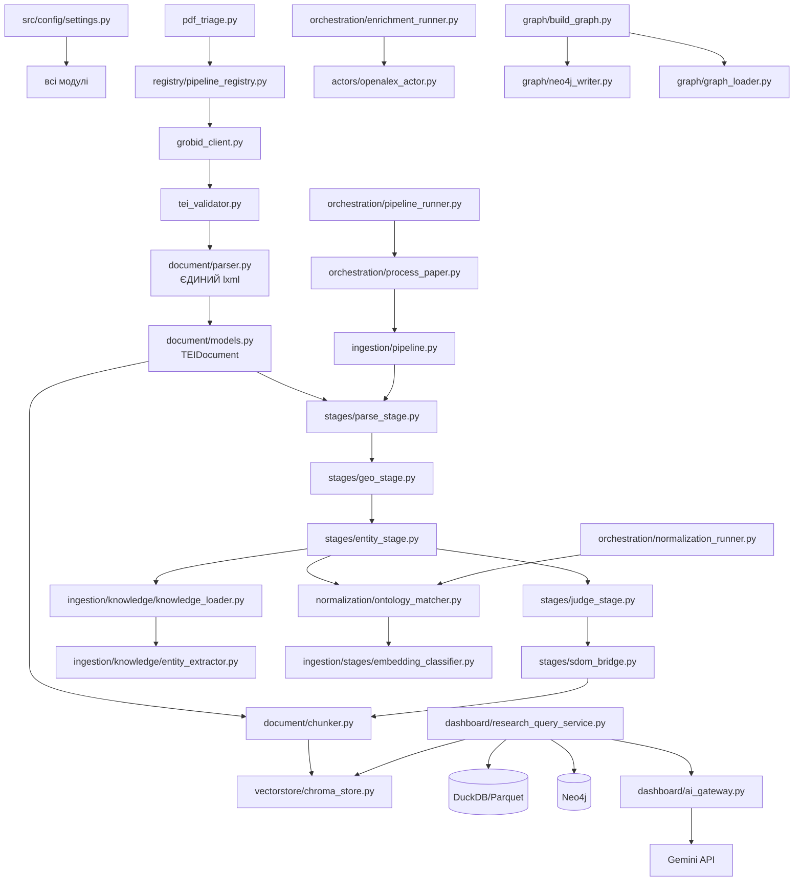

# Code Map GeoHydroAI

**Версія**: 2.0 | **Дата**: 2026-06-09  
**Підстава**: повний аналіз src/, tests/, root-level scripts

---

## 1. Дерево проєкту

```
knoweledg_graf/
│
├── src/                           ← головний код
│   ├── actors/                    ← Ray remote actors (GPU handles)
│   ├── analytics/                 ← Parquet builders, aggregators
│   ├── assembly/                  ← paper_assembler
│   ├── config/                    ← settings.py (всі env vars)
│   ├── dashboard_dash/            ← Plotly Dash app (11 pages)
│   ├── discovery/                 ← ontology gap detector
│   ├── document/                  ← SDOM: TEIDocument, parsers, chunker
│   ├── embedding/                 ← embedder.py
│   ├── enrichment/                ← OpenAlex, parquet layer, author universe
│   ├── evaluation/                ← MetricFact evaluation framework
│   ├── extraction/                ← table_extractor, NumericFact
│   ├── graph/                     ← Neo4j writer, loader, build_graph
│   ├── graphstore/                ← (legacy? паралельно з graph/)
│   ├── ingestion/                 ← ГОЛОВНИЙ пайплайн
│   │   ├── stage0/                ← SDOM Stage 0 Ingestor
│   │   ├── stage1/                ← SDOM Stage 1 Parser
│   │   ├── stage2/                ← SDOM Stage 2 Engineer
│   │   ├── stages/                ← Legacy stages (parse/geo/judge/entity)
│   │   ├── knowledge/             ← KB, entity extractor
│   │   ├── pipeline.py            ← Legacy orchestrator (326 lines)
│   │   ├── nougat_region_pipeline.py ← NougatRegionPipeline
│   │   ├── grobid_client.py       ← GROBID HTTP client
│   │   ├── pdf_triage.py          ← Pre-flight gate
│   │   └── tei_validator.py       ← TEI XML validation
│   ├── normalization/             ← ontology_matcher, embedding_matcher
│   ├── ontology/                  ← merge, refinement tools
│   ├── orchestration/             ← pipeline_runner (Ray), runners
│   ├── pipeline/                  ← rag_pipeline.py
│   ├── processing/                ← analytics, chunker, metadata_cleaner
│   ├── registry/                  ← DuckDB pipeline registry
│   ├── retrieval/                 ← retriever, vector synchronizer
│   ├── schemas/                   ← normalized_paper.py (Pydantic)
│   ├── semantic_objects/          ← SDOM Stage 2.5 validator, semantics
│   ├── utils/                     ← logging_config
│   ├── validation/                ← judge_normalizer
│   └── vectorstore/               ← chroma_store.py
│
├── tests/                         ← 606 tests (pytest)
│   ├── test_11_stage0.py          ← 48 tests
│   ├── test_12_stage1.py          ← 51 tests
│   ├── test_13_stage2.py          ← 51 tests
│   ├── test_14_stage25.py         ← 84 tests
│   ├── test_parser_routing.py     ← parser routing tests
│   └── conftest.py                ← всі моки (SpacyActor/OllamaActor/Ray)
│
├── AUDIT_v1/                      ← Архів аудитних звітів (40 файлів)
├── docs_v2/                       ← ця документація
├── paper_my/                      ← generated scientific paper artifacts
│   ├── sections_v4/               ← останні секції статті
│   ├── sections_v3/               ← попередня версія секцій
│   ├── generated_paper_v4_V2_final.md ← фінальний текст
│   └── evidence_report_v4.md      ← evidence звіт
│
├── data/                          ← всі дані (не в git)
├── notebooks/                     ← Jupyter notebooks
├── figures/                       ← matplotlib/plotly figures
├── outputs/                       ← pipeline outputs
├── scripts/                       ← допоміжні скрипти
│
├── CLAUDE.md                      ← Інструкції для Claude Code
├── README.md                      ← Старий README (63KB — застарів)
├── docker-compose.yml             ← GROBID + Neo4j
├── requirements.txt               ← Python dependencies
├── main.py                        ← Legacy entry point (не основний)
├── generate_report.py             ← Report generation (legacy)
├── create_notebook.py             ← Notebook creation
├── neo4j_schema.cypher            ← Neo4j schema constraints
└── flood_rag_analysis.ipynb       ← RAG analysis notebook (384KB)
```

---

## 2. Головні файли та їхня роль

| Файл | Рядків | Роль | Пріоритет читання |
|------|--------|------|-------------------|
| `src/orchestration/pipeline_runner.py` | ~300 | Ray distributed executor (entry point) | ⭐⭐⭐ |
| `src/orchestration/process_paper.py` | ~200 | Ray remote task per paper | ⭐⭐⭐ |
| `src/ingestion/pipeline.py` | 326 | Legacy orchestrator (post-refactor) | ⭐⭐⭐ |
| `src/ingestion/stages/entity_stage.py` | 1,681 | KB entity pipeline (largest file) | ⭐⭐⭐ |
| `src/document/models.py` | ~300 | TEIDocument SDOM (canonical object) | ⭐⭐⭐ |
| `src/document/parser.py` | ~400 | TEIParser (ЄДИНИЙ lxml import) | ⭐⭐⭐ |
| `src/graph/build_graph.py` | ~300 | Neo4j KG construction | ⭐⭐ |
| `src/graph/neo4j_writer.py` | ~250 | Cypher MERGE writer | ⭐⭐ |
| `src/ingestion/stages/parse_stage.py` | 213 | TEI → sections dict | ⭐⭐ |
| `src/ingestion/stages/judge_stage.py` | 410 | OllamaJudge validation | ⭐⭐ |
| `src/ingestion/stages/geo_stage.py` | 437 | GEO NER + geocoding | ⭐⭐ |
| `src/normalization/ontology_matcher.py` | ~300 | canonical_id resolution | ⭐⭐ |
| `src/config/settings.py` | ~200 | Всі env vars (SINGLE SOURCE) | ⭐⭐ |
| `src/registry/pipeline_registry.py` | ~300 | DuckDB idempotency ledger | ⭐⭐ |
| `src/extraction/table_extractor.py` | ~400 | TEI tables → NumericFact | ⭐⭐ |
| `src/dashboard_dash/app.py` | ~200 | Dash app (entry) | ⭐ |
| `src/dashboard_dash/research_query_service.py` | ~500 | Multi-source evidence retrieval | ⭐⭐ |
| `src/dashboard_dash/ai_gateway.py` | ~300 | Gemini synthesis + anti-hallucination | ⭐⭐ |
| `src/ingestion/knowledge/knowledge_loader.py` | ~400 | KB loading + resolve_metric() | ⭐⭐ |
| `src/ingestion/knowledge/entity_extractor.py` | ~500 | Regex entity extraction | ⭐⭐ |
| `src/vectorstore/chroma_store.py` | ~200 | ChromaDB chunk indexing | ⭐ |
| `src/orchestration/reindex_chromadb.py` | ~200 | ChromaDB full rebuild | ⭐ |
| `src/semantic_objects/semantic_validator.py` | ~300 | 15 IF-THEN rules (SDOM) | ⭐ |

---

## 3. Залежності між модулями



---

## 4. Ray Actors

**Директорія**: `src/actors/`

| Actor | GPU? | RAM | Роль |
|-------|------|-----|------|
| `SpacyActor` | ❌ | ~300MB | SpaCy NER для geo extraction |
| `EmbeddingActor` | ✅ | ~600MB | SPECTER2 embeddings |
| `OllamaActor` | ✅ GPU або CPU | ~4-8GB | mistral-nemo:12b judge |
| `NougatActor` | ✅ | ~4GB | Nougat visual inference |
| `GeonamesActor` | ❌ | ~100MB | GeoNames API geocoding |
| `OpenAlexActor` | ❌ | ~100MB | OpenAlex HTTP |

**Правило**: Ray actors — ЄДИНІ власники GPU handles. Ніяких CUDA calls поза actors.

---

## 5. Де шукати конкретну логіку

| Питання | Де дивитися |
|---------|-------------|
| Де PDF → TEI XML? | `src/ingestion/grobid_client.py` |
| Де TEI XML → Python об'єкт? | `src/document/parser.py` (TEIParser) |
| Де текст ділиться на секції? | `src/ingestion/stages/parse_stage.py:section_tags()` |
| Де витягуються методи/сенсори? | `src/ingestion/stages/entity_stage.py:run_entity_pipeline()` |
| Де витягуються числові метрики? | `src/ingestion/stages/entity_stage.py:extract_metrics()` |
| Де знаходиться KB? | `src/ingestion/knowledge/` (JSON файли) |
| Де ontology v2 entities? | `src/ontology/` + JSON files |
| Де LLM judge logic? | `src/ingestion/stages/judge_stage.py` |
| Де ChromaDB upsert? | `src/ingestion/stages/sdom_bridge.py` + `src/vectorstore/chroma_store.py` |
| Де Neo4j writer? | `src/graph/neo4j_writer.py` |
| Де Neo4j schema? | `neo4j_schema.cypher` |
| Де pipeline idempotency? | `src/registry/pipeline_registry.py` |
| Де всі env variables? | `src/config/settings.py` |
| Де dashboard pages? | `src/dashboard_dash/pages/` |
| Де AI synthesis? | `src/dashboard_dash/ai_gateway.py` |
| Де research query logic? | `src/dashboard_dash/research_query_service.py` |
| Де NumericFact extraction? | `src/extraction/table_extractor.py` |
| Де NumericFact → Neo4j? | `src/graph/table_kg_loader.py` |
| Де тести? | `tests/` (606 tests) |
| Де моки Ray/Ollama? | `tests/conftest.py` |

---

## 6. Структурні проблеми коду

### Дублювання

| Проблема | Файли |
|----------|-------|
| Два Neo4j writer модулі | `src/graph/neo4j_writer.py` vs `src/graphstore/` |
| Два chunker модулі | `src/document/chunker.py` vs `src/processing/chunker.py` |
| `src/config.py` vs `src/config/settings.py` | Два config файли |
| Тести у src/ | `src/test_embeddings.py`, `src/test_nougat_actor.py`, `src/test_ollama_actor.py`, `src/test_spacy_actor.py` (мають бути в `tests/`) |

### Файли що потребують уваги

| Файл | Проблема |
|------|---------|
| `src/ingestion/stages/entity_stage.py` | 1,681 рядків — найбільший файл |
| `1` (root level) | 16,750 байт файл без розширення — незрозумілий артефакт |
| `=23.0`, `=4.0` | Порожні файли у корені — наслідок помилкових `pip install` команд |
| `data/` | Не в git, але потрібна документація структури |

---

## 7. Конфігурація

**Єдине джерело**: `src/config/settings.py`

| Variable | Default | Призначення |
|----------|---------|-------------|
| `TOKENIZERS_PARALLELISM` | `false` | HuggingFace tokenizer deadlock prevention |
| `RAYON_NUM_THREADS` | `1` | Arrow/Rust thread contention |
| `OMP_NUM_THREADS` | `2` | NumPy/SpaCy BLAS threads |
| `OLLAMA_MODEL` | `mistral-nemo:12b` | LLM judge model |
| `OLLAMA_URL` | `http://localhost:11434` | Ollama endpoint |
| `SPACY_MODEL` | `en_core_web_sm` | SpaCy NER model |
| `PARSER_STRATEGY` | `grobid_with_nougat_fallback` | Parser dispatch |
| `NOUGAT_ENABLED` | `true` | Kill-switch для Nougat |
| `NOUGAT_GPU_FRACTION` | `1.0` | GPU memory fraction |
| `EMBEDDING_MODEL` | `allenai/specter2_base` | ChromaDB embedding model |
| `COLLECTION_NAME` | `flood_papers_768d` | ChromaDB collection |
| `NEO4J_URI` | `bolt://localhost:7687` | Neo4j connection |
| `NEO4J_USER` | `neo4j` | Neo4j credentials |
| `NEO4J_PASSWORD` | `python2024` | Neo4j credentials |
