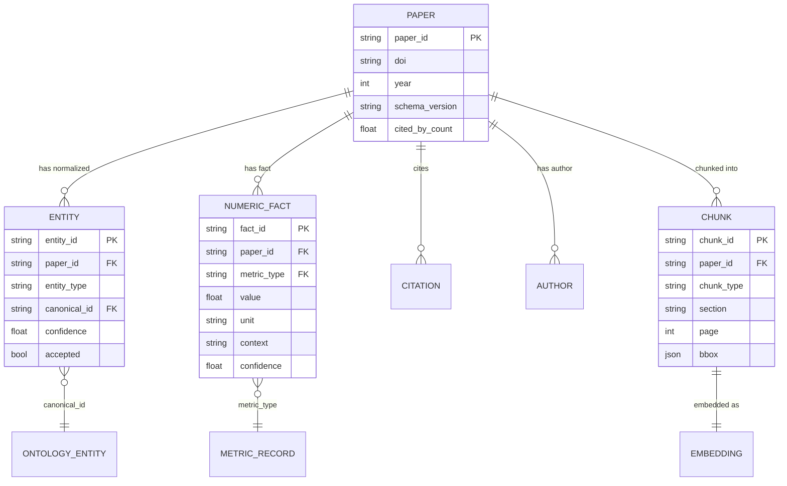

# Data Model GeoHydroAI

**Версія**: 2.0 | **Дата**: 2026-06-09  
**Підстава**: src/schemas/, src/document/models.py, src/analytics/parquet_schema.py, src/registry/

---

## 1. Центральна структура: paper.json

`paper.json` — головний проміжний артефакт Legacy pipeline. Кожен файл відповідає одній статті.

**Розташування**: `data/literature/paper_json/{paper_id}.paper.json`  
**Розмір**: ~300–800 KB per file  
**Кількість**: ~4,850 файлів

### Структура верхнього рівня

```json
{
  "paper_id": "sha256-hash-truncated",
  "content_hash": "sha256-of-pdf-bytes",
  "schema_version": "1.0",
  "title": "Flood Inundation Mapping Using SAR...",
  "doi": "10.1016/j.rse.2021.112345",
  "year": 2021,
  "venue": "Remote Sensing of Environment",
  "abstract": "...",

  "sections": {
    "abstract": "...",
    "methods": "...",        ← може бути "" якщо section routing failed (24-28% papers)
    "results": "...",        ← ~48% порожніх
    "study_area": "...",     ← ~50% порожніх
    "other": "...",          ← avg ~16K chars (некласифікований контент)
    "conclusion": "..."
  },

  "entities": {
    "methods": [...],        ← [{name, canonical_id, confidence, accepted}, ...]
    "sensors": [...],
    "dems": [...],
    "datasets": [...],
    "metrics": [...],        ← [{name, value, unit, canonical_id, accepted}, ...]
    "geo": {
      "countries": [...],
      "study_areas": [...],
      "study_type": {"label": "case_study", ...},   ← ТУТ є, але не на top-level (bug)
      "geo_scope": "regional"
    }
  },

  "task": null,              ← BUG: має бути task label з judge verdict
  "study_type": null,        ← BUG: має бути з entities.geo.study_type.label

  "normalized_entities": [...],

  "references": [
    {"doi": "...", "title": "...", "authors": [...], "year": ...}
  ],

  "llm_judge": {
    "judge_used": true,
    "judge_latency_s": 11.957,
    "task": {
      "corrected_value": "flood_frequency_analysis",  ← ПРАВИЛЬНЕ значення є ТУТ
      "original_value": "spectral_index_analysis"
    }
  },

  "embeddings": {"title_abstract": [...768 floats...]},  ← SPECTER2

  "openalex_id": "W2345678",  ← після enrichment
  "cited_by_count": 42,        ← після enrichment
  "authors": [...],            ← після enrichment
  "topics": [...]              ← після enrichment
}
```

**Відомі структурні проблеми**:
- `task` і `study_type` на top-level завжди `null` — judge verdict зберігається тільки в `llm_judge.task.corrected_value`
- `sections.methods` порожній для ~24-28% papers (section routing failure)
- `entities.metrics` були без `accepted=True` до PATCH 1

Підстава: AUDIT_v1/PIPELINE_TRUST_REPORT_v2_UA.md, src/schemas/normalized_paper.py

---

## 2. Pydantic схема (NormalizedPaper)

**Файл**: `src/schemas/normalized_paper.py`

```python
class MatchType(str, Enum):
    alias          = "alias"
    exact          = "exact"
    semantic       = "semantic"
    disambiguation = "disambiguation"   ← додано у v5 (PATCH BUG-2)
    unknown        = "unknown"
    error          = "error"

class NormalizedEntity(BaseModel):
    name: str
    canonical_id: Optional[str]
    match_type: MatchType
    confidence: float
    accepted: bool = False

class NormalizedPaper(BaseModel):
    paper_id: str
    title: Optional[str]
    doi: Optional[str]
    year: Optional[int]
    schema_version: str = "1.0"
    normalized_entities: List[NormalizedEntity]
    ...
```

---

## 3. TEIDocument (SDOM)

**Файл**: `src/document/models.py`

Canonical domain object — **frozen dataclass** (не можна мутувати після створення).

```python
@dataclass(frozen=True)
class TEIDocument:
    paper_id: str
    title: str
    abstract: str
    authors: tuple[Author, ...]
    sections: tuple[Section, ...]
    references: tuple[Reference, ...]
    figures: tuple[Figure, ...]
    tables: tuple[Table, ...]
    formulas: tuple[Formula, ...]
    coordinates: tuple[Coordinate, ...]
    metadata: DocumentMetadata
    parser_capabilities: ParserCapabilities

@dataclass(frozen=True)
class DocumentChunk:
    chunk_id: str
    text: str
    section: str          ← abstract/body/figure/table/formula
    page: Optional[int]
    bbox: Optional[BBox]
    paper_id: str
    chunk_type: ChunkType
```

**Правило**: TEIDocument — **єдиний** об'єкт що проходить між шарами. Ніяких dict, ніяких XML roots за межами parser.py.

---

## 4. Parquet Analytics Layer

**Директорія**: `data/analytics/` (14 файлів)  
**Схема**: `src/analytics/parquet_schema.py`

| Таблиця | Ключові колонки | Розмір |
|---------|----------------|--------|
| `papers.parquet` | paper_id, title, doi, year, venue, cited_by_count | ~3,680 рядків |
| `authors.parquet` | author_id, display_name, paper_id, institution | N authors |
| `entities.parquet` | paper_id, entity_type, canonical_id, confidence, accepted | N entities |
| `metrics.parquet` | paper_id, metric_name, canonical_id, confidence | N metrics |
| `numeric_facts.parquet` | fact_id, paper_id, metric_type, value, unit, context, confidence | ~16,308 рядків |
| `methods.parquet` | paper_id, method_name, canonical_id | N methods |
| `sensors.parquet` | paper_id, sensor_name, canonical_id, type | N sensors |
| `countries.parquet` | paper_id, country_name, iso_code | N countries |
| `citations.parquet` | citing_paper_id, cited_doi, resolved | N citations |
| `registry.parquet` | paper_id, status, created_at, updated_at | ~3,692 рядків |

---

## 5. DuckDB Pipeline Registry

**Файл**: `data/registry/pipeline_registry.duckdb`  
**Клас**: `src/registry/pipeline_registry.py` (single-writer, RLock)

```sql
CREATE TABLE pipeline_registry (
    paper_id        TEXT PRIMARY KEY,
    status          TEXT,       -- NEW | PROCESSING | SUCCESS | FAILED | SKIPPED
    content_hash    TEXT,
    xml_path        TEXT,
    json_path       TEXT,
    failure_type    TEXT,       -- FailureType enum
    error_message   TEXT,
    attempts        INTEGER DEFAULT 0,
    created_at      TIMESTAMP,
    updated_at      TIMESTAMP,
    started_at      TIMESTAMP,
    completed_at    TIMESTAMP
)
```

**Записів**: ~3,692

---

## 6. ChromaDB Vector Store

**Директорія**: `.chromadb/`  
**Колекція**: `flood_papers_768d`  
**Embedding model**: `allenai/specter2_base` (768-dim)

Metadata кожного чанку:
```python
{
    "paper_id": "sha256...",
    "chunk_type": "abstract" | "body" | "figure" | "table" | "formula",
    "section": "methods" | "results" | ...,
    "page": 3,
    "bbox": {"x0": 50.1, "y0": 120.3, "x1": 540.2, "y1": 200.1},
    "doi": "10.1016/...",
    "year": 2021
}
```

**Статистика**: 986,832 chunks / 3,686 papers  
**Стара колекція**: `flood_papers` (384-dim, archived in `.chromadb_backup_20260520/`)

---

## 7. SODB Parquet (per-paper)

**Директорія**: `data/sodb/{paper_id}/`  
**Є для**: 3,692 papers (більшість тільки базова структура)  
**З Nougat regions**: 180 papers

| Файл | Вміст |
|------|-------|
| `regions.parquet` | ScientificRegion: type/bbox/page/text/nougat_output |
| `tables.parquet` | Table regions з Nougat markdown |
| `figures.parquet` | Figure regions з captions |
| `formulas.parquet` | Formula regions з LaTeX (якщо Nougat запущено) |

Схема regions.parquet:
```
region_id, paper_id, page, bbox, region_type,
grobid_block_ids, nougat_output, crop_path,
has_formula, has_table
```

---

## 8. ER-діаграма



---

## 9. Якість даних

| Аспект | Стан | Примітка |
|--------|------|---------|
| DOI normalization | ✅ | "0% malformed DOIs" (AUDIT_v1 v5) |
| Duplicate paper detection | ✅ | SHA-256 content_hash idempotency |
| Canonical entity deduplication | ✅ | canonical_id через KB |
| Unit normalization | ⚠️ | Є для KB-defined metrics, не для all |
| Missing values handling | ⚠️ | sections.methods=""  для 24% papers |
| Schema validation | ✅ | Pydantic NormalizedPaper (non-fatal) |
| Percent dedup | ✅ | PATCH 3 — Percent metric deduplicated |
| Negative embedding clamping | ✅ | max(0.0, embedding_score) |
| study_type top-level | ❌ | Bug: завжди null на top-level |
| task top-level | ❌ | Bug: judge corrected_value не propagated |

---

## 10. Глосарій ідентифікаторів

Додано 2026-06-11 (Фаза 1.5 remediation; перевірено grep'ом — у коді ЛИШЕ ці терміни):

| Термін | Що означає | Де живе |
|--------|-----------|---------|
| `canonical_id` | **Єдиний** канонічний ідентифікатор сутності в онтології (KB, 1 118 сутностей). Обов'язковий, коли `match_type ∉ {unknown, error}` | `schemas/normalized_paper.py`, Neo4j `Method/Sensor/Metric.canonical_id`, parquet-таблиці |
| `paper_id` | Ідентифікатор статті. УВАГА: два формати співіснують: file-stem (legacy pipeline, doi_map, sodb/) та SHA-256 (Stage 0 / registry) | registry, paper.json `metadata.paper_id` |
| `entity_id` | Ідентифікатор *згадки* (instance) сутності в конкретній статті — не плутати з canonical_id | extraction-шар |
| `study_geo` | Блок гео-сутностей у `paper.json entities.geo.study_geo` (countries/regions/rivers) | ingestion/stages |
| `study_area` | Назва секції TEI ("study area") та fact_type у fact-centric графі | section_extractor, fact_writer |

Заборонені синоніми (не вводити): `ontology_id`, `canon_id`, `kb_id`.
