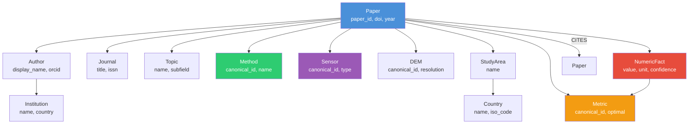

# Knowledge Graph GeoHydroAI

**Версія**: 2.0 | **Дата**: 2026-06-09  
**Підстава**: src/graph/, neo4j_schema.cypher, src/extraction/, CLAUDE.md

---

## 1. Поточний стан графа

| Метрика | Значення |
|---------|---------|
| Загальна кількість вузлів | **57,603** |
| CITES relationships | **92,003** |
| Охоплення нормалізованих papers | ~3,680 |
| NumericFact вузли | **16,308** (з 667 papers) |
| Статус Neo4j | Docker, bolt://localhost:7687 |
| Credentials | neo4j / python2024 |

---

## 2. Типи вузлів (Node types)

Підтверджено з `neo4j_schema.cypher`, `src/graph/build_graph.py`, `src/graph/graph_loader.py`:

### Основні вузли

| Node type | Ключові поля | Джерело |
|-----------|-------------|---------|
| **Paper** | paper_id, title, doi, year, abstract, venue, schema_version | paper.json / normalized.json |
| **Author** | display_name, orcid, openalex_id | OpenAlex enrichment |
| **Institution** | display_name, country_code, openalex_id | OpenAlex enrichment |
| **Journal** | title, issn, openalex_id | OpenAlex enrichment |
| **Topic** | display_name, subfield | OpenAlex enrichment |

### Entity вузли (з KB extraction)

| Node type | Ключові поля | Онтологія |
|-----------|-------------|-----------|
| **Method** | canonical_id, name, category, confidence | v2 KB: SWAT, HEC-RAS, Random Forest, LSTM... |
| **Sensor** | canonical_id, name, type (SAR/optical/LiDAR) | v2 KB: Sentinel-1/2, Landsat, MODIS... |
| **DEM** | canonical_id, name, resolution | v2 KB: SRTM, ASTER, LiDAR DEM... |
| **Dataset** | canonical_id, name | v2 KB: flood datasets |
| **Country** | name, iso_code | GeoNames + SpaCy NER |
| **StudyArea** | name, geometry? | Geocoding |
| **Metric** | canonical_id, name, optimal, applicable_to | v2_metrics: NSE, RMSE, KGE, F1, IoU... |

### Факти та семантика

| Node type | Ключові поля | Джерело |
|-----------|-------------|---------|
| **NumericFact** | metric_type, value, unit, context, confidence, table_id | table_extractor.py (TEI tables) |
| **FloodEvent** | (виявлено в neo4j_schema.cypher) | geo extraction |

---

## 3. Типи зв'язків (Relationship types)

Підтверджено `neo4j_schema.cypher`, `src/graph/neo4j_writer.py`:

| Relation | From | To | Значення | Properties |
|----------|------|----|----------|-----------|
| **CITES** | Paper | Paper | Стаття цитує іншу статтю | confidence, doi_matched |
| **HAS_AUTHOR** | Paper | Author | Стаття має автора | position |
| **AFFILIATED_WITH** | Author | Institution | Автор з установи | |
| **PUBLISHED_IN** | Paper | Journal | Стаття опублікована | |
| **HAS_TOPIC** | Paper | Topic | OpenAlex topic | score |
| **USES_METHOD** | Paper | Method | Стаття використовує метод | confidence, canonical_id |
| **USES_SENSOR** | Paper | Sensor | Стаття використовує сенсор | confidence |
| **USES_DEM** | Paper | DEM | Стаття використовує DEM | confidence |
| **STUDIES_AREA** | Paper | StudyArea | Географічна область дослідження | |
| **LOCATED_IN** | StudyArea | Country | Область у країні | |
| **REPORTS_METRIC** | Paper | Metric | Стаття повідомляє метрику | |
| **HAS_FACT** | Paper | NumericFact | Числовий факт з таблиці | confidence |
| **EVIDENCED_BY** | NumericFact | Paper | Провенанс факту | table_id |

---

## 4. Graph Schema (діаграма)



---

## 5. NumericFact — провенанс

`NumericFact` — найбільш цінний шар для наукового аналізу. Кожен факт має:

```
NumericFact node:
├── metric_type: "NSE" | "RMSE" | "KGE" | "Kappa" | "OA" | ...
├── value: 0.82
├── unit: "-" | "m" | "%" | ...
├── context: "calibration" | "validation" | "testing"
├── confidence: 0.0–1.0
├── table_id: "table_2" (source table в TEI XML)
└── extraction_source: "table_extractor"

HAS_FACT: Paper → NumericFact
EVIDENCED_BY: NumericFact → Paper (зворотній)
```

**Поточне покриття**: 16,308 фактів з 667 papers (із ~3,680 нормалізованих).  
**Причина низького охоплення**: table_extractor читає тільки GROBID-розпізнані таблиці. Papers де таблиці не розпізнались — без NumericFact.

Підстава: `src/extraction/table_extractor.py`, `src/graph/table_kg_loader.py`

---

## 6. Онтологія (KB + v2 моделі)

**Файли**: `src/ontology/` + `src/ingestion/knowledge/`

### Статистика (v2.0)

| Компонент | Кількість |
|-----------|----------|
| EntityRecord вузлів | 1,118 |
| Aliases (псевдоніми) | 3,161 |
| v2 моделі онтології | 46 |
| Disambiguation rules | 15 правил |
| MetricRecord (NSE, RMSE...) | 18 canonical IDs |

### Категорії entities

| Категорія | Приклади |
|-----------|---------|
| Hydrological models | SWAT, HEC-HMS, HEC-RAS, TOPMODEL, VIC |
| ML/DL methods | Random Forest, LSTM, U-Net, CNN, XGBoost |
| Flood mapping methods | SAR threshold, OWA, SVM, MLC |
| SAR sensors | Sentinel-1, ALOS-2, RADARSAT-2, ERS |
| Optical sensors | Sentinel-2, Landsat-8, MODIS, Worldview |
| LiDAR/DEM | SRTM, ASTER DEM, LiDAR, HAND |
| Hydraulic models | LISFLOOD, TELEMAC, MIKE FLOOD, HEC-RAS 2D |
| Hydrology metrics | NSE, KGE, RMSE, MAE, PBIAS, RSR |
| Accuracy metrics | OA, Kappa, F1, IoU, AUC, POD, FAR |
| Study types | case_study, meta_analysis, review, experiment |
| Tasks | flood_mapping, flood_frequency, inundation_simulation |

### MetricRecord canonical IDs (v2_metrics)

```
RMSE, MAE, NSE, R2, KGE, MAPE, PBIAS, RSR,
POD, FAR, Bias_score, CSI, Success_Index,
MARE, MSE, IoA, AUC, Kappa

НЕ покриті (немає MetricRecord, тільки regex):
F1, IoU, OA
```

Підстава: AUDIT_v1/METRIC_EXTRACTION_PATCH_REPORT.md, `src/ingestion/knowledge/knowledge_loader.py`

---

## 7. Аналітичні запити до графа

### Cypher приклади (Neo4j)

```cypher
// Топ-10 методів flood mapping
MATCH (p:Paper)-[:USES_METHOD]->(m:Method)
RETURN m.canonical_id, m.name, count(p) AS paper_count
ORDER BY paper_count DESC LIMIT 10;

// SAR сенсори з найвищою точністю
MATCH (p:Paper)-[:USES_SENSOR]->(s:Sensor {type: "SAR"})
MATCH (p)-[:HAS_FACT]->(f:NumericFact {metric_type: "OA"})
WHERE f.value > 0.9
RETURN s.name, p.title, p.doi, f.value
ORDER BY f.value DESC LIMIT 20;

// Статті про flood mapping в Україні
MATCH (p:Paper)-[:STUDIES_AREA]->(sa:StudyArea)-[:LOCATED_IN]->(c:Country {name: "Ukraine"})
RETURN p.title, p.doi, p.year
ORDER BY p.year DESC;

// Методи що разом зустрічаються
MATCH (p:Paper)-[:USES_METHOD]->(m1:Method)
MATCH (p)-[:USES_METHOD]->(m2:Method)
WHERE m1.canonical_id < m2.canonical_id
RETURN m1.name, m2.name, count(p) AS co_occurrences
ORDER BY co_occurrences DESC LIMIT 15;

// NSE statistics по методах
MATCH (p:Paper)-[:USES_METHOD]->(m:Method)
MATCH (p)-[:HAS_FACT]->(f:NumericFact {metric_type: "NSE", context: "calibration"})
RETURN m.name, avg(f.value) AS avg_nse, count(f) AS n_facts
ORDER BY avg_nse DESC;

// Citation network для топ-цитованих
MATCH (p:Paper)-[:CITES]->(cited:Paper)
RETURN cited.title, cited.doi, count(p) AS in_corpus_citations
ORDER BY in_corpus_citations DESC LIMIT 20;

// Research gaps: методи без метрик
MATCH (p:Paper)-[:USES_METHOD]->(m:Method)
WHERE NOT (p)-[:HAS_FACT]->(:NumericFact)
RETURN m.name, count(p) AS papers_without_numeric_results
ORDER BY papers_without_numeric_results DESC;
```

### DuckDB / Parquet запити

```sql
-- Тренди публікацій по роках
SELECT year, COUNT(*) as n_papers
FROM papers
GROUP BY year ORDER BY year;

-- Метрики coverage
SELECT metric_type, COUNT(*) as count, AVG(value) as avg_value
FROM numeric_facts
GROUP BY metric_type ORDER BY count DESC;

-- Corpus coverage by journal
SELECT venue, COUNT(*) as n_papers
FROM papers
WHERE venue IS NOT NULL
GROUP BY venue ORDER BY n_papers DESC LIMIT 20;
```

---

## 8. Відомі проблеми графа

| Проблема | Вплив | Виправлення |
|----------|-------|-------------|
| **Neo4j graph stale** — не відображає нові papers після збагачення | Граф відстає від corpus | Запустити build_graph після normalization+enrichment |
| **study_type не на top-level** у paper.json | Neo4j читає None для task/study_type | Виправлення в judge_stage.py serialization |
| **DOI coverage 41%** у references | Citation graph неповний | CrossRef DOI fallback для enrichment |
| **NumericFact охоплення низьке** | 16K фактів з 667/3680 papers | Покращити table_extractor + Nougat pipeline підключення |
| **0 NumericFacts з Nougat** | Формули/таблиці з Nougat не в графі | SODB pipeline підключення |
| **geo NER шум** | "Bulletin", "LP3" як countries | Підняти поріг geo NER до 0.65 |
| **Disambiguation rules не завантажуються** | SCS/ANN/MLP плутаються | Додати disambiguation_rules до knowledge_loader |

---

## 9. Провенанс і аудитабельність

### Поточний стан

| Компонент провенансу | Є? |
|---------------------|-----|
| paper_id → PDF SHA-256 | ✅ (content_hash у paper.json) |
| entity → paper_id | ✅ |
| entity → confidence score | ✅ |
| entity → source (pattern/context/embedding/llm) | ✅ (часткова) |
| NumericFact → table_id | ✅ |
| NumericFact → page/bbox | ⚠️ Тільки якщо regions.parquet є |
| NumericFact → raw Nougat text | ❌ (Nougat не підключено до extractor) |
| ChromaDB chunk → sentence/page | ✅ (bbox у metadata) |
| Evidence span для кожної entity | ❌ (sentence рівень відсутній) |

### Рекомендація

Для повного наукового провенансу (reproducible research) потрібно:
1. `evidence_span` поле для кожної extracted entity (sentence text + page)
2. `extraction_version` — версія KB/ontology при якій витягувалось
3. NumericFact → Nougat raw output linkage через regions.parquet
