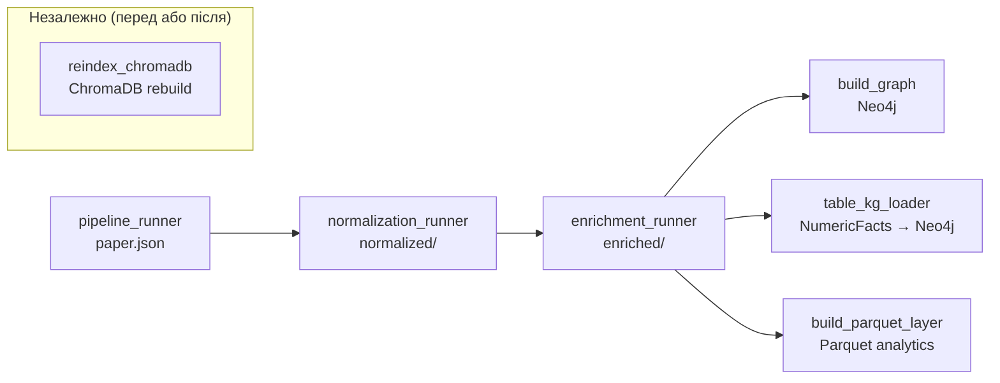

# Pipeline обробки наукових статей

**Версія**: 2.0 | **Дата**: 2026-06-09  
**Підстава**: src/orchestration/, src/ingestion/, src/graph/, CLAUDE.md, AUDIT_v1/

---

## 1. Вхідні дані

| Формат | Директорія | Кількість | Статус |
|--------|-----------|-----------|--------|
| PDF | `data/literature/pdf/` | ~3,875 | Вхід pipeline A |
| GROBID TEI XML | `data/literature/grobid_xml/` | 6,014 | Продукт GROBID |
| paper.json | `data/literature/paper_json/` | ~4,850 | Продукт Legacy Pipeline |
| Normalized JSON | `data/normalized/` | ~3,680 | Після normalization_runner |
| Enriched JSON | `data/enriched/` | ~3,680 | Після OpenAlex enrichment |
| Parquet per-paper | `data/sodb/{paper_id}/` | 3,692 dirs | SDOM output |
| Nougat regions | `data/nougat_regions/{paper_id}/` | 180 papers | NougatRegionPipeline |

---

## 2. Pipeline A — Legacy Ray Pipeline

### 2.1 Стадії

| Стадія | Вхід | Вихід | Файл/функція |
|--------|------|-------|--------------|
| Pre-flight | PDF | accept/reject | `src/ingestion/pdf_triage.py` |
| Idempotency check | paper_id | skip/proceed | `src/registry/pipeline_registry.py` |
| GROBID processing | PDF bytes | TEI XML | `src/ingestion/grobid_client.py` |
| XML validation | TEI XML bytes | validated XML | `src/ingestion/tei_validator.py` |
| TEI parsing | TEI XML file | TEIDocument | `src/document/parser.py` (TEIParser) |
| Section routing | TEIDocument | sections{} | `src/ingestion/stages/parse_stage.py` |
| Geo extraction | sections, SpaCy NER | geo{} | `src/ingestion/stages/geo_stage.py` |
| Entity extraction | sections text | entities{} | `src/ingestion/stages/entity_stage.py` |
| LLM validation | entities, context | judge verdict | `src/ingestion/stages/judge_stage.py` |
| SDOM bridge | TEIDocument | ChromaDB chunks | `src/ingestion/stages/sdom_bridge.py` |
| JSON serialization | paper dict | paper.json | `src/orchestration/process_paper.py` |
| Normalization | paper.json | normalized.json | `src/orchestration/normalization_runner.py` |
| OpenAlex enrichment | normalized.json + DOI | enriched.json | `src/orchestration/enrichment_runner.py` |
| Graph loading | enriched.json | Neo4j nodes/edges | `src/graph/build_graph.py` |
| NumericFact loading | TEI tables | Neo4j NumericFact | `src/graph/table_kg_loader.py` |
| Analytics export | enriched + registry | Parquet tables | `src/enrichment/build_parquet_layer.py` |

### 2.2 Розподілений запуск (Ray)

```
pipeline_runner.py
    │
    ├── SpacyActor (Ray remote)       ← SpaCy NER, ~300MB RAM
    ├── EmbeddingActor (Ray remote)   ← SPECTER2, ~600MB RAM
    ├── OllamaActor (Ray remote)      ← mistral-nemo:12b, ~12s/paper
    │
    └── [paper_1, paper_2, paper_3]   ← 3 concurrent Ray tasks
         MAX_IN_FLIGHT=3, sliding window
         ~18.4s/paper average (bottleneck: OllamaActor)
         ~90 papers/hour at --workers 3
```

**Memory budget**: ~3 GB RAM при `--workers 3`. Ніколи `--workers 8+`.

**Idempotency**: двохрівнева.
- Level 1: `pipeline_runner.py` pre-filter — `paper.json` already exists → skip (filesystem check)
- Level 2: `process_paper.py` task guard — DuckDB registry: SUCCESS/SKIPPED → return immediately

### 2.3 Команда запуску

```bash
# Зупинити попередні Ray instances
.venv/bin/ray stop --force

# Production run
TOKENIZERS_PARALLELISM=false \
RAYON_NUM_THREADS=1 \
OMP_NUM_THREADS=2 \
OLLAMA_MODEL=mistral-nemo:12b \
OLLAMA_URL=http://localhost:11434 \
SPACY_MODEL=en_core_web_sm \
nohup .venv/bin/python -m src.orchestration.pipeline_runner --workers 3 \
  > /tmp/pipeline_run_$(date +%Y%m%d_%H%M).log 2>&1 &
```

### 2.4 Entity extraction детально

Entity pipeline в `entity_stage.py` (1,681 lines):

```
section text (abstract, methods, results, study_area)
    │
    ▼
entity_extractor.py
    ├── Pattern matching (regex + KB aliases)
    ├── Context window scoring
    ├── Embedding scoring (SPECTER2, max(0.0, score))  ← clamp fix applied
    └── LLM scoring (Ollama, 20% weight — partially implemented)
    │
    ▼
run_entity_pipeline() → entities with accepted=True/False
    │
    ▼ (окремо)
extract_metrics() → metrics list
    ├── accepted=True  ← PATCH 1 (metrics bypass run_entity_pipeline)
    ├── canonical_id   ← PATCH 2 (resolve_metric() for v2_metrics)
    └── Percent dedup  ← PATCH 3
```

**Scoring formula**: `final_score = pattern×0.3 + context×0.3 + embedding×0.2 + llm×0.2`

**Відомі проблеми**:
- `metric_text` не включає `methods` секцію → NSE/RMSE coverage ~0% (Проблема O3 з AUDIT_v1/PIPELINE_ANALYSIS_v5.md)
- Section routing fail для 24-28% papers → methods секція порожня

### 2.5 Мomіторинг прогресу

```bash
# Кількість записаних papers
ls data/literature/paper_json/*.paper.json | wc -l

# Live tail
tail -f /tmp/pipeline_run_*.log | grep -E "written|FAILED|fail=|ok="

# Registry stats
python -m src.registry.cli stats

# Failure analysis
python -m src.registry.cli failures -v
```

---

## 3. Pipeline B — SDOM Pipeline (under development)

**Статус**: Тести проходять (186 тестів). CLI-оркестратор відсутній. Повний запуск не виконувався.

### 3.1 Стадії

| Стадія | Файл | Вхід | Вихід | Тести |
|--------|------|------|-------|-------|
| Stage 0: Ingest | `src/ingestion/stage0/ingestor.py` | PDF | SHA-256 content-addressed → data/raw/ | 48 |
| Stage 1: Parse | `src/ingestion/stage1/parser_runner.py` | PDF + optional regions.parquet | structured Parquet → data/parsed/ | 51 |
| Stage 2: Engineer | `src/ingestion/stage2/engineer.py` | Parsed Parquet | SODB scientific objects → data/sodb/ | 51 |
| Stage 2.5: Validate | `src/semantic_objects/semantic_validator.py` | SODB Parquet | 15 IF-THEN rule annotations → data/sodb/ | 84 |

### 3.2 Переваги нового pipeline (vs Legacy)

| Проблема Legacy | Рішення SDOM |
|----------------|--------------|
| GPU coupling (зміна extraction → re-GROBID) | regions.parquet handoff: Nougat окремо від extraction |
| Provenance collapse (звідки NSE=0.82?) | regions.parquet → tables.parquet → numeric_facts.parquet |
| Non-incremental improvement | Кожна стадія пише у свій Parquet → незалежно rerunnable |
| Nougat disconnected | Stage1Parser читає regions.parquet якщо він є |

Підстава: AUDIT_v1/SODB_DESIGN.md, AUDIT_v1/SDOM_SODB_EXPLAINED_UA.md

### 3.3 Запуск (програмно, без CLI)

```python
from src.ingestion.stage0.ingestor import Stage0Ingestor
from src.ingestion.stage1.parser_runner import Stage1Parser
from src.ingestion.stage2.engineer import Stage2Engineer
from src.semantic_objects.semantic_validator import SemanticValidatorStage

# Stage 0
ingestor = Stage0Ingestor()
paper_id = ingestor.ingest_pdf(pdf_path)

# Stage 1
parser = Stage1Parser()
parser.run(paper_id)

# Stage 2
engineer = Stage2Engineer()
engineer.run(paper_id)

# Stage 2.5
validator = SemanticValidatorStage()
validator.run(paper_id)
```

---

## 4. NougatRegionPipeline (Stage 1.5)

**Статус**: 180/3,875 papers оброблено.

```bash
# Рекомендований запуск (3 workers, GPU ~15-25%)
TOKENIZERS_PARALLELISM=false NOUGAT_GPU_FRACTION=1.0 \
python -m src.ingestion.nougat_region_pipeline --workers 3

# CPU-only (no CUDA)
TOKENIZERS_PARALLELISM=false NOUGAT_GPU_FRACTION=0 \
python -m src.ingestion.nougat_region_pipeline --workers 2
```

**Вихід**:
- `data/sodb/{paper_id}/regions.parquet` — структуровані регіони документа
- `data/nougat_regions/{paper_id}/crops/*.png` — crop images

**Читання Stage1Parser**: `parser_runner.py` автоматично читає `regions.parquet` якщо він є для конкретного paper_id.

---

## 5. Post-Pipeline кроки (порядок важливий)



### Точні команди

```bash
# 1. Нормалізація (ОБОВ'ЯЗКОВО після pipeline_runner)
python -m src.orchestration.normalization_runner \
    --input-dir data/literature/paper_json \
    --output-dir data/normalized

# 2. OpenAlex збагачення (~6 годин для 3,680 papers)
python -m src.orchestration.enrichment_runner

# 3. ChromaDB rebuild (якщо порожня або dim mismatch)
# УВАГА: ChromaDB 1.5.9 bug — одразу після завершення verify: vs.count()
TOKENIZERS_PARALLELISM=false EMBEDDING_MODEL=allenai/specter2_base \
python -m src.orchestration.reindex_chromadb \
    --xml-dir data/literature/grobid_xml \
    --json-dir data/literature/paper_json \
    --collection-name flood_papers_768d \
    --batch-size 32

# 4. Побудова Neo4j графа (після enrichment)
docker compose up -d   # Переконатись що Neo4j running
python -m src.graph.build_graph \
    --uri bolt://localhost:7687 --user neo4j --password python2024

# 5. NumericFact loader
python -m src.graph.table_kg_loader

# 6. Parquet analytics layer (після enrichment)
python -m src.enrichment.build_parquet_layer
```

---

## 6. ChromaDB — критичне попередження

**ChromaDB 1.5.9 bug**: НЕ переривати re-indexer якщо є items у `embeddings_queue`. Max_seq_id gap корумпує HNSW при reload.

**Після кожного re-index obov'yazkovo**:
```bash
python -c "
from chromadb import PersistentClient
c = PersistentClient('.chromadb')
col = c.get_collection('flood_papers_768d')
print('chunks:', col.count())  # Has to match expected ~986,832
"
```

**Поточна колекція**: `flood_papers_768d` (768-dim, SPECTER2). Стара `flood_papers` (384-dim) заархівована в `.chromadb_backup_20260520/`.

---

## 7. Registry CLI

```bash
python -m src.registry.cli stats          # overall status
python -m src.registry.cli failures -v    # error details з причинами
python -m src.registry.cli pending        # unprocessed papers
python -m src.registry.cli reset-stale    # розблокувати завислі tasks
python -m src.registry.cli query "SELECT paper_id, status FROM pipeline_registry LIMIT 10"
```

---

## 8. Проміжні артефакти

| Артефакт | Директорія | Формат | Породжує |
|----------|-----------|--------|----------|
| TEI XML | `data/literature/grobid_xml/` | XML | GROBID |
| paper.json | `data/literature/paper_json/` | JSON (~500KB) | Legacy Pipeline |
| normalized.json | `data/normalized/` | JSON | normalization_runner |
| enriched.json | `data/enriched/` | JSON | enrichment_runner |
| SODB parquet | `data/sodb/{paper_id}/` | Parquet | SDOM Pipeline |
| regions.parquet | `data/sodb/{paper_id}/` | Parquet | NougatRegionPipeline |
| crop images | `data/nougat_regions/{paper_id}/crops/` | PNG | NougatActor |
| registry DB | `data/registry/pipeline_registry.duckdb` | DuckDB | PipelineRegistry |
| analytics tables | `data/analytics/` | Parquet | build_parquet_layer |
| ChromaDB | `.chromadb/` | ChromaDB | reindex_chromadb |

---

## 9. Відтворюваність

| Параметр | Де | Значення |
|----------|----|---------|
| Seed | `random.Random(42).sample()` | Фіксований для вибірки аудиту |
| Resolver version | `schema_version: 1.0` у paper.json | Версія схеми |
| Ontology version | `v2.0` | 1,118 entities, 3,161 aliases |
| Content hash | `content_hash` у paper.json | SHA-256 PDF hash |
| Parser strategy | `PARSER_STRATEGY` env | default: `grobid_with_nougat_fallback` |

**Відомі невідтворювані компоненти**:
- Ollama LLM judge — недетермінований (temperature > 0)
- Geocoding — залежить від зовнішнього GeoNames API
- OpenAlex — snapshot-dependent (citation counts змінюються)
